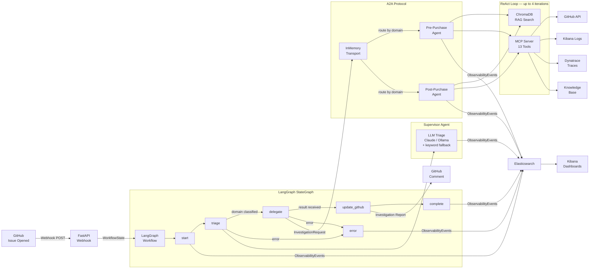

# AIIS — Agentic Issue Investigation System

A production-quality POC demonstrating a modern **Agentic AI Engineering Platform** that automatically triages GitHub issues, delegates investigations to specialized AI agents, retrieves domain knowledge via RAG, invokes external tools through MCP, and provides enterprise-grade observability with Elasticsearch and Kibana.

---

## Documentation

Full documentation is in the [`docs/`](docs/) folder. Start with the index:

| Guide | Description |
| ----- | ----------- |
| [docs/index.md](docs/index.md) | Navigation hub — start here |
| [docs/architecture/overview.md](docs/architecture/overview.md) | Full system architecture, data flow, sequence diagrams |
| [docs/architecture/langgraph-workflow.md](docs/architecture/langgraph-workflow.md) | LangGraph StateGraph, nodes, edges, state |
| [docs/architecture/a2a-protocol.md](docs/architecture/a2a-protocol.md) | Agent-to-Agent messaging protocol |
| [docs/architecture/mcp-server.md](docs/architecture/mcp-server.md) | All 13 MCP tools documented |
| [docs/architecture/rag-system.md](docs/architecture/rag-system.md) | ChromaDB, embeddings, knowledge retrieval |
| [docs/architecture/observability.md](docs/architecture/observability.md) | Distributed tracing, Elasticsearch, Kibana |
| [docs/modules/supervisor-agent.md](docs/modules/supervisor-agent.md) | Triage and delegation logic |
| [docs/modules/domain-agents.md](docs/modules/domain-agents.md) | ReAct investigation loop |
| [docs/modules/webhook-api.md](docs/modules/webhook-api.md) | FastAPI endpoints and startup |
| [docs/guides/getting-started.md](docs/guides/getting-started.md) | 5-step beginner quick start |
| [docs/guides/build-and-run.md](docs/guides/build-and-run.md) | uv, Docker, tests, production |
| [docs/guides/debugging.md](docs/guides/debugging.md) | Troubleshooting and log reading |
| [docs/guides/configuration.md](docs/guides/configuration.md) | Every environment variable explained |

---

## Architecture



---

## Key Architectural Patterns

| Pattern | Implementation |
| ------- | -------------- |
| **Supervisor Orchestration** | LangGraph `StateGraph` with conditional routing |
| **A2A Protocol** | In-memory transport mimicking distributed message bus |
| **MCP Tool Calling** | 13 tools: GitHub, Debugging, Knowledge |
| **RAG** | ChromaDB + Sentence Transformers, per-domain collections |
| **ReAct Loop** | Domain agents iterate: Observe → Reason → Retrieve → Call → Evaluate |
| **Distributed Tracing** | `TraceContext` propagated through all layers via `ContextVar` |
| **Observability** | Structured JSON logs + 19 Elasticsearch event types |

---

## Project Structure

```text
aiis/
├── docs/                             # Full documentation (start here)
│   ├── index.md                      # Navigation hub
│   ├── architecture/                 # System design docs
│   ├── modules/                      # Per-module deep dives
│   └── guides/                       # Build, run, debug, configure
│
├── src/
│   ├── a2a/                          # Agent-to-Agent protocol
│   │   ├── messages.py               # Pydantic message contracts
│   │   ├── transport.py              # In-memory async transport
│   │   ├── registry.py               # Agent discovery registry
│   │   ├── client.py                 # A2A client (supervisor → agents)
│   │   └── server.py                 # A2A server (agent registration)
│   │
│   ├── agents/
│   │   ├── state.py                  # LangGraph shared WorkflowState
│   │   ├── supervisor/
│   │   │   └── agent.py              # Issue Triage Agent (Claude / Ollama)
│   │   └── domain/
│   │       ├── base_agent.py         # ReAct investigation loop
│   │       ├── pre_purchase_agent.py
│   │       └── post_purchase_agent.py
│   │
│   ├── mcp_server/
│   │   ├── server.py                 # MCP server with tool registry
│   │   └── tools/
│   │       ├── github_tools.py       # GitHub REST API tools
│   │       ├── debugging_tools.py    # Kibana, Dynatrace, FlexSearch (mock)
│   │       └── knowledge_tools.py    # RAG-backed knowledge tools
│   │
│   ├── rag/
│   │   ├── indexer.py                # Markdown → ChromaDB ingestion
│   │   └── retriever.py              # Semantic search with fallback
│   │
│   ├── observability/
│   │   ├── events.py                 # ObservabilityEvent schema (19 event types)
│   │   ├── tracer.py                 # TraceContext with ContextVar propagation
│   │   ├── elasticsearch_client.py   # Async ES client with circuit breaker
│   │   └── logger.py                 # JSON structured logging
│   │
│   ├── workflow/
│   │   └── graph.py                  # LangGraph StateGraph definition
│   │
│   └── api/
│       └── webhook.py                # FastAPI: /webhook/github, /investigate
│
├── knowledge-base/
│   ├── pre-purchase/
│   │   ├── troubleshooting-guides/
│   │   ├── runbooks/
│   │   ├── architecture/
│   │   └── previous-issues/
│   └── post-purchase/
│       ├── troubleshooting-guides/
│       ├── runbooks/
│       ├── architecture/
│       └── previous-issues/
│
├── tests/
│   ├── test_a2a.py
│   ├── test_supervisor.py
│   ├── test_mcp_tools.py
│   ├── test_workflow.py
│   └── browser/
│       ├── test_aiis_browser.py      # Playwright browser tests
│       └── screenshots/              # Auto-saved test screenshots
│
├── kibana/
│   └── setup.sh                      # Calls create_kibana_dashboards.py
│
├── scripts/
│   ├── create_kibana_dashboards.py   # Creates all Kibana visualizations + dashboards via REST API
│   ├── simulate_issue.py             # Local demo runner
│   └── index_kb.py                   # Knowledge base indexer
│
├── .mcp.json                         # Chrome DevTools MCP (Playwright) config
├── docker-compose.yml
├── Dockerfile
├── pyproject.toml
└── .env.example
```

---

## Quick Start

> **New to this project?** Read [docs/guides/getting-started.md](docs/guides/getting-started.md) for a detailed walkthrough.

### 1. Prerequisites

- Python 3.12+
- [uv](https://docs.astral.sh/uv/) package manager (`pip install uv`)
- Docker Desktop or Rancher Desktop (for Elasticsearch/Kibana)
- One of:
  - **Ollama** (free, local): `ollama pull llama3.1:8b`
  - **Anthropic** (cloud): set `ANTHROPIC_API_KEY` in `.env`
  - **OpenAI / vLLM** (cloud or OpenStack): set `OPENAI_API_KEY` and optionally `OPENAI_BASE_URL`

### 2. Install dependencies

```bash
uv sync
```

### 3. Configure environment

```bash
cp .env.example .env
# Edit .env — set ANTHROPIC_API_KEY or leave empty to use Ollama
```

### 4. Start infrastructure

```bash
docker compose up -d
# Wait ~30 seconds for Elasticsearch to be healthy
```

### 5. Run the server

```bash
uv run uvicorn src.api.webhook:app --reload --port 8000
```

### 6. Trigger a test investigation

```bash
# Pre-purchase issue
curl -X POST http://localhost:8000/investigate \
  -H "Content-Type: application/json" \
  -d '{"issue_id": 101, "title": "Search returns empty results on category pages", "description": "After last nights Solr reindex, PLP shows no products. Affecting ~30% of users."}'

# Post-purchase issue
curl -X POST http://localhost:8000/investigate \
  -H "Content-Type: application/json" \
  -d '{"issue_id": 102, "title": "Order not shipped after 3 days", "description": "Fulfillment pipeline appears stuck. 200+ orders in PENDING state."}'
```

### 7. Or run the simulation script

```bash
uv run python scripts/simulate_issue.py
```

---

## GitHub Webhook Integration

For local development, AIIS includes a webhook simulator that sends a properly signed GitHub `issues` event directly to the running server — no public URL or tunnel required.

```bash
# Terminal 1: start the server
uv run uvicorn src.api.webhook:app --reload --port 8000

# Terminal 2: fire a simulated webhook
uv run python scripts/simulate_webhook.py                        # pre-purchase sample
uv run python scripts/simulate_webhook.py --domain post-purchase # post-purchase sample

# Custom issue
uv run python scripts/simulate_webhook.py \
    --issue-number 42 \
    --title "Payment gateway timeout during checkout" \
    --body "Customers are getting 504s when clicking Pay Now..."
```

The simulator builds a realistic GitHub payload, signs it with HMAC-SHA256 (identical to how GitHub signs real webhooks), and POSTs it to `localhost:8000/webhook/github`. The full investigation pipeline runs and — if `GITHUB_TOKEN` is configured — posts an AI comment on the real GitHub issue.

For connecting a real GitHub webhook on staging or production, see [docs/guides/build-and-run.md](docs/guides/build-and-run.md).

---

## Docker Compose

```bash
# Start Elasticsearch + Kibana
docker compose up -d

# View logs
docker compose logs -f

# Import Kibana dashboards
bash kibana/setup.sh

# Stop everything
docker compose down
```

Access:

- **API**: <http://localhost:8000>
- **Kibana**: <http://localhost:5601>
- **Elasticsearch**: <http://localhost:9200>

---

## Running Tests

```bash
# Unit and integration tests
uv run pytest

# Specific suite
uv run pytest tests/test_a2a.py -v
uv run pytest tests/test_workflow.py -v

# With coverage
uv run pytest --cov=src --cov-report=term-missing
```

**Browser tests** (requires running server + Docker services):

```bash
# Install Chromium once
uv run playwright install chromium

# Run all browser tests (headless)
uv run pytest tests/browser/ -v -s

# Run with visible browser window
uv run pytest tests/browser/ -v -s --headed
```

Browser tests cover Swagger UI, `/investigate` end-to-end, Elasticsearch event counts, field mappings, and Kibana. Screenshots are saved to `tests/browser/screenshots/`.

---

## Kibana Dashboards

Run `bash kibana/setup.sh` (or `uv run python scripts/create_kibana_dashboards.py`) to create the dashboards via the Kibana REST API, then navigate to Kibana → Dashboards:

| Dashboard | URL | What it shows |
| --------- | --- | ------------- |
| **AIIS — Issue Status** | `/app/dashboards#/view/aiis-issue-status-dashboard` | Workflow outcomes, pre/post-purchase split, domain routing, investigation duration, per-issue table |
| **AIIS — Trace & Debug** | `/app/dashboards#/view/aiis-trace-debug-dashboard` | Full event timeline (all 19 event types), span trace table, A2A messages, MCP tool calls, RAG activity |

**Trace a specific request end-to-end:**

```bash
# 1. Submit an investigation and capture the trace_id
curl -s -X POST http://localhost:8000/investigate \
  -H 'Content-Type: application/json' \
  -d '{"issue_id": 1, "title": "Search broken", "description": "PLP shows no results"}' \
  | jq .trace_id

# 2. Open Kibana Trace & Debug dashboard, add KQL filter:
#    trace_id: "paste-your-uuid-here"
#    → Span Trace Table shows every event in the call tree
```

**Query raw events:**

```bash
# All events for a workflow
curl "http://localhost:9200/aiis-events-*/_search?pretty" \
  -H 'Content-Type: application/json' \
  -d '{"query": {"term": {"workflow_id": "YOUR-WORKFLOW-ID"}}, "sort": [{"timestamp": "asc"}]}'

# MCP tool calls only
curl "http://localhost:9200/aiis-events-*/_search?pretty" \
  -H 'Content-Type: application/json' \
  -d '{"query": {"term": {"event_type": "MCP_TOOL_CALL"}}}'
```

---

## MCP Tools

| Category | Tool | Description |
| -------- | ---- | ----------- |
| **GitHub** | `assign_issue` | Assign issue to team members |
| **GitHub** | `add_labels` | Add labels to issue |
| **GitHub** | `add_comment` | Post investigation report |
| **GitHub** | `search_issues` | Find similar past issues |
| **Debugging** | `get_kibana_logs` | Fetch service error logs |
| **Debugging** | `get_dynatrace_traces` | Distributed trace analysis |
| **Debugging** | `execute_flexible_search` | SAP Commerce data queries |
| **Debugging** | `configuration_lookup` | Service configuration values |
| **Debugging** | `feature_flag_lookup` | Feature flag status |
| **Debugging** | `service_health` | Service health check |
| **Knowledge** | `search_knowledge_base` | RAG semantic search |
| **Knowledge** | `retrieve_runbook` | Get operational runbook |
| **Knowledge** | `retrieve_architecture_docs` | Component architecture docs |

---

## A2A Message Contract

**Investigation Request** (Supervisor → Domain Agent):

```json
{
  "message_type": "InvestigationRequest",
  "trace_id": "3f8a2...",
  "workflow_id": "c7d1e...",
  "issue_id": 101,
  "title": "Search returns empty results",
  "description": "...",
  "assigned_domain": "pre-purchase",
  "timestamp": "2026-07-18T10:30:04Z"
}
```

**Investigation Result** (Domain Agent → Supervisor):

```json
{
  "message_type": "InvestigationResult",
  "trace_id": "3f8a2...",
  "workflow_id": "c7d1e...",
  "issue_id": 101,
  "status": "completed",
  "confidence": 0.91,
  "summary": "...",
  "root_cause": "...",
  "recommended_actions": ["..."],
  "iterations": 3,
  "duration_ms": 1240
}
```

---

## Extending the System

### Add a new domain agent

```python
# src/agents/domain/payments_agent.py
from src.a2a.messages import Domain
from .base_agent import BaseDomainAgent

class PaymentsAgent(BaseDomainAgent):
    domain = Domain.PAYMENTS       # extend the Domain enum
    agent_id = "payments-agent"

    @property
    def service_areas(self) -> list[str]:
        return ["payment-processing", "fraud-detection", "billing"]

    @property
    def primary_services(self) -> list[str]:
        return ["payment-service", "fraud-service"]
```

### Add a new MCP tool

```python
# src/mcp_server/tools/custom_tools.py
async def my_new_tool(param: str) -> dict:
    return {"result": "..."}

# In src/mcp_server/server.py, call register_tool() with the MCPTool definition
```

### Replace the transport layer

Swap `InMemoryTransport` in `src/a2a/transport.py` with an HTTP, Kafka, or NATS implementation. The `A2AClient` and `A2AServer` interfaces remain unchanged.

---

## Configuration Reference

### LLM — Per-Agent Model Configuration

Each agent role can use a different LLM provider and model:

| Variable | Default | Description |
|---|---|---|
| `LLM_PROVIDER` | _(auto)_ | Global default: `anthropic` \| `openai` \| `ollama` |
| `SUPERVISOR_LLM_PROVIDER` | `LLM_PROVIDER` | Provider for the supervisor/triage agent |
| `SUPERVISOR_LLM_MODEL` | provider default | Model for the supervisor agent |
| `DOMAIN_AGENT_LLM_PROVIDER` | `LLM_PROVIDER` | Provider for domain investigation agents |
| `DOMAIN_AGENT_LLM_MODEL` | provider default | Model for domain agents |
| `ANTHROPIC_API_KEY` | — | Required when any agent uses `provider=anthropic` |
| `ANTHROPIC_MODEL` | `claude-haiku-4-5-20251001` | Default Anthropic model |
| `OPENAI_API_KEY` | — | Required when any agent uses `provider=openai` |
| `OPENAI_BASE_URL` | _(OpenAI cloud)_ | Override for vLLM, Azure, OpenStack endpoint |
| `OPENAI_MODEL` | `gpt-4o-mini` | Default OpenAI / vLLM model |
| `OLLAMA_BASE_URL` | `http://localhost:11434` | Ollama server endpoint |
| `OLLAMA_MODEL` | `llama3.1:8b` | Ollama model |

### Other Variables

| Variable | Default | Description |
|---|---|---|
| `GITHUB_TOKEN` | — | GitHub API access (`issues:write`) |
| `GITHUB_REPO` | — | Target repo (`owner/repo`) |
| `GITHUB_WEBHOOK_SECRET` | — | HMAC secret for webhook verification |
| `ELASTICSEARCH_URL` | `http://localhost:9200` | Elasticsearch endpoint |
| `CHROMA_PERSIST_DIR` | `./data/chroma` | ChromaDB storage path |
| `KNOWLEDGE_BASE_DIR` | `./knowledge-base` | Markdown documents root |
| `EMBED_MODEL` | `all-MiniLM-L6-v2` | Sentence Transformers model |
| `MAX_INVESTIGATION_ITERATIONS` | `4` | Max iterations per agent |
| `CONFIDENCE_THRESHOLD` | `0.75` | Stop investigation above this score |
| `LOG_LEVEL` | `INFO` | Logging verbosity |

See [docs/guides/configuration.md](docs/guides/configuration.md) for full details and [docs/guides/deployment.md](docs/guides/deployment.md) for Local, OpenStack, and AWS deployment steps.

---

## Technology Stack

| Layer | Technology |
| ----- | ---------- |
| Agent Framework | LangGraph + LangChain |
| LLM | Anthropic Claude Haiku or Ollama (`llama3.1:8b`) |
| API | FastAPI + Uvicorn |
| Vector DB | ChromaDB |
| Embeddings | Sentence Transformers (`all-MiniLM-L6-v2`) |
| Observability | Elasticsearch 8.15 + Kibana |
| GitHub Integration | GitHub REST API v3 |
| Package Manager | uv |
| Containerization | Docker Compose |
| Data Validation | Pydantic v2 |
