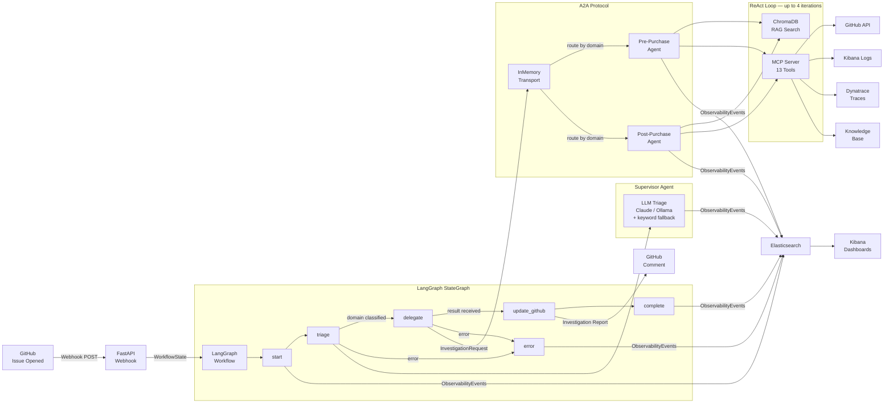

# AIIS — Agentic Issue Investigation System

A production-quality POC demonstrating a modern **Agentic AI Engineering Platform** that automatically triages GitHub issues, delegates investigations to specialized AI agents, retrieves domain knowledge via RAG, invokes external tools through MCP, and provides enterprise-grade observability with Elasticsearch and Kibana.

---

## Documentation

Full documentation is in the [`docs/`](docs/) folder. Start with the index:

| Guide | Description |
| ----- | ----------- |
| [docs/index.md](docs/index.md) | Navigation hub — start here |
| [docs/architecture/overview.md](docs/architecture/overview.md) | Full system architecture, data flow, sequence diagrams |
| [docs/architecture/langgraph-workflow.md](docs/architecture/langgraph-workflow.md) | LangGraph StateGraph, nodes, edges, state |
| [docs/architecture/a2a-protocol.md](docs/architecture/a2a-protocol.md) | Agent-to-Agent messaging protocol |
| [docs/architecture/mcp-server.md](docs/architecture/mcp-server.md) | All 13 MCP tools documented |
| [docs/architecture/rag-system.md](docs/architecture/rag-system.md) | ChromaDB, embeddings, knowledge retrieval |
| [docs/architecture/observability.md](docs/architecture/observability.md) | Distributed tracing, Elasticsearch, Kibana |
| [docs/modules/supervisor-agent.md](docs/modules/supervisor-agent.md) | Triage and delegation logic |
| [docs/modules/domain-agents.md](docs/modules/domain-agents.md) | ReAct investigation loop |
| [docs/modules/webhook-api.md](docs/modules/webhook-api.md) | FastAPI endpoints and startup |
| [docs/guides/getting-started.md](docs/guides/getting-started.md) | 5-step beginner quick start |
| [docs/guides/build-and-run.md](docs/guides/build-and-run.md) | uv, Docker, tests, production |
| [docs/guides/debugging.md](docs/guides/debugging.md) | Troubleshooting and log reading |
| [docs/guides/configuration.md](docs/guides/configuration.md) | Every environment variable explained |

---

## Architecture



---

## Key Architectural Patterns

| Pattern | Implementation |
| ------- | -------------- |
| **Supervisor Orchestration** | LangGraph `StateGraph` with conditional routing |
| **A2A Protocol** | In-memory transport mimicking distributed message bus |
| **MCP Tool Calling** | 13 tools: GitHub, Debugging, Knowledge |
| **RAG** | ChromaDB + Sentence Transformers, per-domain collections |
| **ReAct Loop** | Domain agents iterate: Observe → Reason → Retrieve → Call → Evaluate |
| **Distributed Tracing** | `TraceContext` propagated through all layers via `ContextVar` |
| **Event Bus** | Kafka (KRaft) — mandatory pipeline; all 19 event types with complete payloads |
| **Observability** | Kafka → ES-sink consumer → Elasticsearch + Kibana dashboards |

---

See `docs/` for full documentation.

---

## Quick Start

```bash
cp .env.example .env   # fill in GITHUB_TOKEN, GITHUB_REPO, KAFKA_BOOTSTRAP_SERVERS
docker compose up -d   # start Kafka, Elasticsearch, Kibana
uv sync && uv run python scripts/index_kb.py
uv run uvicorn src.api.webhook:app --port 8000 --reload
```

See [Getting Started](docs/guides/getting-started.md) for the full walkthrough.

---

## GitHub Webhook Integration

For local development, AIIS includes a webhook simulator that sends a properly signed GitHub `issues` event directly to the running server — no public URL or tunnel required.

```bash
# Terminal 1: start the server
uv run uvicorn src.api.webhook:app --reload --port 8000

# Terminal 2: fire a simulated webhook
uv run python scripts/simulate_webhook.py                        # pre-purchase sample
uv run python scripts/simulate_webhook.py --domain post-purchase # post-purchase sample

# Custom issue
uv run python scripts/simulate_webhook.py \
    --issue-number 42 \
    --title "Payment gateway timeout during checkout" \
    --body "Customers are getting 504s when clicking Pay Now..."
```

The simulator builds a realistic GitHub payload, signs it with HMAC-SHA256 (identical to how GitHub signs real webhooks), and POSTs it to `localhost:8000/webhook/github`. The full investigation pipeline runs and — if `GITHUB_TOKEN` is configured — posts an AI comment on the real GitHub issue.

For connecting a real GitHub webhook on staging or production, see [docs/guides/build-and-run.md](docs/guides/build-and-run.md).

---

## Docker Compose

```bash
# Start Kafka + Elasticsearch + Kibana (Kafka must be up before the AIIS server)
docker compose up -d

# View logs
docker compose logs -f

# Import Kibana dashboards
bash kibana/setup.sh

# Stop everything
docker compose down
```

Access:

- **API**: <http://localhost:8000>
- **Kafka**: `localhost:9092`
- **Kibana**: <http://localhost:5601>
- **Elasticsearch**: <http://localhost:9200>

---

## Running Tests

```bash
# Unit and integration tests
uv run pytest

# Specific suite
uv run pytest tests/test_a2a.py -v
uv run pytest tests/test_workflow.py -v

# With coverage
uv run pytest --cov=src --cov-report=term-missing
```

**Browser tests** (requires running server + Docker services):

```bash
# Install Chromium once
uv run playwright install chromium

# Run all browser tests (headless)
uv run pytest tests/browser/ -v -s

# Run with visible browser window
uv run pytest tests/browser/ -v -s --headed
```

Browser tests cover Swagger UI, `/investigate` end-to-end, Elasticsearch event counts, field mappings, and Kibana. Screenshots are saved to `tests/browser/screenshots/`.

---

## A2A Message Contract

**Investigation Request** (Supervisor → Domain Agent):

```json
{
  "message_type": "InvestigationRequest",
  "trace_id": "3f8a2...",
  "workflow_id": "c7d1e...",
  "issue_id": 101,
  "title": "Search returns empty results",
  "description": "...",
  "assigned_domain": "pre-purchase",
  "timestamp": "2026-07-18T10:30:04Z"
}
```

**Investigation Result** (Domain Agent → Supervisor):

```json
{
  "message_type": "InvestigationResult",
  "trace_id": "3f8a2...",
  "workflow_id": "c7d1e...",
  "issue_id": 101,
  "status": "completed",
  "confidence": 0.91,
  "summary": "...",
  "root_cause": "...",
  "recommended_actions": ["..."],
  "iterations": 3,
  "duration_ms": 1240
}
```

---

## Extending the System

### Add a new domain agent

```python
# src/agents/domain/payments_agent.py
from src.a2a.messages import Domain
from .base_agent import BaseDomainAgent

class PaymentsAgent(BaseDomainAgent):
    domain = Domain.PAYMENTS       # extend the Domain enum
    agent_id = "payments-agent"

    @property
    def service_areas(self) -> list[str]:
        return ["payment-processing", "fraud-detection", "billing"]

    @property
    def primary_services(self) -> list[str]:
        return ["payment-service", "fraud-service"]
```

### Add a new MCP tool

```python
# src/mcp_server/tools/custom_tools.py
async def my_new_tool(param: str) -> dict:
    return {"result": "..."}

# In src/mcp_server/server.py, call register_tool() with the MCPTool definition
```

### Replace the transport layer

Swap `InMemoryTransport` in `src/a2a/transport.py` with an HTTP, Kafka, or NATS implementation. The `A2AClient` and `A2AServer` interfaces remain unchanged.

---

See [Configuration Reference](docs/guides/configuration.md) for all environment variables.
