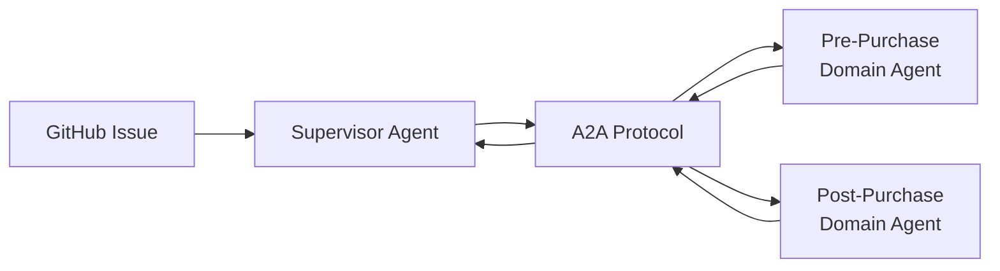
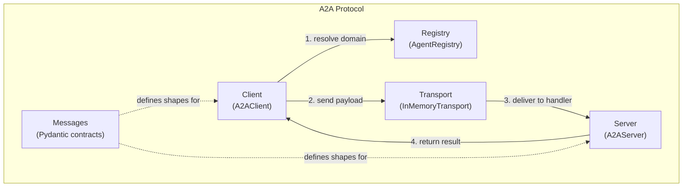
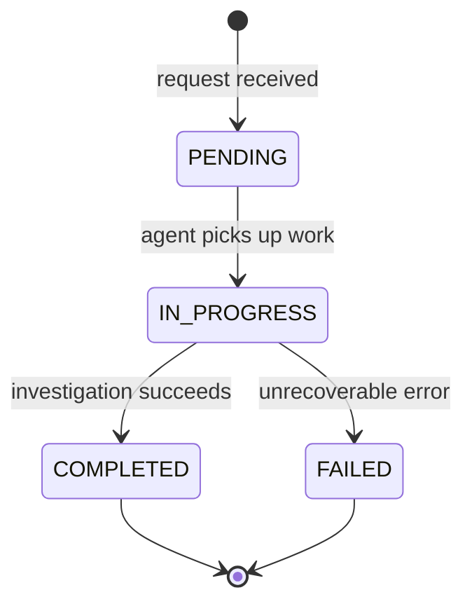
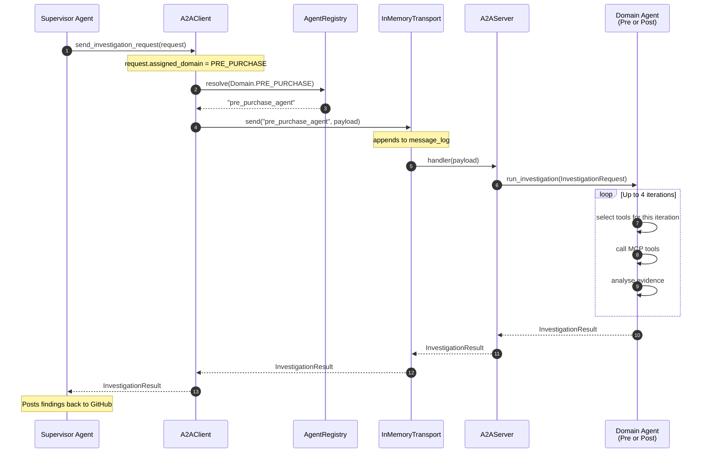
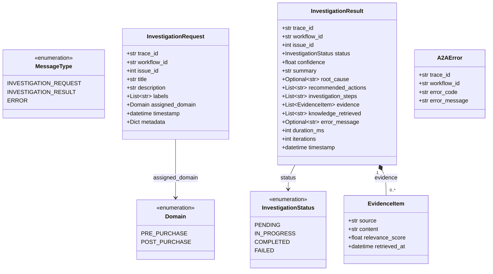
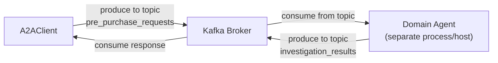

# A2A Protocol — Agent-to-Agent Communication

## Table of Contents

1. [What Is A2A?](#1-what-is-a2a)
2. [Why Does AIIS Need It?](#2-why-does-aiis-need-it)
3. [Core Concepts at a Glance](#3-core-concepts-at-a-glance)
4. [Component 1 — Messages (`src/a2a/messages.py`)](#4-component-1--messages)
5. [Component 2 — Transport (`src/a2a/transport.py`)](#5-component-2--transport)
6. [Component 3 — Registry (`src/a2a/registry.py`)](#6-component-3--registry)
7. [Component 4 — Client (`src/a2a/client.py`)](#7-component-4--client)
8. [Component 5 — Server (`src/a2a/server.py`)](#8-component-5--server)
9. [End-to-End Flow](#9-end-to-end-flow)
10. [Message Model Class Diagram](#10-message-model-class-diagram)
11. [Scaling to Production](#11-scaling-to-production)
12. [Code Examples](#12-code-examples)
13. [Quick-Reference Summary](#13-quick-reference-summary)

---

## 1. What Is A2A?

**A2A (Agent-to-Agent)** is a lightweight communication protocol that lets software agents talk to each other in a structured, reliable way.

Think of it like this: in a large company, different departments (e.g., pre-purchase support, post-purchase support) handle different kinds of customer problems. When a new issue arrives, a supervisor reads it, decides which department is responsible, and routes the case there. Each department follows the same form template so everyone understands the case details.

A2A does the same thing for AI agents:

- **A standard envelope format** so every agent speaks the same language (Messages).
- **A post-office** that delivers messages to the right agent (Transport).
- **A directory** of which agents exist and what they handle (Registry).
- **A front-desk worker** who assembles and sends the envelope on the caller's behalf (Client).
- **A reception desk** each agent runs to accept incoming messages (Server).

### In-Memory vs. Production

Right now, all messages travel through Python function calls in the same process (in-memory). This is perfect for a proof-of-concept: no networking, no configuration, instant. When AIIS graduates to a distributed deployment, only the Transport layer needs to be replaced — the rest of the code stays exactly the same.

| Mode | Transport | Latency | Multi-host |
|------|-----------|---------|------------|
| Current (POC) | In-memory (`InMemoryTransport`) | Microseconds | No |
| Production option A | Apache Kafka | Milliseconds | Yes |
| Production option B | NATS | Sub-millisecond | Yes |
| Production option C | HTTP/REST | Variable | Yes |

---

## 2. Why Does AIIS Need It?

AIIS investigates GitHub issues automatically. A single investigation may involve:

- A **Supervisor Agent** that reads the issue and decides whether it belongs to pre-purchase or post-purchase support.
- A **Pre-Purchase Domain Agent** that investigates pricing, product catalogue, or checkout issues.
- A **Post-Purchase Domain Agent** that investigates order fulfilment, returns, or account issues.

These agents need to hand work off to each other cleanly. A2A defines exactly how that handoff happens — what data is sent, who receives it, and how results come back.



---

## 3. Core Concepts at a Glance



**How to read this:** The Client asks the Registry "which agent handles pre-purchase?" then passes the message through the Transport, which delivers it to the destination agent's Server. Every piece of data shared is typed using the Message models.

---

## 4. Component 1 — Messages

**File:** `src/a2a/messages.py`

Messages are the **data contracts** of A2A. Using [Pydantic](https://docs.pydantic.dev/), every field has a type, validation rules, and a default value where appropriate. If an agent accidentally sends malformed data, Pydantic catches it immediately with a clear error.

### 4.1 Enumerations

Enumerations (enums) are a fixed list of allowed values. Using them prevents typos like `"INVESTIG_REQUEST"` slipping through undetected.

#### `MessageType`

Identifies the kind of A2A envelope being sent.

| Value | Meaning |
|-------|---------|
| `INVESTIGATION_REQUEST` | A supervisor is asking a domain agent to investigate an issue |
| `INVESTIGATION_RESULT` | A domain agent is returning its findings |
| `ERROR` | Something went wrong; see the A2AError body |

#### `Domain`

Which area of the business owns this investigation.

| Value | Meaning |
|-------|---------|
| `PRE_PURCHASE` | Issues related to browsing, search, pricing, checkout |
| `POST_PURCHASE` | Issues related to orders, fulfilment, returns, accounts |

#### `InvestigationStatus`

Tracks the lifecycle of a single investigation.

| Value | Meaning |
|-------|---------|
| `PENDING` | The request has been accepted but work has not started |
| `IN_PROGRESS` | The domain agent is actively investigating |
| `COMPLETED` | Investigation finished successfully |
| `FAILED` | Investigation could not be completed |



### 4.2 `InvestigationRequest`

This is the payload the Supervisor sends to a domain agent. Every field is documented below.

| Field | Type | Description |
|-------|------|-------------|
| `trace_id` | `str` | Unique ID for distributed tracing — lets you find all logs related to one investigation across every system |
| `workflow_id` | `str` | ID of the LangGraph workflow run that spawned this request |
| `issue_id` | `int` | The GitHub issue number (e.g., `42` for `github.com/org/repo/issues/42`) |
| `title` | `str` | The issue title as it appears on GitHub |
| `description` | `str` | Full body text of the GitHub issue |
| `labels` | `List[str]` | GitHub labels attached to the issue (e.g., `["bug", "pre-purchase"]`) |
| `assigned_domain` | `Domain` | Which domain (`PRE_PURCHASE` or `POST_PURCHASE`) should handle this |
| `timestamp` | `datetime` | When the request was created (UTC) |
| `metadata` | `Dict[str, Any]` | Optional free-form dictionary for extra context (e.g., reporter, priority) |

### 4.3 `EvidenceItem`

A single piece of evidence gathered during investigation — one log line, one knowledge-base article, one similar past issue.

| Field | Type | Description |
|-------|------|-------------|
| `source` | `str` | Where this evidence came from (e.g., `"kibana"`, `"knowledge_base"`, `"github"`) |
| `content` | `str` | The actual text of the evidence |
| `relevance_score` | `float` | How relevant this piece is to the issue, from `0.0` (irrelevant) to `1.0` (perfectly relevant) |
| `retrieved_at` | `datetime` | When this evidence was fetched (UTC) |

### 4.4 `InvestigationResult`

The full answer returned by a domain agent when it finishes.

| Field | Type | Description |
|-------|------|-------------|
| `trace_id` | `str` | Same trace ID from the original request — links request to result |
| `workflow_id` | `str` | Same workflow ID from the original request |
| `issue_id` | `int` | The GitHub issue number |
| `status` | `InvestigationStatus` | Final status (`COMPLETED` or `FAILED`) |
| `confidence` | `float` | Agent's confidence in its conclusion, `0.0`–`1.0` |
| `summary` | `str` | Short human-readable summary of findings |
| `root_cause` | `Optional[str]` | The likely root cause identified, if any |
| `recommended_actions` | `List[str]` | Ordered list of recommended next steps for the human engineer |
| `investigation_steps` | `List[str]` | Log of what the agent did at each iteration (for audit/debugging) |
| `evidence` | `List[EvidenceItem]` | All evidence items gathered during investigation |
| `knowledge_retrieved` | `List[str]` | Summaries of knowledge-base articles retrieved |
| `error_message` | `Optional[str]` | If status is `FAILED`, the error description |
| `duration_ms` | `int` | How long the investigation took in milliseconds |
| `iterations` | `int` | How many investigation loops the agent ran |
| `timestamp` | `datetime` | When the result was produced (UTC) |

### 4.5 `A2AError`

A structured error envelope returned when something goes wrong at the protocol level (not inside the investigation itself).

| Field | Type | Description |
|-------|------|-------------|
| `trace_id` | `str` | Trace ID for correlation |
| `workflow_id` | `str` | Workflow ID for correlation |
| `error_code` | `str` | Machine-readable error code (e.g., `"AGENT_NOT_FOUND"`) |
| `error_message` | `str` | Human-readable description of what went wrong |

---

## 5. Component 2 — Transport

**File:** `src/a2a/transport.py`

The Transport layer is the **delivery system**. It does not care what the message contains — it just knows how to route a payload to the correct recipient.

### `InMemoryTransport`

In the current POC, the transport is an in-memory dictionary mapping agent IDs to their handler functions. Sending a message is as simple as looking up the function and calling it.

#### Methods

| Method | Parameters | What It Does |
|--------|-----------|--------------|
| `register_handler(agent_id, handler)` | `agent_id: str`, `handler: Callable` | Stores an async callback function under a given agent ID. When this agent receives a message, this function is called. |
| `send(recipient, payload)` | `recipient: str`, `payload: dict` | Looks up the handler for `recipient` and calls it with `payload`. Appends the message to `message_log`. Raises `AgentNotFoundError` if no handler exists. |

#### `message_log`

Every call to `send()` appends a record to `message_log`. This is an **audit trail** — you can inspect it after a test run to see every message that was delivered, in order. In production Kafka, this role would be played by the Kafka topic's persistent log.

#### Singleton: `get_transport()`

Rather than creating multiple `InMemoryTransport` instances, a module-level singleton is provided. All components that import `get_transport()` share the same instance and therefore the same handler registry and message log.

```python
from a2a.transport import get_transport

transport = get_transport()  # always returns the same object
```

---

## 6. Component 3 — Registry

**File:** `src/a2a/registry.py`

The Registry is the **phone book** of the A2A world. Any agent that wants to receive messages must first announce itself to the registry.

### `AgentRegistry`

Stores a catalog of all registered agents and answers questions like "which agent handles post-purchase issues?"

#### Methods

| Method | Parameters | Returns | What It Does |
|--------|-----------|---------|--------------|
| `register(agent_id, domain, description, capabilities)` | `agent_id: str`, `domain: Domain`, `description: str`, `capabilities: List[str]` | `None` | Adds an agent entry. `capabilities` is a list of strings describing what this agent can do (e.g., `["kibana_search", "knowledge_base_lookup"]`). |
| `resolve(domain)` | `domain: Domain` | `str` (agent_id) | Finds the ID of a healthy agent registered for that domain. Raises `NoAgentForDomainError` if none exist. |
| `get(agent_id)` | `agent_id: str` | Agent record | Direct lookup by ID. |
| `all_agents()` | — | `List[AgentRecord]` | Returns every registered agent, useful for debugging or admin views. |

#### Singleton: `get_registry()`

```python
from a2a.registry import get_registry

registry = get_registry()  # always returns the same object
```

---

## 7. Component 4 — Client

**File:** `src/a2a/client.py`

The Client is the **helper** that other parts of the system call when they want to trigger an investigation. It hides the complexity of registry lookup and transport dispatch behind a single clean method.

### `A2AClient`

#### Method: `send_investigation_request(request)`

| Step | What Happens |
|------|-------------|
| 1 | Reads `request.assigned_domain` to know which domain to target |
| 2 | Calls `registry.resolve(domain)` to find the agent ID |
| 3 | Serialises the `InvestigationRequest` into a dict payload |
| 4 | Calls `transport.send(agent_id, payload)` |
| 5 | Deserialises the returned dict into an `InvestigationResult` |
| 6 | Returns the `InvestigationResult` to the caller |

#### Singleton: `get_a2a_client()`

```python
from a2a.client import get_a2a_client

client = get_a2a_client()  # always returns the same object
```

---

## 8. Component 5 — Server

**File:** `src/a2a/server.py`

The Server is the **reception desk** an agent runs to make itself reachable. Every domain agent wraps itself in an `A2AServer` at startup.

### `A2AServer`

#### Method: `serve(handler)`

| Parameter | Type | Description |
|-----------|------|-------------|
| `handler` | `async Callable[[InvestigationRequest], InvestigationResult]` | The async function the agent uses to process requests |

When `serve(handler)` is called, two things happen:

1. The agent is registered in the **AgentRegistry** (so `resolve()` can find it).
2. The agent's handler is registered in the **InMemoryTransport** (so `send()` can call it).

From that point on, any message sent to this agent's ID will invoke `handler` and return the result.

---

## 9. End-to-End Flow

The sequence diagram below shows exactly what happens from the moment the Supervisor decides to delegate an investigation to the moment it receives the result.



**Step-by-step plain English:**

1. The Supervisor creates an `InvestigationRequest` and calls `send_investigation_request`.
2. The Client asks the Registry for the agent ID that handles `PRE_PURCHASE`.
3. The Registry returns `"pre_purchase_agent"`.
4. The Client passes the message to the Transport.
5. The Transport appends the message to its audit log, then calls the domain agent's registered handler.
6. The Server (reception desk) forwards the call to the actual domain agent logic.
7. The domain agent runs up to 4 investigation iterations, using MCP tools each time.
8. When done, the result bubbles back up through Server → Transport → Client → Supervisor.

---

## 10. Message Model Class Diagram



---

## 11. Scaling to Production

### Why the current design makes scaling easy

Notice that the Supervisor, Client, Registry, and Transport are all **decoupled**. The Supervisor does not know which physical machine the domain agent runs on. It only knows:

1. The domain (pre-purchase or post-purchase).
2. The shape of the request and result messages.

This means swapping the transport is a configuration change, not a code change.

### Option A — Apache Kafka



Each domain gets its own Kafka topic. Multiple domain agent instances can consume from the same topic for horizontal scaling. Kafka retains messages persistently — if an agent crashes mid-investigation, the message is not lost.

### Option B — NATS

Similar to Kafka but optimised for ultra-low latency. NATS supports request-reply semantics natively, which maps well to the `send_investigation_request` → `InvestigationResult` pattern. JetStream (NATS's persistent layer) can provide durability similar to Kafka.

### Option C — HTTP/REST

Each domain agent exposes a `POST /investigate` endpoint. The `InMemoryTransport.send()` becomes an HTTP `POST` call. Works well when domain agents are deployed as independent microservices behind an API gateway.

### Migration checklist

- [ ] Implement a `KafkaTransport` (or `NATSTransport`) class with the same `register_handler` and `send` interface.
- [ ] Replace `get_transport()` to return the new transport instance.
- [ ] Update `AgentRegistry` to store network addresses alongside agent IDs, if needed.
- [ ] No changes required to `A2AClient`, `A2AServer`, or any Message model.

---

## 12. Code Examples

### Registering a domain agent at startup

```python
import asyncio
from a2a.server import A2AServer
from a2a.messages import Domain, InvestigationRequest, InvestigationResult, InvestigationStatus

# 1. Define the investigation handler
async def handle_pre_purchase(request: InvestigationRequest) -> InvestigationResult:
    print(f"Starting investigation for issue #{request.issue_id}")
    # ... investigation logic (MCP tool calls, evidence gathering) ...
    return InvestigationResult(
        trace_id=request.trace_id,
        workflow_id=request.workflow_id,
        issue_id=request.issue_id,
        status=InvestigationStatus.COMPLETED,
        confidence=0.87,
        summary="Root cause identified: stale cache in product pricing service.",
        root_cause="PricingService cache TTL misconfigured to 0 — prices returned are always stale.",
        recommended_actions=[
            "Set PRICING_CACHE_TTL=300 in production config.",
            "Restart PricingService pods.",
            "Verify prices via /health endpoint.",
        ],
        investigation_steps=["Checked Kibana logs", "Retrieved pricing runbook"],
        evidence=[],
        knowledge_retrieved=[],
        duration_ms=4200,
        iterations=2,
    )

# 2. Create and start the server
server = A2AServer(
    agent_id="pre_purchase_agent",
    domain=Domain.PRE_PURCHASE,
    description="Investigates pre-purchase issues: search, pricing, checkout.",
    capabilities=["kibana_search", "knowledge_base_lookup", "dynatrace_traces"],
)

asyncio.run(server.serve(handle_pre_purchase))
```

### Sending an investigation request from the Supervisor

```python
import asyncio
from a2a.client import get_a2a_client
from a2a.messages import Domain, InvestigationRequest
import uuid
from datetime import datetime, timezone

async def investigate_issue(issue_id: int, title: str, description: str, domain: Domain):
    client = get_a2a_client()

    request = InvestigationRequest(
        trace_id=str(uuid.uuid4()),          # unique ID for this investigation
        workflow_id=str(uuid.uuid4()),        # LangGraph workflow run ID
        issue_id=issue_id,
        title=title,
        description=description,
        labels=["bug"],
        assigned_domain=domain,
        timestamp=datetime.now(timezone.utc),
        metadata={"reporter": "github-actions-bot"},
    )

    result = await client.send_investigation_request(request)

    print(f"Status:     {result.status}")
    print(f"Confidence: {result.confidence:.0%}")
    print(f"Summary:    {result.summary}")
    print(f"Root cause: {result.root_cause}")
    print("Recommended actions:")
    for action in result.recommended_actions:
        print(f"  - {action}")

asyncio.run(investigate_issue(
    issue_id=42,
    title="Product prices showing as $0 on checkout page",
    description="After the latest deploy, all product prices display as $0...",
    domain=Domain.PRE_PURCHASE,
))
```

### Inspecting the message audit log

```python
from a2a.transport import get_transport

transport = get_transport()

for entry in transport.message_log:
    print(f"[{entry['timestamp']}] {entry['recipient']}: {entry['message_type']}")
```

---

## 13. Quick-Reference Summary

| Component | File | Role | Singleton getter |
|-----------|------|------|-----------------|
| Messages | `src/a2a/messages.py` | Pydantic data contracts | — (just import the classes) |
| Transport | `src/a2a/transport.py` | Message delivery | `get_transport()` |
| Registry | `src/a2a/registry.py` | Agent discovery | `get_registry()` |
| Client | `src/a2a/client.py` | Send requests | `get_a2a_client()` |
| Server | `src/a2a/server.py` | Receive requests | Instantiate `A2AServer` |

**Key enums:** `MessageType` · `Domain` · `InvestigationStatus`

**Key models:** `InvestigationRequest` · `EvidenceItem` · `InvestigationResult` · `A2AError`

**Golden rule:** To add a new domain agent, implement an `async def handle(request) -> result` function and pass it to `A2AServer.serve()`. Everything else (routing, discovery, audit logging) is handled automatically.
