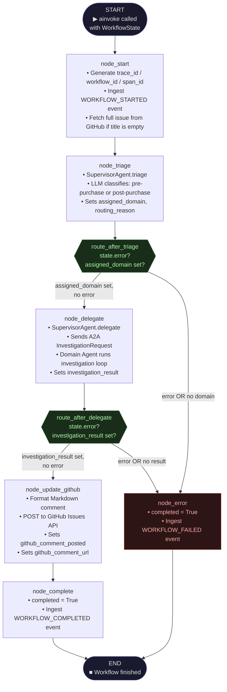

# LangGraph Workflow — Deep Dive

**AIIS Agentic Issue Investigation System**

---

## Table of Contents

1. [What is LangGraph?](#what-is-langgraph)
2. [Core Concepts](#core-concepts)
3. [The WorkflowState Model](#the-workflowstate-model)
4. [The Six Workflow Nodes](#the-six-workflow-nodes)
5. [Conditional Routing](#conditional-routing)
6. [Complete Workflow Graph (Mermaid)](#complete-workflow-graph-mermaid)
7. [How to Invoke the Workflow](#how-to-invoke-the-workflow)
8. [Important: Pydantic State and ainvoke()](#important-pydantic-state-and-ainvoke)
9. [Observability Events](#observability-events)

---

## What is LangGraph?

LangGraph is a Python library that lets you build **stateful, multi-step AI applications** as a **directed graph** — a network of connected steps where data flows from one step to the next.

Before LangGraph, developers built AI pipelines as simple function chains:

```python
# Old approach — simple chain, no branching, no error paths
result1 = step_one(input)
result2 = step_two(result1)
result3 = step_three(result2)
```

This breaks down quickly when you need:

- Different paths depending on what the AI decided (branching)
- A dedicated error handling step
- The ability to loop (agent re-tries a tool call)
- Checkpointing so the workflow can be resumed if it crashes

LangGraph solves all of this. You define your application as a **graph** with named nodes and edges, and LangGraph handles the state passing, routing, and execution.

The key design principle is: **the state is the source of truth**. Every node reads from the state and writes back to it. No hidden variables, no global mutable objects — all information lives in one typed, validated object (`WorkflowState`).

---

## Core Concepts

### StateGraph

A `StateGraph` is the main LangGraph class. You create one, add nodes to it, add edges between nodes, set an entry point, and then compile it into a runnable object.

```python
from langgraph.graph import StateGraph, END

graph = StateGraph(WorkflowState)   # WorkflowState is your state schema
graph.add_node("my_node", my_function)
graph.set_entry_point("my_node")
graph.add_edge("my_node", END)

runnable = graph.compile()          # Now you can call runnable.ainvoke(...)
```

### Nodes

A **node** is simply an async Python function. It takes the current state as input and returns an updated state (or a dict of updates). LangGraph calls nodes in the order determined by the edges.

```python
async def node_start(state: WorkflowState) -> WorkflowState:
    state.trace_id = "new-trace-id"
    return state
```

### Edges

An **edge** is a connection from one node to another. When node A finishes, LangGraph follows the edge to determine which node runs next.

There are two types:

| Edge Type | Description | Example |
|---|---|---|
| **Fixed edge** | Always goes to the same next node | `graph.add_edge("update_github", "complete")` |
| **Conditional edge** | Calls a Python function to decide the next node | `graph.add_conditional_edges("triage", route_after_triage, {...})` |

### Conditional Edges

A conditional edge calls a **router function** that examines the current state and returns a string key. The key is looked up in a routing map to find the actual next node name.

```python
def route_after_triage(state: WorkflowState) -> str:
    if state.error or not state.assigned_domain:
        return "error"          # key → mapped to "error" node
    return "delegate"           # key → mapped to "delegate" node

graph.add_conditional_edges(
    "triage",                   # source node
    route_after_triage,         # router function
    {
        "delegate": "delegate", # key → node name
        "error": "error",
    }
)
```

### END

`END` is a special constant imported from `langgraph.graph`. When an edge points to `END`, LangGraph knows the workflow is finished and stops execution. In AIIS, both `node_complete` and `node_error` route to `END`.

---

## The WorkflowState Model

`WorkflowState` is a **Pydantic v2 model** defined in `src/agents/state.py`. It is the single object passed through every node in the LangGraph workflow. Every field is explicitly typed and validated.

Think of `WorkflowState` as the "memory" of the workflow — it accumulates information as the workflow progresses through each node.

```python
# src/agents/state.py
class WorkflowState(BaseModel):
    ...
```

### Field Reference

The fields are organized into logical groups:

#### Issue Data — What We Are Investigating

| Field | Type | Default | Description |
|---|---|---|---|
| `issue_id` | `int` | `0` | GitHub issue number (e.g., `123` for issue #123) |
| `title` | `str` | `""` | The issue title text |
| `description` | `str` | `""` | The full issue body / description |
| `labels` | `list[str]` | `[]` | GitHub labels already applied to the issue |
| `author` | `str` | `""` | GitHub username of the person who opened the issue |

These fields are populated in `node_start` — either from the incoming webhook payload or by calling the GitHub API to fetch the full issue.

---

#### Tracing — Where Did This Workflow Run?

| Field | Type | Default | Description |
|---|---|---|---|
| `trace_id` | `str` | `""` | Unique ID for the entire trace (spans the full workflow) |
| `workflow_id` | `str` | `""` | Unique ID for this specific workflow execution |
| `span_id` | `str` | `""` | ID for the current operation within the trace |

These are set in `node_start` using `new_trace_context()`. They follow OpenTelemetry-style distributed tracing conventions and appear in every Elasticsearch event, so you can reconstruct the full execution history for any workflow run.

---

#### Routing — Where Should This Issue Go?

| Field | Type | Default | Description |
|---|---|---|---|
| `assigned_domain` | `Domain \| None` | `None` | Which domain agent handles this issue: `"pre-purchase"` or `"post-purchase"` |
| `routing_reason` | `str` | `""` | Human-readable explanation of why this domain was chosen (LLM output) |
| `assignees` | `list[str]` | `[]` | GitHub usernames to assign to the issue |
| `applied_labels` | `list[str]` | `[]` | Labels the agent decided to add during triage |

These are populated by `SupervisorAgent.triage()` in `node_triage`. The `assigned_domain` field determines which branch of the conditional edge after `node_triage` is taken.

The `Domain` enum has two values:

```python
class Domain(str, Enum):
    PRE_PURCHASE = "pre-purchase"
    POST_PURCHASE = "post-purchase"
```

---

#### A2A — The Investigation Request and Result

| Field | Type | Default | Description |
|---|---|---|---|
| `investigation_request` | `InvestigationRequest \| None` | `None` | The A2A message sent to the domain agent (built in `node_delegate`) |
| `investigation_result` | `InvestigationResult \| None` | `None` | The A2A response from the domain agent (populated after investigation completes) |

`InvestigationResult` is a rich object containing:

- `summary` — plain-English summary of the issue
- `root_cause` — the AI's hypothesis
- `confidence` — float 0.0–1.0 (0% to 100%)
- `recommended_actions` — list of actionable next steps
- `investigation_steps` — list of what the agent did
- `evidence` — list of `EvidenceItem` objects (source, content, relevance_score)
- `knowledge_retrieved` — list of document names used
- `iterations` — how many LLM reasoning loops the agent ran
- `duration_ms` — how long the investigation took

---

#### GitHub Output — What We Posted Back

| Field | Type | Default | Description |
|---|---|---|---|
| `github_comment_posted` | `bool` | `False` | Whether the AI comment was successfully posted to GitHub |
| `github_comment_url` | `str` | `""` | The URL of the posted GitHub comment (e.g., `https://github.com/org/repo/issues/123#issuecomment-456`) |

These are set in `node_update_github` after the GitHub API call succeeds.

---

#### Control Flow — Is the Workflow Done or Broken?

| Field | Type | Default | Description |
|---|---|---|---|
| `error` | `str \| None` | `None` | If not `None`, something went wrong. Contains the error message. Causes routing to `node_error`. |
| `completed` | `bool` | `False` | Set to `True` by both `node_complete` and `node_error`. Signals that the workflow has finished. |

The `error` field is the signal that conditional edges inspect. If any node sets `state.error`, the router functions detect this and redirect to `node_error`.

---

## The Six Workflow Nodes

The AIIS workflow is built from exactly six nodes. Each node is a focused, single-responsibility async function.

### Node 1: `node_start`

**File:** `src/workflow/graph.py`
**Purpose:** Initialize the trace context and ensure the workflow has full issue data.

This is always the first node to run (it is the graph's entry point). It does two things:

**1. Create a trace context.** A new `trace_id`, `workflow_id`, and `span_id` are generated and stored in the state. All subsequent nodes and Elasticsearch events carry these IDs, creating a full audit trail.

**2. Optionally fetch the issue from GitHub.** The webhook payload may only contain a partial issue (title and ID). If `state.title` is empty, `node_start` calls the GitHub API to fetch the complete issue — full body, all labels, author username — and populates the state fields.

```python
async def node_start(state: WorkflowState) -> WorkflowState:
    ctx = new_trace_context(workflow_id=state.workflow_id or str(uuid.uuid4()))
    state.trace_id = ctx.trace_id
    state.workflow_id = ctx.workflow_id
    state.span_id = ctx.span_id

    await ingest_event(ObservabilityEvent(..., event_type=EventType.WORKFLOW_STARTED))

    if not state.title and state.issue_id:
        issue = await get_issue(state.issue_id)
        if issue:
            state.title = issue.title
            state.description = issue.body
            state.labels = issue.labels
            state.author = issue.author

    return state
```

**Output state changes:** `trace_id`, `workflow_id`, `span_id`, and potentially `title`, `description`, `labels`, `author`.

---

### Node 2: `node_triage`

**File:** `src/workflow/graph.py`
**Purpose:** Use the Supervisor Agent to classify the issue into a domain.

This node delegates all logic to `SupervisorAgent.triage()`. The Supervisor Agent sends the issue title, description, and labels to the LLM and asks it to:

1. Choose the correct domain (`pre-purchase` or `post-purchase`).
2. Explain why it made that choice (`routing_reason`).
3. Suggest labels and assignees.

If the LLM fails or produces an invalid response, the Supervisor sets `state.error`, which causes the next conditional edge to route to `node_error`.

```python
async def node_triage(state: WorkflowState) -> WorkflowState:
    supervisor = get_supervisor()
    return await supervisor.triage(state)
```

**Output state changes:** `assigned_domain`, `routing_reason`, `assignees`, `applied_labels`, or `error`.

---

### Node 3: `node_delegate`

**File:** `src/workflow/graph.py`
**Purpose:** Send an A2A InvestigationRequest to the appropriate Domain Agent and collect the result.

This node builds an `InvestigationRequest` message and sends it via the A2A transport to whichever agent handles the `assigned_domain`. The Domain Agent runs its full agentic investigation loop (calling MCP tools, reasoning with the LLM) and returns an `InvestigationResult`.

```python
async def node_delegate(state: WorkflowState) -> WorkflowState:
    supervisor = get_supervisor()
    return await supervisor.delegate(state)
```

The supervisor's `delegate()` method:

1. Constructs the `InvestigationRequest` Pydantic model.
2. Calls `A2AClient.send_request(request)`.
3. The A2A transport delivers the message to the registered Domain Agent.
4. The Domain Agent processes the request and returns `InvestigationResult`.
5. `state.investigation_result` is set with the returned result.

If the A2A call fails or the Domain Agent returns an error, `state.error` is set.

**Output state changes:** `investigation_request`, `investigation_result`, or `error`.

---

### Node 4: `node_update_github`

**File:** `src/workflow/graph.py`
**Purpose:** Format the investigation result as a Markdown comment and post it to GitHub.

This node calls the `add_comment` MCP tool directly (not via the agent — this is a deterministic action, not an AI decision). It formats the `InvestigationResult` into a rich Markdown document using `_format_github_comment()` and posts it as a comment on the original GitHub issue.

```python
async def node_update_github(state: WorkflowState) -> WorkflowState:
    comment = _format_github_comment(state)
    resp = await add_comment(state.issue_id, comment)
    state.github_comment_posted = True
    state.github_comment_url = resp.get("html_url", "")
    return state
```

If the GitHub API call fails, `state.error` is set but the workflow still proceeds to `node_complete` (the edge from `update_github` always goes to `complete`, not to `error`). The error is logged in the Elasticsearch event.

**Output state changes:** `github_comment_posted`, `github_comment_url`, and potentially `error`.

---

### Node 5: `node_complete`

**File:** `src/workflow/graph.py`
**Purpose:** Mark the workflow as successfully completed and emit the final observability event.

This is the happy-path terminal node. It sets `state.completed = True` and logs a `WORKFLOW_COMPLETED` event to Elasticsearch with summary metadata (domain, confidence, whether GitHub was updated).

```python
async def node_complete(state: WorkflowState) -> WorkflowState:
    ctx = get_trace_context()
    state.completed = True

    await ingest_event(ObservabilityEvent(
        ...
        event_type=EventType.WORKFLOW_COMPLETED,
        status="SUCCESS",
        metadata={
            "domain": state.assigned_domain,
            "confidence": result.confidence if result else 0,
            "github_updated": state.github_comment_posted,
        },
    ))
    return state
```

After `node_complete`, the edge goes to `END` — the workflow stops.

**Output state changes:** `completed = True`.

---

### Node 6: `node_error`

**File:** `src/workflow/graph.py`
**Purpose:** Handle any workflow failure gracefully — log the error and terminate cleanly.

This node is the error-path terminal. It is reached whenever a conditional edge detects `state.error` is set. It logs a `WORKFLOW_FAILED` event to Elasticsearch with the error details, then sets `state.completed = True` so the caller knows the workflow ended.

```python
async def node_error(state: WorkflowState) -> WorkflowState:
    ctx = get_trace_context()
    await ingest_event(ObservabilityEvent(
        ...
        event_type=EventType.WORKFLOW_FAILED,
        status="ERROR",
        message=f"Workflow failed: {state.error}",
        error_details=state.error,
    ))
    state.completed = True
    return state
```

After `node_error`, the edge also goes to `END`.

**Output state changes:** `completed = True`.

---

## Conditional Routing

There are two conditional edges in the AIIS workflow. Each is a Python function that inspects the state and returns a string key.

### `route_after_triage`

Called after `node_triage` completes.

```python
def route_after_triage(state: WorkflowState) -> Literal["delegate", "error"]:
    if state.error or not state.assigned_domain:
        return "error"
    return "delegate"
```

| Condition | Returns | Next Node |
|---|---|---|
| `state.error` is set | `"error"` | `node_error` |
| `state.assigned_domain` is `None` | `"error"` | `node_error` |
| Triage succeeded | `"delegate"` | `node_delegate` |

The check for `not state.assigned_domain` guards against an edge case where the LLM returns a response that does not contain a valid domain value (neither `"pre-purchase"` nor `"post-purchase"`). If this happens, rather than crashing, the workflow routes to `node_error` cleanly.

---

### `route_after_delegate`

Called after `node_delegate` completes.

```python
def route_after_delegate(state: WorkflowState) -> Literal["update_github", "error"]:
    if state.error or not state.investigation_result:
        return "error"
    return "update_github"
```

| Condition | Returns | Next Node |
|---|---|---|
| `state.error` is set | `"error"` | `node_error` |
| `state.investigation_result` is `None` | `"error"` | `node_error` |
| Investigation succeeded | `"update_github"` | `node_update_github` |

This ensures we never attempt to post a GitHub comment if there is no investigation result to post.

---

## Complete Workflow Graph (Mermaid)



### Reading the Diagram

- **Rectangles** (`node_*`) are async Python functions — the work happens here.
- **Hexagons** (`route_after_*`) are router functions — they inspect state and pick the next path.
- **Rounded rectangles** (`START`, `END`) are graph boundaries — where execution enters and exits.
- The **red node** (`node_error`) is the error-handling terminal. Both conditional routers can send execution here.
- The **green hexagons** are decision points. Read the labels on the arrows to understand which conditions lead where.

---

## How to Invoke the Workflow

The compiled LangGraph workflow is invoked with `ainvoke()`. It is async, so it must be called from an `async` context (e.g., a FastAPI endpoint or an `asyncio.run()` call).

### Minimal Example

```python
import asyncio
from src.workflow.graph import get_workflow
from src.agents.state import WorkflowState

async def run_example():
    workflow = get_workflow()       # Returns the compiled StateGraph (singleton)

    initial_state = WorkflowState(
        issue_id=42,
        title="Payment gateway times out at checkout",
        description="Users report a 30-second hang then a 504 error when clicking 'Place Order'.",
        labels=["bug", "payment"],
        author="alice",
    )

    # ainvoke returns a raw dict when using Pydantic state — see next section!
    raw_result = await workflow.ainvoke(initial_state)

    # Convert back to WorkflowState for type-safe access
    final_state = WorkflowState.model_validate(raw_result)

    print(f"Completed: {final_state.completed}")
    print(f"Domain: {final_state.assigned_domain}")
    print(f"Comment posted: {final_state.github_comment_posted}")
    print(f"Comment URL: {final_state.github_comment_url}")

    if final_state.error:
        print(f"Error: {final_state.error}")

asyncio.run(run_example())
```

### In a FastAPI Webhook Handler

In production, the workflow is triggered from the FastAPI webhook endpoint:

```python
# src/api/webhook.py (simplified)
from fastapi import FastAPI
from src.workflow.graph import get_workflow
from src.agents.state import WorkflowState

app = FastAPI()

@app.post("/webhook/github")
async def github_webhook(payload: dict):
    issue = payload.get("issue", {})

    initial_state = WorkflowState(
        issue_id=issue["number"],
        title=issue.get("title", ""),
        description=issue.get("body", ""),
        labels=[lbl["name"] for lbl in issue.get("labels", [])],
        author=issue.get("user", {}).get("login", ""),
    )

    workflow = get_workflow()
    raw = await workflow.ainvoke(initial_state)
    final = WorkflowState.model_validate(raw)

    return {"status": "ok", "completed": final.completed, "error": final.error}
```

---

## Important: Pydantic State and `ainvoke()`

> **This is a common gotcha when using LangGraph with Pydantic models.**

When your `StateGraph` is typed with a **Pydantic model** (as `WorkflowState` is), calling `ainvoke()` does **not** return the Pydantic model instance. It returns a **plain Python dictionary**.

```python
raw_result = await workflow.ainvoke(initial_state)

# Wrong — raw_result is a dict, not WorkflowState:
print(raw_result.completed)         # AttributeError!

# Correct — validate the dict back into the model:
final_state = WorkflowState.model_validate(raw_result)
print(final_state.completed)        # Works
```

The reason is that LangGraph internally serializes and deserializes state between nodes (to support checkpointing and streaming). By the time `ainvoke()` returns, the output has been converted to a dict.

**The fix is always the same:** call `WorkflowState.model_validate(raw_result)` on the dict returned by `ainvoke()` to get a fully typed, validated `WorkflowState` instance.

### Why Does This Matter?

If you forget this step and access the dict like an object, you get an `AttributeError`. Worse, if you pass the raw dict to another function that expects a `WorkflowState`, Pydantic validation errors will surface in confusing places. Always validate immediately after `ainvoke()`.

---

## Observability Events

Every major step in the workflow emits a structured event to Elasticsearch via `ingest_event()`. This creates a complete audit trail for every workflow execution.

| Event | Emitted By | `status` Value | Key Metadata |
|---|---|---|---|
| `WORKFLOW_STARTED` | `node_start` | `"STARTED"` | `issue_id`, `trace_id` |
| `WORKFLOW_COMPLETED` | `node_complete` | `"SUCCESS"` | `domain`, `confidence`, `github_updated` |
| `WORKFLOW_FAILED` | `node_error` | `"ERROR"` | `error_details` |
| `GITHUB_UPDATED` | `node_update_github` | `"SUCCESS"` or `"ERROR"` | `comment_url` |

All events share the same `trace_id` and `workflow_id`, making it trivial to filter in Kibana to see every event for a single workflow run:

```
trace_id:"<your-trace-id>"
```

The Elasticsearch index for these events is `aiis-events-*`. You can build Kibana dashboards showing:

- How many issues were triaged in the last 24 hours
- Domain distribution (pre-purchase vs. post-purchase ratio)
- Average investigation duration
- Success vs. error rates
- All events for a specific `workflow_id` in chronological order

---

*This document is part of the AIIS project documentation. For system-wide architecture, see [System Architecture Overview](overview.md).*
