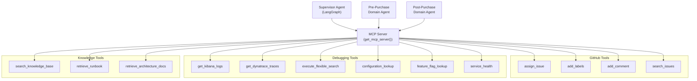
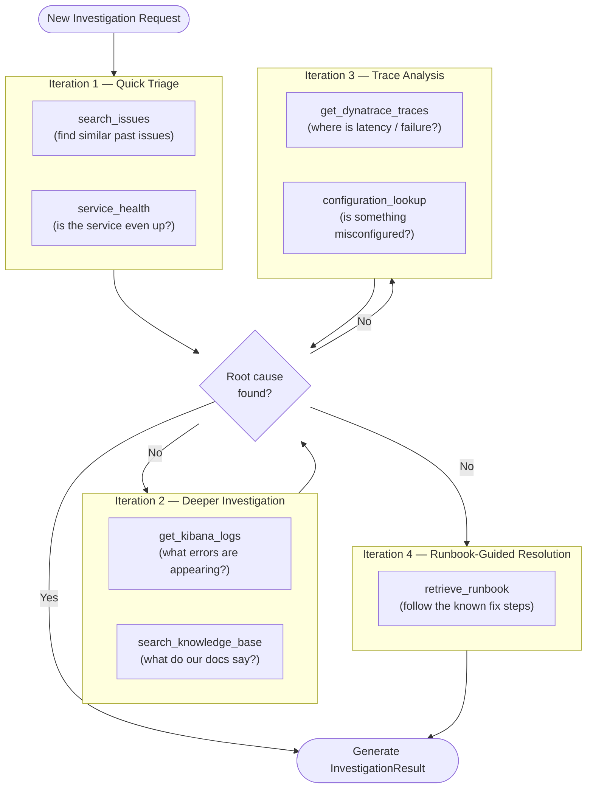
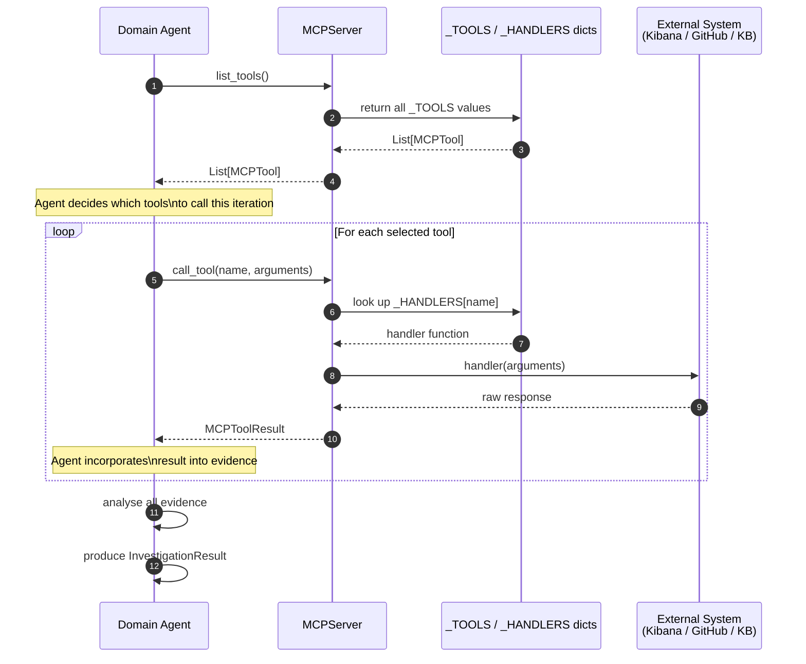
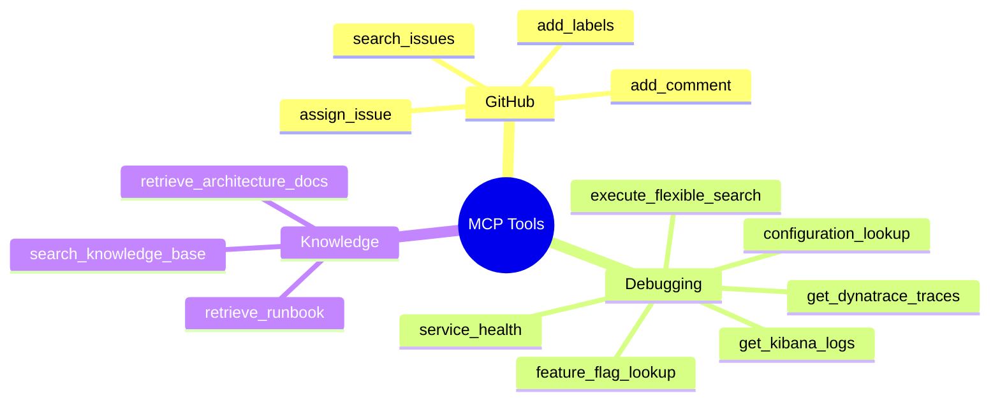

# MCP Server — Model Context Protocol

## Table of Contents

1. [What Is MCP?](#1-what-is-mcp)
2. [How MCP Fits Into AIIS](#2-how-mcp-fits-into-aiis)
3. [Core Data Models](#3-core-data-models)
4. [Tool Registration and the MCP Server](#4-tool-registration-and-the-mcp-server)
5. [Tool Catalogue](#5-tool-catalogue)
   - [GitHub Tools](#51-github-tools)
   - [Debugging Tools](#52-debugging-tools)
   - [Knowledge Tools](#53-knowledge-tools)
6. [How Domain Agents Select Tools](#6-how-domain-agents-select-tools)
7. [End-to-End Tool Call Flow](#7-end-to-end-tool-call-flow)
8. [Adding a New Tool](#8-adding-a-new-tool)
9. [Quick-Reference Summary](#9-quick-reference-summary)

---

## 1. What Is MCP?

**MCP (Model Context Protocol)** is a standard way for AI agents to call external tools — think of it as a **plugin system for large language models**.

Without MCP, an LLM is like a brilliant researcher locked in a room with no internet, no phone, and no filing cabinet. They can reason extremely well, but they cannot look anything up.

With MCP, the researcher gets a telephone directory of tools they are allowed to call:

- "Run this search query against Kibana."
- "Fetch the distributed trace for this service."
- "Look up this configuration key in production."
- "Search the knowledge base for runbooks about checkout failures."

The agent does not know *how* any of these tools work internally. It only knows:

1. The **name** of the tool.
2. What **arguments** the tool accepts (the input schema).
3. What kind of **result** the tool returns.

This keeps the agent and the tools cleanly separated. Swapping a mock Kibana tool for a real one is a one-file change with zero impact on agent logic.

### MCP vs. Direct API Calls

| Approach | Coupling | Testability | Discoverability |
|----------|----------|-------------|-----------------|
| Agent calls Kibana SDK directly | High — agent must know SDK details | Hard to mock | None — hardcoded |
| Agent calls via MCP | Low — agent only knows tool name + schema | Easy to mock | Tools are listed dynamically |

---

## 2. How MCP Fits Into AIIS



Every agent in AIIS goes through the same MCP Server. There is one central registry of tools, and all agents share it. This means:

- A new tool added to the MCP Server is instantly available to every agent.
- Agents do not need to be redeployed when tool implementations change.

---

## 3. Core Data Models

### `MCPTool`

An `MCPTool` is the **advertisement** of a tool — it describes what the tool is and what arguments it needs, without executing anything.

| Field | Type | Description |
|-------|------|-------------|
| `name` | `str` | Unique tool name (snake_case). This is what agents use to call the tool, e.g., `"get_kibana_logs"`. |
| `description` | `str` | Human (and LLM) readable explanation of what the tool does and when to use it. The LLM reads this to decide whether to call the tool. |
| `input_schema` | `dict` | A [JSON Schema](https://json-schema.org/) object describing the tool's arguments: which fields are required, their types, and what they mean. |

**Example — the `service_health` tool advertisement:**

```python
MCPTool(
    name="service_health",
    description=(
        "Checks whether a named service is currently healthy. "
        "Use this as the first step of any investigation to rule out "
        "outright service downtime before diving into logs."
    ),
    input_schema={
        "type": "object",
        "properties": {
            "service_name": {
                "type": "string",
                "description": "The name of the service to check, e.g. 'pricing-service'",
            }
        },
        "required": ["service_name"],
    },
)
```

### `MCPToolResult`

An `MCPToolResult` is what the tool sends back after being called.

| Field | Type | Description |
|-------|------|-------------|
| `content` | `List[dict]` | A list of content blocks. Each block is `{"type": "text", "text": "..."}`. Using a list allows a tool to return multiple chunks (e.g., a summary followed by raw log lines). |
| `is_error` | `bool` | If `True`, the tool call failed. The `content` will contain an error description rather than useful data. Agents should handle this gracefully. |

**Example tool result:**

```python
MCPToolResult(
    content=[
        {"type": "text", "text": "Service: pricing-service"},
        {"type": "text", "text": "Status: DEGRADED"},
        {"type": "text", "text": "Uptime: 99.1% (last 24h)"},
        {"type": "text", "text": "Last incident: 2 hours ago — high latency on /price endpoint"},
    ],
    is_error=False,
)
```

---

## 4. Tool Registration and the MCP Server

### How registration works

When the application starts, each tool file calls `register_tool(tool, handler)`:

```python
register_tool(
    MCPTool(name="service_health", description="...", input_schema={...}),
    handler=_handle_service_health,   # the async function that actually runs
)
```

Internally, `register_tool` adds the tool to two dictionaries:

| Dictionary | Key | Value |
|-----------|-----|-------|
| `_TOOLS` | `tool.name` | The `MCPTool` object (the advertisement) |
| `_HANDLERS` | `tool.name` | The async handler function (the implementation) |

### `MCPServer` class

The `MCPServer` class is the single front door through which all tool calls pass.

#### `list_tools() → List[MCPTool]`

Returns every registered tool advertisement. Agents call this at startup to discover what tools are available.

```python
server = get_mcp_server()
tools = server.list_tools()
for tool in tools:
    print(f"{tool.name}: {tool.description[:60]}...")
```

#### `call_tool(name, arguments) → MCPToolResult`

Looks up the handler for `name` in `_HANDLERS` and calls it with `arguments`. Returns an `MCPToolResult`.

If `name` is not found in `_HANDLERS`, it returns an `MCPToolResult` with `is_error=True` and an error message explaining which tool was not found.

```python
result = await server.call_tool(
    name="get_kibana_logs",
    arguments={
        "service": "pricing-service",
        "time_range_minutes": 60,
        "log_level": "ERROR",
    }
)

if result.is_error:
    print("Tool call failed:", result.content[0]["text"])
else:
    for block in result.content:
        print(block["text"])
```

### Singleton: `get_mcp_server()`

Just like the A2A components, the MCP Server is a singleton:

```python
from mcp_server.server import get_mcp_server

server = get_mcp_server()  # always returns the same instance
```

---

## 5. Tool Catalogue

AIIS has **13 tools** organised into three categories.

### 5.1 GitHub Tools

**File:** `src/mcp_server/tools/github_tools.py`

These tools interact with the GitHub API. They are used primarily at the start and end of an investigation — to gather context and to post results back.

| Tool | Arguments | What It Does |
|------|-----------|--------------|
| `assign_issue` | `issue_number: int`, `assignees: List[str]` | Assigns the GitHub issue to one or more team members. Used when the investigation identifies a clear owner. |
| `add_labels` | `issue_number: int`, `labels: List[str]` | Adds labels to a GitHub issue (e.g., `"pre-purchase"`, `"pricing"`, `"high-priority"`). Helps with filtering and triage. |
| `add_comment` | `issue_number: int`, `body: str` | Posts a comment on the issue. Used to publish the investigation summary and recommended actions directly on the issue thread. |
| `search_issues` | `query: str`, `repo: str` | Searches GitHub Issues for similar past issues. Returns issue titles, states, and links. Useful for finding previously resolved duplicates. |

**Example — searching for similar issues:**

```python
result = await server.call_tool(
    name="search_issues",
    arguments={
        "query": "pricing service returns zero price checkout",
        "repo": "my-org/commerce-platform",
    }
)
```

### 5.2 Debugging Tools

**File:** `src/mcp_server/tools/debugging_tools.py`

These tools connect to observability and configuration systems to gather technical evidence during an investigation.

| Tool | Arguments | What It Does |
|------|-----------|--------------|
| `get_kibana_logs` | `service: str`, `time_range_minutes: int`, `log_level: str` | Queries Kibana (Elasticsearch) for application logs from a named service. Returns log lines filtered by severity (e.g., `"ERROR"`, `"WARN"`). |
| `get_dynatrace_traces` | `service: str`, `issue_keywords: List[str]` | Fetches distributed traces from Dynatrace. Returns spans showing which services were called and how long each took. Excellent for diagnosing slow requests or cascading failures. |
| `execute_flexible_search` | `query: str`, `index: str`, `filters: dict` | Runs a flexible search query (SAP Commerce style) against a data index. Useful for inspecting product data, order records, or customer data. |
| `configuration_lookup` | `key: str`, `environment: str` | Looks up the value of a named configuration key in a given environment (e.g., `"pricing.cache.ttl"` in `"production"`). Critical for diagnosing misconfiguration bugs. |
| `feature_flag_lookup` | `flag_name: str`, `user_segment: str` | Checks whether a feature flag is enabled for a given user segment. Important when a bug only affects users in a specific experiment group. |
| `service_health` | `service_name: str` | Checks the current health status of a service. Returns uptime percentage, recent incidents, and status (HEALTHY / DEGRADED / DOWN). Always run this first to rule out complete outages. |

**Example — checking Kibana logs:**

```python
result = await server.call_tool(
    name="get_kibana_logs",
    arguments={
        "service": "pricing-service",
        "time_range_minutes": 30,
        "log_level": "ERROR",
    }
)
```

**Example — checking a feature flag:**

```python
result = await server.call_tool(
    name="feature_flag_lookup",
    arguments={
        "flag_name": "new_checkout_flow_v2",
        "user_segment": "beta_testers",
    }
)
```

### 5.3 Knowledge Tools

**File:** `src/mcp_server/tools/knowledge_tools.py`

These tools query the internal knowledge base — a collection of runbooks, architecture documents, and past incident reports stored as vector embeddings.

> **What is a vector embedding?** Each document is converted into a list of numbers that capture its meaning. When you search with a question, your question is also converted into numbers, and the system finds documents whose numbers are most similar. This is called **semantic search** or **RAG (Retrieval-Augmented Generation)** — it finds relevant content even if you use different words than the document does.

| Tool | Arguments | What It Does |
|------|-----------|--------------|
| `search_knowledge_base` | `query: str`, `domain: str`, `top_k: int` | Performs a semantic search over the entire knowledge base. Returns the `top_k` most relevant chunks (articles, runbook sections, incident reports). |
| `retrieve_runbook` | `runbook_name: str`, `domain: str` | Fetches a specific runbook by name. A runbook is a step-by-step guide for diagnosing and fixing a known category of issue (e.g., `"pricing-cache-flush-runbook"`). |
| `retrieve_architecture_docs` | `component: str`, `domain: str` | Fetches architecture documentation for a specific component (e.g., `"pricing-service"`). Helps the agent understand how the system is supposed to work before diagnosing why it is not. |

**Example — semantic knowledge base search:**

```python
result = await server.call_tool(
    name="search_knowledge_base",
    arguments={
        "query": "checkout price showing zero after deployment",
        "domain": "pre_purchase",
        "top_k": 5,
    }
)
```

---

## 6. How Domain Agents Select Tools

Domain agents do not call all 13 tools on every investigation. Instead, they follow an **iterative investigation strategy**: each iteration uses a different set of tools, progressing from quick triage to deep diagnosis to guided resolution.

This mirrors how an experienced human engineer would approach a bug report:

1. First, check if the service is even up and look for similar known issues.
2. Then pull logs and search the knowledge base for context.
3. Then look at distributed traces and configuration if the cause is still unclear.
4. Finally, pull the specific runbook for guided resolution steps.

### Tool Selection Per Iteration



### Iteration Detail Table

| Iteration | Tools Used | Goal | When It Stops Early |
|-----------|-----------|------|-------------------|
| 1 — Quick Triage | `search_issues`, `service_health` | Determine if this is a known issue or a complete outage | If service is DOWN or an exact duplicate is found |
| 2 — Deeper Investigation | `get_kibana_logs`, `search_knowledge_base` | Find error patterns in logs and relevant knowledge | If logs clearly point to root cause |
| 3 — Trace Analysis | `get_dynatrace_traces`, `configuration_lookup` | Trace the request path and check config values | If misconfiguration is confirmed |
| 4 — Runbook Resolution | `retrieve_runbook` | Follow a proven remediation procedure | Always the final iteration |

The agent evaluates evidence after each iteration. If confidence is high enough (typically above `0.85`), it stops early and produces a result rather than running all four iterations.

### Mapping to `InvestigationResult.iterations`

The `iterations` field on the result records how many loops the agent actually ran. A result with `iterations: 1` means the service-health check or the known-issue search was sufficient. A result with `iterations: 4` means the agent needed all available tools.

---

## 7. End-to-End Tool Call Flow



---

## 8. Adding a New Tool

Adding a new tool to AIIS takes three steps. No changes are required to any agent, the MCP Server class, or the A2A layer.

### Step 1 — Write the handler function

Create (or add to) a file in `src/mcp_server/tools/`. The handler is an `async` function that accepts a `dict` of arguments and returns an `MCPToolResult`.

```python
# src/mcp_server/tools/debugging_tools.py  (add to existing file)

from mcp_server.models import MCPToolResult

async def _handle_deployment_history(arguments: dict) -> MCPToolResult:
    service = arguments["service_name"]
    limit = arguments.get("limit", 10)

    # In production, this calls your real deployment API / CI system.
    # For the POC, this returns mock data.
    deployments = [
        {"version": "v2.3.1", "deployed_at": "2026-07-18T14:00:00Z", "deployer": "ci-bot"},
        {"version": "v2.3.0", "deployed_at": "2026-07-17T09:30:00Z", "deployer": "alice"},
    ][:limit]

    lines = [f"{d['deployed_at']}  {d['version']}  by {d['deployer']}" for d in deployments]
    return MCPToolResult(
        content=[
            {"type": "text", "text": f"Deployment history for {service}:"},
            {"type": "text", "text": "\n".join(lines)},
        ],
        is_error=False,
    )
```

### Step 2 — Register the tool

In the same file, call `register_tool` with an `MCPTool` advertisement and the handler:

```python
from mcp_server.server import register_tool
from mcp_server.models import MCPTool

register_tool(
    MCPTool(
        name="get_deployment_history",
        description=(
            "Returns the recent deployment history for a service. "
            "Use this when you suspect a regression introduced by a recent deploy. "
            "Returns version tags, timestamps, and who triggered each deployment."
        ),
        input_schema={
            "type": "object",
            "properties": {
                "service_name": {
                    "type": "string",
                    "description": "The service whose deployment history to retrieve.",
                },
                "limit": {
                    "type": "integer",
                    "description": "Maximum number of deployments to return. Default: 10.",
                    "default": 10,
                },
            },
            "required": ["service_name"],
        },
    ),
    handler=_handle_deployment_history,
)
```

### Step 3 — Ensure the module is imported at startup

The tool file must be imported before any agent starts. The simplest way is to add an import to the MCP Server's `__init__.py`:

```python
# src/mcp_server/__init__.py

from mcp_server.tools import github_tools      # noqa: F401
from mcp_server.tools import debugging_tools   # noqa: F401
from mcp_server.tools import knowledge_tools   # noqa: F401
# Add your new import here:
# from mcp_server.tools import my_new_tools    # noqa: F401
```

The `# noqa: F401` comment tells linters that the import is intentional even though the module name is not used directly — importing it triggers `register_tool()` as a side effect.

### Checklist for a new tool

- [ ] Handler function is `async def` and returns `MCPToolResult`.
- [ ] `MCPTool.description` clearly explains *when* an agent should call this tool (the LLM reads this to decide).
- [ ] All required `input_schema` fields have a `"description"` entry.
- [ ] The tool file is imported in `__init__.py`.
- [ ] Error cases return `MCPToolResult(content=[{"type": "text", "text": "...error..."}], is_error=True)`.

---

## 9. Quick-Reference Summary

### All 13 Tools at a Glance



### File Locations

| Category | File | Tools |
|----------|------|-------|
| GitHub | `src/mcp_server/tools/github_tools.py` | `assign_issue`, `add_labels`, `add_comment`, `search_issues` |
| Debugging | `src/mcp_server/tools/debugging_tools.py` | `get_kibana_logs`, `get_dynatrace_traces`, `execute_flexible_search`, `configuration_lookup`, `feature_flag_lookup`, `service_health` |
| Knowledge | `src/mcp_server/tools/knowledge_tools.py` | `search_knowledge_base`, `retrieve_runbook`, `retrieve_architecture_docs` |

### Key Classes and Functions

| Name | Location | Purpose |
|------|----------|---------|
| `MCPTool` | `src/mcp_server/models.py` | Describes a tool (name, description, schema) |
| `MCPToolResult` | `src/mcp_server/models.py` | Wraps tool output (content blocks, error flag) |
| `register_tool(tool, handler)` | `src/mcp_server/server.py` | Adds a tool to the global registry |
| `MCPServer` | `src/mcp_server/server.py` | Exposes `list_tools()` and `call_tool()` |
| `get_mcp_server()` | `src/mcp_server/server.py` | Returns the singleton MCP Server instance |

### Golden Rules

1. **Agents never call external systems directly.** All external calls go through `MCPServer.call_tool()`.
2. **Tool descriptions matter.** The LLM agent reads the `description` field to decide whether to call a tool. Write it like documentation for a colleague, not a computer.
3. **Always handle `is_error=True`.** A tool that fails should not crash the investigation; agents should log the failure and continue with whatever evidence they have.
4. **Registration is automatic.** Import the tool file at startup and `register_tool()` takes care of the rest.
