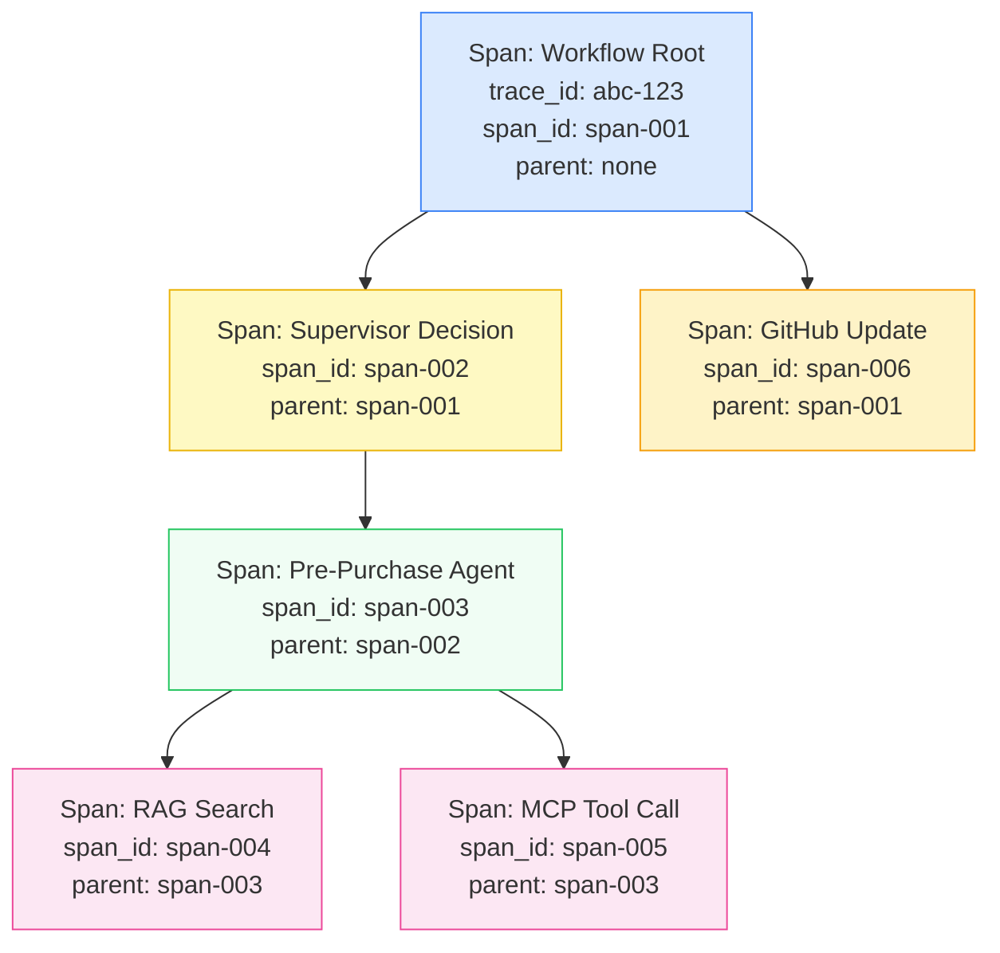
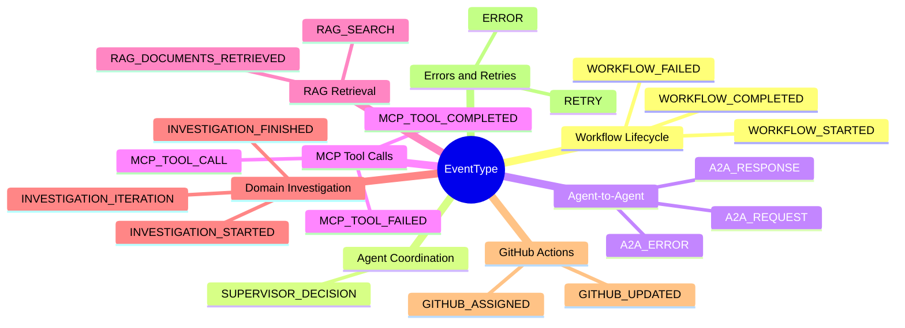
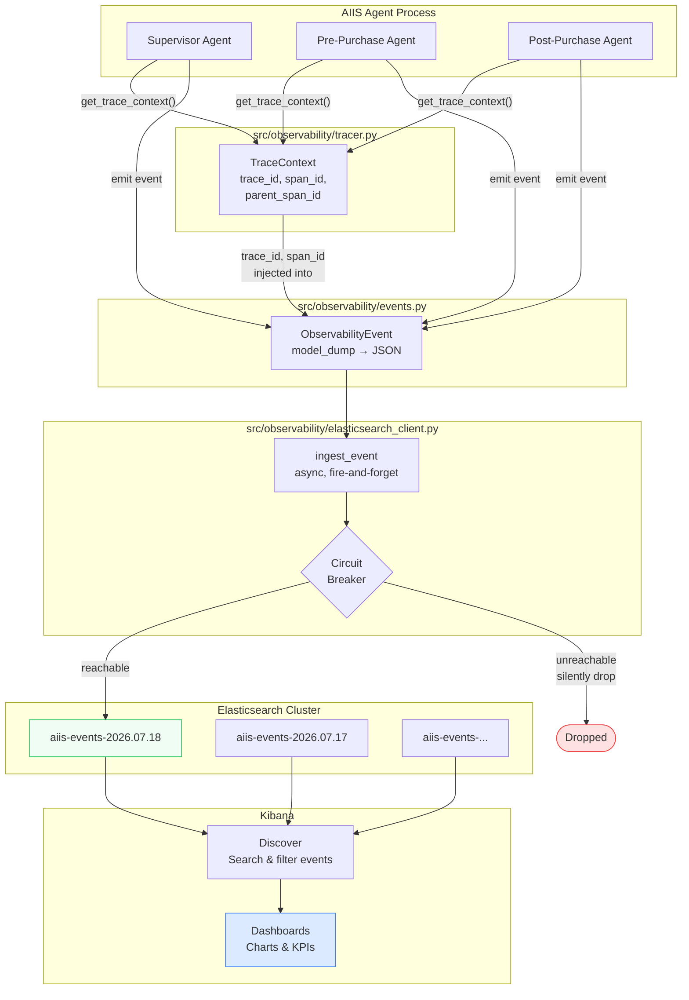
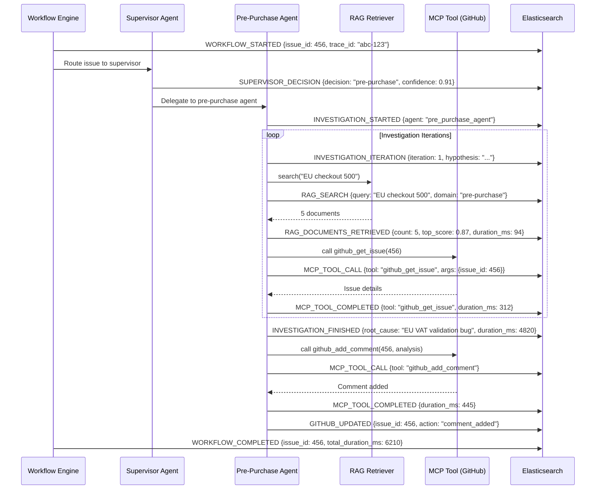
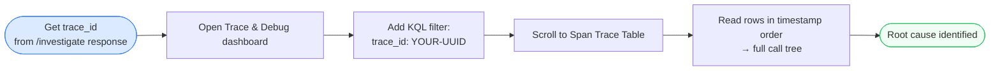
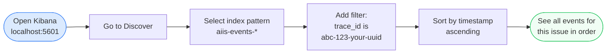

# Observability — Tracing, Events, and Dashboards

> **Audience:** Engineers new to distributed tracing, Elasticsearch, and Kibana. No prior observability tooling knowledge assumed.

---

## Table of Contents

1. [What is Observability and Why Does it Matter for AI Agents?](#1-what-is-observability-and-why-does-it-matter-for-ai-agents)
2. [The Three Pillars of Observability](#2-the-three-pillars-of-observability)
3. [Distributed Tracing — Following a Request Through the System](#3-distributed-tracing--following-a-request-through-the-system)
   - [TraceContext](#31-tracecontext)
   - [Spans and Parent-Child Relationships](#32-spans-and-parent-child-relationships)
   - [ContextVar — Passing Context Without Threading Headaches](#33-contextvar--passing-context-without-threading-headaches)
   - [Helper Functions](#34-helper-functions)
4. [Events — What Actually Gets Recorded](#4-events--what-actually-gets-recorded)
   - [Event Types Reference](#41-event-types-reference)
   - [ObservabilityEvent Model](#42-observabilityevent-model)
5. [Elasticsearch — Where Events Live](#5-elasticsearch--where-events-live)
   - [Index Naming Strategy](#51-index-naming-strategy)
   - [Field Mappings](#52-field-mappings)
   - [The Circuit Breaker](#53-the-circuit-breaker)
   - [Fire-and-Forget Ingestion](#54-fire-and-forget-ingestion)
6. [Observability Flow Diagram](#6-observability-flow-diagram)
7. [A Typical Workflow — Event Timeline](#7-a-typical-workflow--event-timeline)
8. [Kibana Dashboards](#8-kibana-dashboards)
   - [Setup](#81-setup)
   - [Viewing a Trace in Kibana Discover](#82-viewing-a-trace-in-kibana-discover)
9. [Configuration Reference](#9-configuration-reference)
10. [Troubleshooting](#10-troubleshooting)

---

## 1. What is Observability and Why Does it Matter for AI Agents?

### The Basic Idea

When something goes wrong in a traditional web application, you look at server logs or a dashboard and usually pinpoint the problem quickly. But **multi-agent AI systems** are much harder to debug:

- Multiple agents run concurrently and independently
- Each agent makes external calls (to GitHub, to an LLM, to tools)
- A single user request might trigger dozens of internal operations
- Failures can be silent (an agent returns a degraded result without crashing)

**Observability** is the engineering discipline that gives you visibility into what a system is actually doing, based on the data it produces. If a system is *observable*, you can answer questions like:

- Which agent handled GitHub issue #456?
- How long did the RAG search take?
- Did the MCP tool call fail? Why?
- What was the supervisor's routing decision?
- How many retries happened before success?

### AIIS Without Observability

Imagine debugging this scenario without observability:

> "The triage for issue #456 posted a wrong label to GitHub. Something went wrong."

Without traces, you have no idea which agent decided on the label, what context it had, or whether it failed and retried. With AIIS's observability stack, you can filter by the issue's `trace_id` in Kibana and see every event in chronological order.

---

## 2. The Three Pillars of Observability

Observability is traditionally built on three types of telemetry:

| Pillar | What it is | AIIS Implementation |
|---|---|---|
| **Logs** | Free-text messages about what happened | Python `logging` module (console output) |
| **Metrics** | Numeric measurements over time (counts, durations, rates) | `duration_ms` field on every event; aggregatable in Kibana |
| **Traces** | A tree of operations representing a single end-to-end request | `TraceContext` with `trace_id`, `span_id`, `parent_span_id` |

AIIS combines all three into a single structured **event** that is shipped to Elasticsearch. Each event has log-like message fields, metric-like `duration_ms`, and trace-like `trace_id`/`span_id` identifiers. This means a single query in Kibana can answer all three types of questions at once.

---

## 3. Distributed Tracing — Following a Request Through the System

**Source file:** `src/observability/tracer.py`

### 3.1 TraceContext

`TraceContext` is a small data object that holds the current position in a distributed trace. Every operation in AIIS runs within a `TraceContext`:

```python
@dataclass
class TraceContext:
    trace_id: str          # UUID — same for the entire workflow (one per GitHub issue)
    workflow_id: str       # UUID — same as trace_id in practice; reserved for future use
    span_id: str           # UUID — unique to this specific operation
    parent_span_id: str | None  # UUID of the operation that started this one (None for root)
```

All four values are UUID strings, generated automatically if not provided.

### 3.2 Spans and Parent-Child Relationships

A **span** represents one unit of work — for example, a single MCP tool call or a single RAG search. Spans are arranged in a tree using `parent_span_id`.



Every span in this tree shares the same `trace_id` (`abc-123`). In Kibana, filtering by `trace_id: "abc-123"` returns all events for the entire workflow.

To create a child span from the current context:

```python
parent_ctx = get_trace_context()
child_ctx = parent_ctx.child_span()
# child_ctx.trace_id  == parent_ctx.trace_id   (same trace)
# child_ctx.span_id   == new UUID              (new span)
# child_ctx.parent_span_id == parent_ctx.span_id
```

### 3.3 ContextVar — Passing Context Without Threading Headaches

AIIS is an async Python application (using `asyncio`). Traditional approaches like global variables or function parameters break down in async code because multiple coroutines run concurrently.

Python's `ContextVar` solves this:

```python
_current_trace: ContextVar[TraceContext | None] = ContextVar("_current_trace", default=None)
```

A `ContextVar` is like a variable that automatically has a **separate value for each concurrent async task**, similar to how thread-local storage works for threads. When an async task reads `_current_trace`, it gets the value that was set in its own context, not a value set by another concurrently running task.

Think of it as a sticky note attached to each coroutine's "thread of execution" — other coroutines cannot see or modify your sticky note.

### 3.4 Helper Functions

| Function | What it does |
|---|---|
| `new_trace_context(workflow_id)` | Creates a brand-new root trace (call this at the start of each GitHub issue workflow) |
| `get_trace_context()` | Returns the current trace context; creates a new one if none exists (safe to call anywhere) |
| `set_trace_context(ctx)` | Explicitly sets the current context (used when passing context across task boundaries) |

---

## 4. Events — What Actually Gets Recorded

**Source file:** `src/observability/events.py`

### 4.1 Event Types Reference

AIIS defines 19 event types that together tell the complete story of a workflow:



**What each group represents:**

| Group | Events | Purpose |
|---|---|---|
| Workflow Lifecycle | WORKFLOW_STARTED, WORKFLOW_COMPLETED, WORKFLOW_FAILED | Bookend the entire issue triage workflow |
| Agent Coordination | SUPERVISOR_DECISION | Records which domain the supervisor routed the issue to and why |
| Agent-to-Agent (A2A) | A2A_REQUEST/RESPONSE/ERROR | Tracks calls between agents in the multi-agent graph |
| MCP Tool Calls | MCP_TOOL_CALL/COMPLETED/FAILED | Records every call to an external tool (GitHub API, search, etc.) |
| RAG Retrieval | RAG_SEARCH, RAG_DOCUMENTS_RETRIEVED | Records what was searched and what was found |
| Domain Investigation | INVESTIGATION_STARTED/ITERATION/FINISHED | Tracks the agent's reasoning loop |
| GitHub Actions | GITHUB_UPDATED, GITHUB_ASSIGNED | Records changes made back to the GitHub issue |
| Errors and Retries | ERROR, RETRY | Captures failures and automatic retry attempts |

### 4.2 ObservabilityEvent Model

Every event stored in Elasticsearch has this structure:

```python
class ObservabilityEvent(BaseModel):
    timestamp: datetime          # When the event occurred (UTC)
    trace_id: str                # Links all events in one workflow
    span_id: str                 # Unique to this event/operation
    parent_span_id: str | None   # Parent span, if any
    workflow_id: str             # Same as trace_id for this workflow
    issue_id: int | None         # GitHub issue number
    agent: str                   # Which agent emitted this event
    event_type: EventType        # One of the 19 types above
    status: str                  # "SUCCESS", "FAILURE", etc.
    duration_ms: int | None      # How long the operation took (milliseconds)
    message: str                 # Human-readable description
    metadata: dict[str, Any]     # Any extra key-value data
    error_details: str | None    # Stack trace or error message on failure
```

**Example event document in Elasticsearch:**

```json
{
  "timestamp": "2024-11-15T14:32:07.451Z",
  "trace_id": "a1b2c3d4-e5f6-7890-abcd-ef1234567890",
  "span_id": "f0e1d2c3-b4a5-6789-0abc-def012345678",
  "parent_span_id": "11223344-5566-7788-99aa-bbccddeeff00",
  "workflow_id": "a1b2c3d4-e5f6-7890-abcd-ef1234567890",
  "issue_id": 456,
  "agent": "pre_purchase_agent",
  "event_type": "RAG_DOCUMENTS_RETRIEVED",
  "status": "SUCCESS",
  "duration_ms": 87,
  "message": "Retrieved 5 documents for query 'EU checkout 500 error'",
  "metadata": {
    "query": "EU checkout 500 error",
    "top_k": 5,
    "documents_found": 5,
    "top_score": 0.87
  },
  "error_details": null
}
```

---

## 5. Elasticsearch — Where Events Live

**Source file:** `src/observability/elasticsearch_client.py`

Elasticsearch is a distributed search and analytics engine. AIIS uses it as the storage layer for all observability events. Events flow in from the agents and can be searched and visualized in Kibana.

### 5.1 Index Naming Strategy

AIIS writes to **daily rolling indices** with the pattern `aiis-events-YYYY.MM.DD`:

| Date | Index name |
|---|---|
| November 15, 2024 | `aiis-events-2024.11.15` |
| November 16, 2024 | `aiis-events-2024.11.16` |
| July 18, 2026 | `aiis-events-2026.07.18` |

**Why daily indices?**

- Makes it easy to delete old data (delete the index, not individual documents)
- Kibana can query a range of dates by querying multiple indices via the `aiis-events-*` wildcard pattern
- Keeps individual indices from growing too large

### 5.2 Field Mappings

The `ensure_index_template()` function creates an Elasticsearch index template that pre-defines how each field is stored. Without a template, Elasticsearch guesses field types and can make poor choices (e.g., treating a UUID string as full-text when it should be a keyword for exact matching).

| Field | Elasticsearch Type | Why this type |
|---|---|---|
| `timestamp` | `date` | Enables time-range queries and sorting by time |
| `trace_id` | `keyword` | Exact-match search — you search for an exact UUID |
| `span_id` | `keyword` | Same as trace_id |
| `parent_span_id` | `keyword` | Same |
| `workflow_id` | `keyword` | Same |
| `issue_id` | `integer` | Numeric filtering (`issue_id: 456`) |
| `agent` | `keyword` | Exact-match on agent name |
| `event_type` | `keyword` | Exact-match on event type enum value |
| `status` | `keyword` | Exact-match on "SUCCESS" / "FAILURE" |
| `duration_ms` | `integer` | Numeric aggregation (avg, max, histogram) |
| `message` | `text` | Full-text search across message content |
| `error_details` | `text` | Full-text search through error messages |
| `metadata` | `object` (dynamic) | Flexible — new keys are indexed automatically |

**`keyword` vs `text`:** `keyword` stores the string exactly as-is and supports sorting/aggregation. `text` tokenizes the string for full-text search. Use `keyword` for IDs and categorical values; use `text` for human-readable messages.

### 5.3 The Circuit Breaker

AIIS agents must never hang waiting for Elasticsearch. If Elasticsearch is down or slow, the agents must continue working normally and simply drop observability events.

The circuit breaker uses a module-level boolean `_es_reachable`:

```
_es_reachable = None   →  Unknown — try connecting on next call
_es_reachable = True   →  Elasticsearch is up — proceed normally
_es_reachable = False  →  Elasticsearch is down — skip all future calls silently
```

The client is configured to fail fast:
- `max_retries=0` — no automatic retries
- `request_timeout=2` — give up after 2 seconds

When an ingestion call fails, `_es_reachable` is set to `False` and all subsequent calls short-circuit immediately, adding essentially zero overhead to agent operations.

### 5.4 Fire-and-Forget Ingestion

The `ingest_event()` function is `async` but agents do not `await` its result in a way that blocks the main workflow. Any exception inside `ingest_event()` is caught and logged at `DEBUG` level — never re-raised. This design ensures that an Elasticsearch outage cannot cause an agent to crash or slow down.


---

## 6. Observability Flow Diagram

This diagram shows the full path from agent code emitting an event to a developer viewing it in Kibana.



---

## 7. A Typical Workflow — Event Timeline

When GitHub issue #456 arrives, the following events are emitted in sequence. All share the same `trace_id`.



This sequence produces approximately 12–20 events in Elasticsearch for a single issue, all linked by `trace_id: "abc-123"`.

---

## 8. Kibana Dashboards

### 8.1 Setup

Dashboards are created via the Kibana REST API using a Python script:

```
kibana/
└── setup.sh                                  # Calls the Python creator script
scripts/
└── create_kibana_dashboards.py               # Creates all visualizations and dashboards
```

**First-time setup:**

```bash
# Make sure Elasticsearch and Kibana are running, then:
bash kibana/setup.sh

# Or run the Python script directly:
uv run python scripts/create_kibana_dashboards.py
```

The script creates a Kibana data view (`aiis-events-*`) and two complete dashboards containing **32 panels** total — no manual import required.

### 8.2 Available Dashboards

#### AIIS — Issue Status
`http://localhost:5601/app/dashboards#/view/aiis-issue-status-dashboard`

Shows the health and outcome of every investigation workflow.

| Panel | What it shows |
|---|---|
| Total Workflows | Count of `WORKFLOW_STARTED` events |
| Completed | Count of `WORKFLOW_COMPLETED` events |
| Failed | Count of `WORKFLOW_FAILED` events (0 = healthy) |
| Pre-Purchase Issues | Issues routed to the pre-purchase agent |
| Post-Purchase Issues | Issues routed to the post-purchase agent |
| MCP Tool Calls | Total tool invocations across all agents |
| Issues by Domain | Donut chart: pre-purchase vs post-purchase split |
| Workflow Status | Donut chart: SUCCESS / FAILURE distribution |
| Workflows Over Time | Area chart of `WORKFLOW_STARTED` events over the selected time range |
| Events Per Agent/Team | Horizontal bar chart showing event volume per agent |
| Events Per Status | Horizontal bar of event status distribution |
| Investigation Duration | Histogram of `duration_ms` for `INVESTIGATION_FINISHED` events |
| Issue Summary Table | Per-issue × agent × status breakdown with event counts |

**Tip:** Click any pie slice or bar segment to add a KQL filter that propagates to all panels on the dashboard.

#### AIIS — Trace & Debug
`http://localhost:5601/app/dashboards#/view/aiis-trace-debug-dashboard`

Full observability into the internal mechanics of every request.

| Panel | What it shows |
|---|---|
| Total Events | All events in the selected time range |
| MCP Tool Calls | Count of `MCP_TOOL_CALL` events |
| A2A Messages | Count of `A2A_REQUEST + A2A_RESPONSE` events |
| RAG Searches | Count of `RAG_SEARCH` events |
| Error Events | Count where `status: ERROR` |
| Workflows | Count of `WORKFLOW_STARTED` events |
| Event Timeline | Full-width stacked area chart — all 19 event types as colour-coded series |
| Events by Agent | Horizontal bar of event volume per agent |
| Event Type Distribution | Donut of all 19 event types |
| Avg Duration by Event Type | Horizontal bar of average `duration_ms` grouped by event type |
| Agent Activity Over Time | Stacked area chart split by agent — see who is active when |
| Investigation Phase Events | Donut of `INVESTIGATION_STARTED/ITERATION/FINISHED` events |
| MCP Tool Events by Status | Bar chart of MCP events grouped by status |
| A2A Message Types | Donut of `A2A_REQUEST/RESPONSE/ERROR` events |
| RAG Activity Over Time | Area chart of RAG search activity |
| Span Trace Table | `trace_id × span_id × agent × event_type × status` — for reconstructing call trees |
| Issue × Workflow × Agent | Per-issue workflow ID mapping with event type breakdown |

**How to trace a single request end-to-end:**



### 8.3 Viewing a Trace in Kibana Discover

To follow a specific GitHub issue through the system:



**Step-by-step:**

1. Open Kibana at `http://localhost:5601`
2. Click **Discover** in the left sidebar
3. In the index pattern dropdown (top left), select **aiis-events-\***
4. Set the time range to cover when the issue was processed
5. In the search bar, type: `trace_id: "your-trace-id-here"`
6. Click **Add filter** → field: `trace_id` → operator: `is` → value: the UUID
7. Sort the table by `timestamp` ascending to see events in order

**Useful Kibana queries:**

| Goal | Query |
|---|---|
| All events for one workflow | `trace_id: "abc-123-..."` |
| All failures in the last hour | `status: "FAILURE"` |
| All events for a GitHub issue | `issue_id: 456` |
| All events from one agent | `agent: "pre_purchase_agent"` |
| Slow MCP tool calls (>1s) | `event_type: "MCP_TOOL_COMPLETED" AND duration_ms: >1000` |
| All RAG searches | `event_type: "RAG_SEARCH"` |
| Elasticsearch unreachable — nothing to query! Check logs instead. | N/A |

**Columns to add in Discover for maximum clarity:**

- `timestamp` (always present)
- `agent`
- `event_type`
- `status`
- `duration_ms`
- `message`

---

## 9. Configuration Reference

| Environment Variable | Default | Description |
|---|---|---|
| `ELASTICSEARCH_URL` | `http://localhost:9200` | Full URL of the Elasticsearch cluster |

**Example `.env`:**

```bash
ELASTICSEARCH_URL=http://localhost:9200
```

For production or cloud-hosted Elasticsearch (Elastic Cloud, AWS OpenSearch):

```bash
ELASTICSEARCH_URL=https://your-cluster.es.io:443
```

If the `elasticsearch` Python package is not installed, the client silently does nothing — Elasticsearch is fully optional.

---

## 10. Troubleshooting

### "ES unavailable; event dropped" in logs

Elasticsearch is not running or not reachable at `ELASTICSEARCH_URL`. The system will continue working normally — events are just not stored.

Check:
```bash
curl http://localhost:9200/_cluster/health
```

If that fails, start Elasticsearch or update `ELASTICSEARCH_URL`.

### Events are not appearing in Kibana

1. **Check the index pattern.** Make sure Kibana has an index pattern for `aiis-events-*`. If not, create one in **Stack Management → Index Patterns**.
2. **Check the time range.** Kibana defaults to "Last 15 minutes". Widen the time range if processing happened earlier.
3. **Check the circuit breaker.** If Elasticsearch was unavailable when events were emitted, they are permanently dropped (no buffering). Restart the AIIS process after Elasticsearch is confirmed healthy.

### Index template was not created

Run `ensure_index_template()` manually or via `bash kibana/setup.sh`. Without the template, Elasticsearch auto-maps fields, which may cause issues with keyword vs text types in queries.

### `trace_id` filter returns no results

- Confirm you are using the exact UUID (copy-paste from logs, not from memory)
- Confirm the correct index pattern is selected in Kibana (`aiis-events-*`, not a specific daily index)
- Confirm the time range includes the day the issue was processed

### How to get the `trace_id` for an issue

The `trace_id` for a workflow is logged at the `INFO` level when the workflow starts:

```
INFO  workflow:start trace_id=abc-123-... issue_id=456
```

Search your application logs (stdout or log files) for the issue number to find the corresponding `trace_id`.
