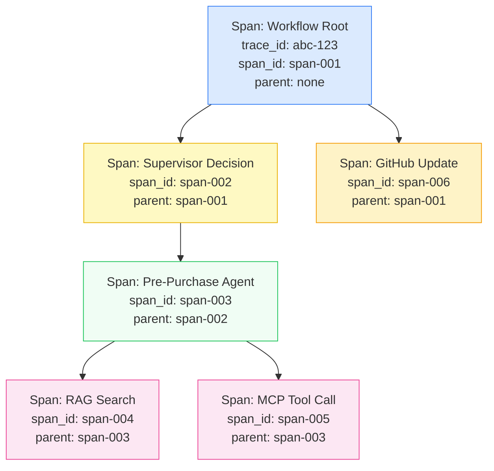
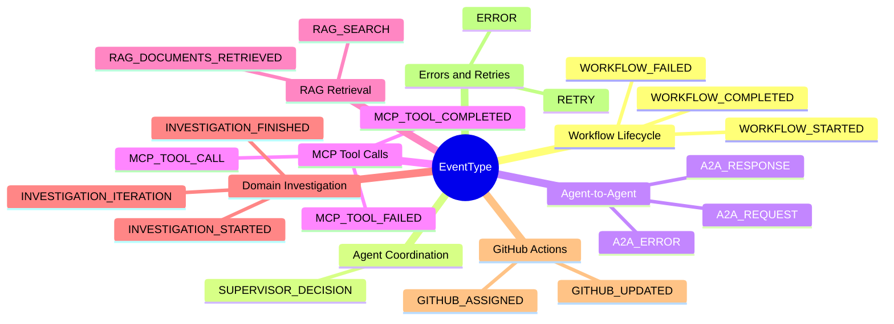
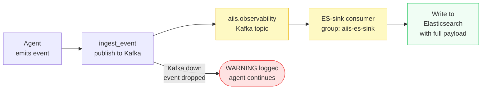
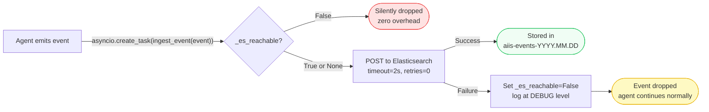
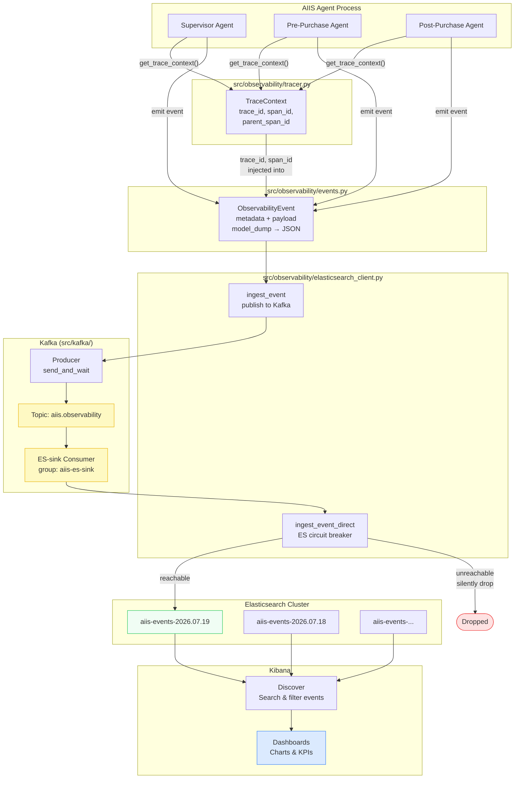
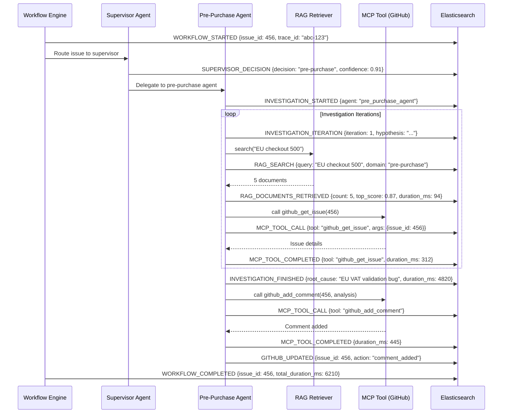

# Observability — Tracing, Events, and Dashboards

> **Audience:** Engineers new to distributed tracing, Elasticsearch, and Kibana. No prior observability tooling knowledge assumed.

---

## Table of Contents

1. [Distributed Tracing — Following a Request Through the System](#1-distributed-tracing--following-a-request-through-the-system)
   - [TraceContext](#11-tracecontext)
   - [Spans and Parent-Child Relationships](#12-spans-and-parent-child-relationships)
   - [ContextVar](#13-contextvar)
   - [Helper Functions](#14-helper-functions)
2. [Events — What Actually Gets Recorded](#2-events--what-actually-gets-recorded)
   - [Event Types Reference](#21-event-types-reference)
   - [ObservabilityEvent Model](#22-observabilityevent-model)
3. [Kafka Event Bus + Elasticsearch Storage](#3-kafka-event-bus--elasticsearch-storage)
   - [Index Naming Strategy](#31-index-naming-strategy)
   - [Field Mappings](#32-field-mappings)
   - [The Circuit Breaker](#33-the-circuit-breaker)
   - [Fire-and-Forget Ingestion](#34-fire-and-forget-ingestion)
4. [Observability Flow Diagram](#4-observability-flow-diagram)
5. [A Typical Workflow — Event Timeline](#5-a-typical-workflow--event-timeline)
6. [Kibana Dashboards](#6-kibana-dashboards)
   - [Setup](#61-setup)
   - [Available Dashboards](#62-available-dashboards) — Issue Status, Trace & Debug, A2A Payloads, MCP Payloads, RAG Payloads
   - [Viewing a Trace in Kibana Discover](#63-viewing-a-trace-in-kibana-discover)
7. [Configuration Reference](#7-configuration-reference)
8. [Troubleshooting](#8-troubleshooting)

---

## 1. Distributed Tracing — Following a Request Through the System

**Source file:** `src/observability/tracer.py`

### 1.1 TraceContext

`TraceContext` is a small data object that holds the current position in a distributed trace. Every operation in AIIS runs within a `TraceContext`:

```python
@dataclass
class TraceContext:
    trace_id: str          # UUID — same for the entire workflow (one per GitHub issue)
    workflow_id: str       # UUID — same as trace_id in practice; reserved for future use
    span_id: str           # UUID — unique to this specific operation
    parent_span_id: str | None  # UUID of the operation that started this one (None for root)
```

All four values are UUID strings, generated automatically if not provided.

### 1.2 Spans and Parent-Child Relationships

A **span** represents one unit of work — for example, a single MCP tool call or a single RAG search. Spans are arranged in a tree using `parent_span_id`.



Every span in this tree shares the same `trace_id` (`abc-123`). In Kibana, filtering by `trace_id: "abc-123"` returns all events for the entire workflow.

To create a child span from the current context:

```python
parent_ctx = get_trace_context()
child_ctx = parent_ctx.child_span()
# child_ctx.trace_id  == parent_ctx.trace_id   (same trace)
# child_ctx.span_id   == new UUID              (new span)
# child_ctx.parent_span_id == parent_ctx.span_id
```

### 1.3 ContextVar

```python
_current_trace: ContextVar[TraceContext | None] = ContextVar("_current_trace", default=None)
```

### 1.4 Helper Functions

| Function | What it does |
|---|---|
| `new_trace_context(workflow_id)` | Creates a brand-new root trace (call this at the start of each GitHub issue workflow) |
| `get_trace_context()` | Returns the current trace context; creates a new one if none exists (safe to call anywhere) |
| `set_trace_context(ctx)` | Explicitly sets the current context (used when passing context across task boundaries) |

---

## 2. Events — What Actually Gets Recorded

**Source file:** `src/observability/events.py`

### 2.1 Event Types Reference

AIIS defines 19 event types that together tell the complete story of a workflow:



**What each group represents:**

| Group | Events | Purpose |
|---|---|---|
| Workflow Lifecycle | WORKFLOW_STARTED, WORKFLOW_COMPLETED, WORKFLOW_FAILED | Bookend the entire issue triage workflow |
| Agent Coordination | SUPERVISOR_DECISION | Records which domain the supervisor routed the issue to and why |
| Agent-to-Agent (A2A) | A2A_REQUEST/RESPONSE/ERROR | Tracks calls between agents in the multi-agent graph |
| MCP Tool Calls | MCP_TOOL_CALL/COMPLETED/FAILED | Records every call to an external tool (GitHub API, search, etc.) |
| RAG Retrieval | RAG_SEARCH, RAG_DOCUMENTS_RETRIEVED | Records what was searched and what was found |
| Domain Investigation | INVESTIGATION_STARTED/ITERATION/FINISHED | Tracks the agent's reasoning loop |
| GitHub Actions | GITHUB_UPDATED, GITHUB_ASSIGNED | Records changes made back to the GitHub issue |
| Errors and Retries | ERROR, RETRY | Captures failures and automatic retry attempts |

### 2.2 ObservabilityEvent Model

Every event stored in Elasticsearch has this structure:

```python
class ObservabilityEvent(BaseModel):
    timestamp: datetime              # When the event occurred (UTC)
    trace_id: str                    # Links all events in one workflow
    span_id: str                     # Unique to this event/operation
    parent_span_id: str | None       # Parent span, if any
    workflow_id: str                 # Same as trace_id for this workflow
    issue_id: int | None             # GitHub issue number
    agent: str                       # Which agent emitted this event
    event_type: EventType            # One of the 19 types above
    status: str                      # "SUCCESS", "FAILURE", etc.
    duration_ms: int | None          # How long the operation took (milliseconds)
    message: str                     # Human-readable description
    metadata: dict[str, Any]         # Summary key-value data (always populated)
    payload: dict[str, Any] | None   # Complete request/response body (see below)
    error_details: str | None        # Stack trace or error message on failure
```

#### The `payload` Field

The `payload` field carries the **complete request and response body** for each communication event. Unlike `metadata` (which contains a brief summary), `payload` contains every field of the original message with no truncation.

| `event_type` | `payload` contents |
|---|---|
| `A2A_REQUEST` | Full `InvestigationRequest` — `trace_id`, `workflow_id`, `issue_id`, `title`, `description`, `labels`, `assigned_domain`, `timestamp` |
| `A2A_RESPONSE` | Full `InvestigationResult` — `status`, `confidence`, `summary`, `root_cause`, `recommended_actions`, `investigation_steps`, `evidence`, `knowledge_retrieved`, `iterations`, `duration_ms` |
| `SUPERVISOR_DECISION` | `domain`, `routing_reason`, `confidence`, `suggested_labels`, `assignees`, `llm_result` (raw LLM JSON or `null`) |
| `MCP_TOOL_CALL` | `tool`, `arguments` (exact dict passed to the tool) |
| `MCP_TOOL_COMPLETED` / `MCP_TOOL_FAILED` | `tool`, `arguments`, `duration_ms`, `is_error`, `response` (full tool result content) |
| `RAG_SEARCH` | `query`, `domain`, `top_k` |
| `RAG_DOCUMENTS_RETRIEVED` | `query`, `domain`, `doc_count`, `documents` (list with `source`, `filename`, full `content`, `relevance_score` for every retrieved doc) |

**Example `A2A_RESPONSE` event in Elasticsearch:**

```json
{
  "timestamp": "2024-11-15T14:32:07.451Z",
  "trace_id": "a1b2c3d4-e5f6-7890-abcd-ef1234567890",
  "span_id": "f0e1d2c3-b4a5-6789-0abc-def012345678",
  "workflow_id": "a1b2c3d4-e5f6-7890-abcd-ef1234567890",
  "issue_id": 456,
  "agent": "supervisor",
  "event_type": "A2A_RESPONSE",
  "status": "RECEIVED",
  "duration_ms": 4820,
  "message": "Investigation result received: status=completed, confidence=0.91",
  "metadata": {"status": "completed", "confidence": 0.91},
  "payload": {
    "trace_id": "a1b2c3d4-...",
    "workflow_id": "a1b2c3d4-...",
    "issue_id": 456,
    "status": "completed",
    "confidence": 0.91,
    "summary": "The EU checkout 500 error is caused by a VAT validation bug...",
    "root_cause": "The `calculate_vat()` function does not handle IE country codes...",
    "recommended_actions": ["Apply hotfix for VAT calculation", "Deploy to staging", "..."],
    "investigation_steps": ["Iteration 1: gathering evidence", "RAG: retrieved 3 docs..."],
    "evidence": [{"source": "RAG:checkout-runbook.md", "content": "...", "relevance_score": 0.89}],
    "knowledge_retrieved": ["checkout-runbook.md", "vat-handling.md"],
    "iterations": 2,
    "duration_ms": 4820
  },
  "error_details": null
}
```

---

## 3. Kafka Event Bus + Elasticsearch Storage

**Source files:** `src/kafka/`, `src/observability/elasticsearch_client.py`

### Architecture Overview

AIIS uses **Kafka as the mandatory event bus** and **Elasticsearch as the storage layer**. Every call to `ingest_event()` publishes to the Kafka topic `aiis.observability`. The built-in Kafka ES-sink consumer (consumer group `aiis-es-sink`) reads that topic and writes every event to Elasticsearch with the complete `payload` field. There is no direct agent→ES fallback path — Kafka must be running.



### Kafka Topic

| Topic | Producer | Consumer group | Purpose |
|---|---|---|---|
| `aiis.observability` | All agents via `ingest_event()` | `aiis-es-sink` | Streams every observability event to Elasticsearch |

### Kafka Module (`src/kafka/`)

| File | Purpose |
|---|---|
| `topics.py` | Topic name constants |
| `producer.py` | Singleton async producer — lazy-connects, silent on failure |
| `consumer.py` | ES-sink consumer — reads `aiis.observability`, writes to ES |

The producer uses `send_and_wait()` for at-least-once delivery. If Kafka is unreachable or slow, the producer logs a warning and `ingest_event()` falls back to direct ES ingestion automatically — agents are never blocked by Kafka unavailability.

---

## 3a. Elasticsearch — Where Events Live

**Source file:** `src/observability/elasticsearch_client.py`

Elasticsearch is a distributed search and analytics engine. AIIS uses it as the storage layer for all observability events. Events flow in from the Kafka ES-sink consumer (or directly when Kafka is not configured) and can be searched and visualized in Kibana.

### 3.1 Index Naming Strategy

AIIS writes to **daily rolling indices** with the pattern `aiis-events-YYYY.MM.DD`:

| Date | Index name |
|---|---|
| November 15, 2024 | `aiis-events-2024.11.15` |
| November 16, 2024 | `aiis-events-2024.11.16` |
| July 18, 2026 | `aiis-events-2026.07.18` |

**Why daily indices?**

- Makes it easy to delete old data (delete the index, not individual documents)
- Kibana can query a range of dates by querying multiple indices via the `aiis-events-*` wildcard pattern
- Keeps individual indices from growing too large

### 3.2 Field Mappings

The `ensure_index_template()` function creates an Elasticsearch index template that pre-defines how each field is stored. Without a template, Elasticsearch guesses field types and can make poor choices (e.g., treating a UUID string as full-text when it should be a keyword for exact matching).

| Field | Elasticsearch Type |
|---|---|
| `timestamp` | `date` |
| `trace_id` | `keyword` |
| `span_id` | `keyword` |
| `parent_span_id` | `keyword` |
| `workflow_id` | `keyword` |
| `issue_id` | `integer` |
| `agent` | `keyword` |
| `event_type` | `keyword` |
| `status` | `keyword` |
| `duration_ms` | `integer` |
| `message` | `text` |
| `error_details` | `text` |
| `metadata` | `object` (dynamic) |
| `payload` | `object` (dynamic) |

### 3.3 The Circuit Breaker

AIIS agents must never hang waiting for Elasticsearch. If Elasticsearch is down or slow, the agents must continue working normally and simply drop observability events.

The circuit breaker uses a module-level boolean `_es_reachable`:

```
_es_reachable = None   →  Unknown — try connecting on next call
_es_reachable = True   →  Elasticsearch is up — proceed normally
_es_reachable = False  →  Elasticsearch is down — skip all future calls silently
```

The client is configured to fail fast:
- `max_retries=0` — no automatic retries
- `request_timeout=2` — give up after 2 seconds

When an ingestion call fails, `_es_reachable` is set to `False` and all subsequent calls short-circuit immediately, adding essentially zero overhead to agent operations.

### 3.4 Fire-and-Forget Ingestion

The `ingest_event()` function is `async` but agents do not `await` its result in a way that blocks the main workflow. Any exception inside `ingest_event()` is caught and logged at `DEBUG` level — never re-raised. This design ensures that an Elasticsearch outage cannot cause an agent to crash or slow down.



---

## 4. Observability Flow Diagram

This diagram shows the full path from agent code emitting an event to a developer viewing it in Kibana.



---

## 5. A Typical Workflow — Event Timeline

When GitHub issue #456 arrives, the following events are emitted in sequence. All share the same `trace_id`.



This sequence produces approximately 12–20 events in Elasticsearch for a single issue, all linked by `trace_id: "abc-123"`.

---

## 6. Kibana Dashboards

### 6.1 Setup

Dashboards are created via the Kibana REST API using a Python script:

```
kibana/
└── setup.sh                                  # Calls the Python creator script
scripts/
└── create_kibana_dashboards.py               # Creates all visualizations and dashboards
```

**First-time setup:**

```bash
# Make sure Elasticsearch and Kibana are running, then:
bash kibana/setup.sh

# Or run the Python script directly:
uv run python scripts/create_kibana_dashboards.py
```

The script creates a Kibana data view (`aiis-events-*`) and **5 dashboards** — no manual import required.

### 6.2 Available Dashboards

#### AIIS — Issue Status
`http://localhost:5601/app/dashboards#/view/aiis-issue-status-dashboard`

Workflow health and outcomes: total/completed/failed counts, domain split, duration histogram, per-issue resolution table.

#### AIIS — Trace & Debug
`http://localhost:5601/app/dashboards#/view/aiis-trace-debug-dashboard`

Full internal observability: event timeline, span trace table (`trace_id × span_id × agent × event_type`), agent activity, duration by event type. Use this to follow any single request end-to-end.

#### AIIS — A2A & Supervisor Payloads
`http://localhost:5601/app/dashboards#/view/aiis-a2a-payload-dashboard`

Shows the **complete payload** for every supervisor decision and A2A message.

| Panel | What it shows |
|---|---|
| Domain Routing pie | Classified domain distribution from `SUPERVISOR_DECISION` events |
| Supervisor Decisions table | `payload.domain`, `payload.confidence`, `payload.routing_reason`, `payload.llm_result.reasoning` — full LLM reasoning text |
| A2A Requests table | `payload.assigned_domain`, `payload.title`, `payload.description` — the issue sent to the domain agent |
| A2A Responses table | `payload.status`, `payload.confidence`, `payload.summary`, `payload.root_cause` — the full investigation result |

**Tip:** Expand any table row to see the complete raw document, including `payload.recommended_actions`, `payload.evidence`, and `payload.investigation_steps`.

#### AIIS — MCP Tool Payloads
`http://localhost:5601/app/dashboards#/view/aiis-mcp-payload-dashboard`

Shows the **complete payload** for every MCP tool invocation.

| Panel | What it shows |
|---|---|
| Tool Call Frequency bar | Which tools are called most often |
| Avg Duration by Tool bar | Latency profile per tool |
| MCP Tool Calls table | `payload.tool`, `payload.duration_ms`, `payload.is_error`, `payload.response.text` — full tool response |

**Tip:** Expand any row to see `payload.arguments` (exact input parameters) and the complete tool response.

#### AIIS — RAG Retrieval Payloads
`http://localhost:5601/app/dashboards#/view/aiis-rag-payload-dashboard`

Shows the **complete payload** for every RAG search and document retrieval.

| Panel | What it shows |
|---|---|
| RAG Searches by Agent bar | Which agents are searching and how often |
| RAG Searches by Domain pie | Domain distribution of knowledge base queries |
| RAG Search Queries table | `payload.query`, `payload.domain`, `payload.top_k` — the exact query sent |
| RAG Documents Retrieved table | `payload.query`, `payload.doc_count`, `payload.documents.source`, `payload.documents.content` |

**Tip:** Expand any retrieval row to see the full document list with source paths, content excerpts, and relevance scores.

**How to trace a single request end-to-end:**


### 6.3 Viewing a Trace in Kibana Discover

**Useful Kibana queries:**

| Goal | Query |
|---|---|
| All events for one workflow | `trace_id: "abc-123-..."` |
| All failures in the last hour | `status: "FAILURE"` |
| All events for a GitHub issue | `issue_id: 456` |
| All events from one agent | `agent: "pre_purchase_agent"` |
| Slow MCP tool calls (>1s) | `event_type: "MCP_TOOL_COMPLETED" AND duration_ms: >1000` |
| All RAG searches | `event_type: "RAG_SEARCH"` |
| Elasticsearch unreachable — nothing to query! Check logs instead. | N/A |

**Columns to add in Discover for maximum clarity:**

- `timestamp` (always present)
- `agent`
- `event_type`
- `status`
- `duration_ms`
- `message`

---

## 7. Configuration Reference

| Environment Variable | Default | Description |
|---|---|---|
| `ELASTICSEARCH_URL` | `http://localhost:9200` | Full URL of the Elasticsearch cluster (written to by the ES-sink consumer) |
| `KAFKA_BOOTSTRAP_SERVERS` | _(none)_ | **Required.** Kafka broker(s). Kafka must be running before the server starts |

**Local development (server on host, Kafka in Docker):**

```bash
ELASTICSEARCH_URL=http://localhost:9200
KAFKA_BOOTSTRAP_SERVERS=localhost:9092
```

**Docker Compose (all containers):**

```bash
ELASTICSEARCH_URL=http://elasticsearch:9200
KAFKA_BOOTSTRAP_SERVERS=kafka:9092
```

**Production / cloud:**

```bash
ELASTICSEARCH_URL=https://your-cluster.es.io:443
KAFKA_BOOTSTRAP_SERVERS=kafka-broker-1:9092,kafka-broker-2:9092
```

If Kafka is unreachable, `ingest_event()` logs a WARNING and drops the event — the agent continues normally but observability is lost for that event. There is no fallback to direct ES. Start Kafka before starting the AIIS server.

---

## 8. Troubleshooting

### "ES unavailable; event dropped" in logs

Elasticsearch is not running or not reachable at `ELASTICSEARCH_URL`. The system will continue working normally — events are just not stored.

Check:
```bash
curl http://localhost:9200/_cluster/health
```

If that fails, start Elasticsearch or update `ELASTICSEARCH_URL`.

### Events are not appearing in Kibana

1. **Check the index pattern.** Make sure Kibana has an index pattern for `aiis-events-*`. If not, create one in **Stack Management → Index Patterns**.
2. **Check the time range.** Kibana defaults to "Last 15 minutes". Widen the time range if processing happened earlier.
3. **Check the circuit breaker.** If Elasticsearch was unavailable when events were emitted, they are permanently dropped (no buffering). Restart the AIIS process after Elasticsearch is confirmed healthy.

### Index template was not created

Run `ensure_index_template()` manually or via `bash kibana/setup.sh`. Without the template, Elasticsearch auto-maps fields, which may cause issues with keyword vs text types in queries.

### `trace_id` filter returns no results

- Confirm you are using the exact UUID (copy-paste from logs, not from memory)
- Confirm the correct index pattern is selected in Kibana (`aiis-events-*`, not a specific daily index)
- Confirm the time range includes the day the issue was processed

### How to get the `trace_id` for an issue

The `trace_id` for a workflow is logged at the `INFO` level when the workflow starts:

```
INFO  workflow:start trace_id=abc-123-... issue_id=456
```

Search your application logs (stdout or log files) for the issue number to find the corresponding `trace_id`.
