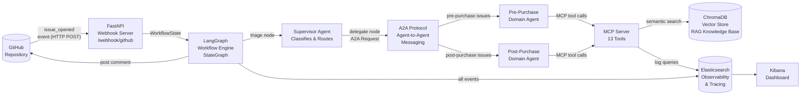
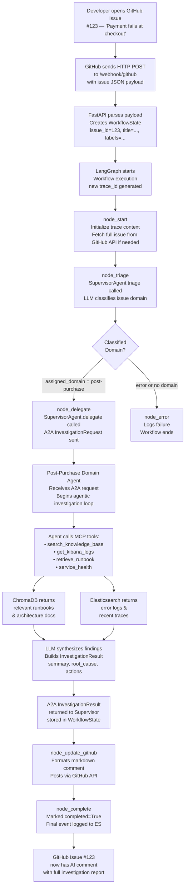
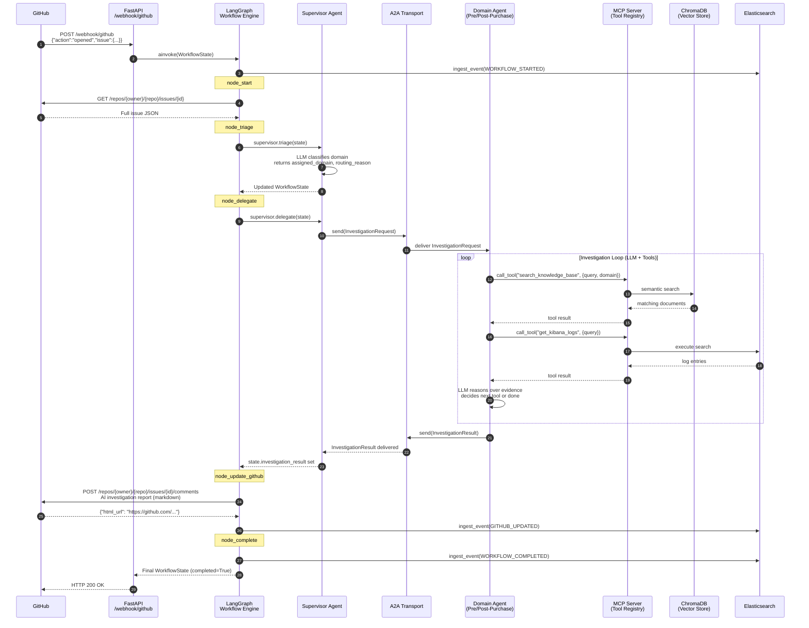
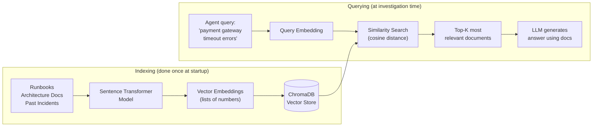

# AIIS System Architecture Overview

**Agentic Issue Investigation System**

---

## Table of Contents

1. [What is AIIS?](#what-is-aiis)
2. [High-Level System Diagram](#high-level-system-diagram)
3. [Technology Stack](#technology-stack)
4. [End-to-End Data Flow](#end-to-end-data-flow)
5. [Component Interaction (Sequence Diagram)](#component-interaction-sequence-diagram)
6. [Key Concepts for Beginners](#key-concepts-for-beginners)

---

## What is AIIS?

AIIS (Agentic Issue Investigation System) is an automated GitHub issue triage platform powered by AI agents. When a new issue is opened on GitHub, AIIS automatically:

1. **Receives** the GitHub event (webhook).
2. **Classifies** the issue into a domain (Pre-Purchase vs. Post-Purchase) using an AI Supervisor Agent.
3. **Delegates** the investigation to a specialized Domain Agent.
4. **Researches** the issue using a knowledge base (past runbooks, architecture docs, etc.).
5. **Posts** a detailed AI-generated investigation report as a GitHub comment — including root cause analysis, recommended actions, and referenced documents.

This removes hours of manual triage work from engineering and support teams. Every step is traced and stored in Elasticsearch so you can observe exactly what the AI did and why.

### Why "Agentic"?

Traditional automation runs fixed scripts. **Agentic AI** means the system uses AI reasoning to make decisions at each step — the agents decide which tools to call, what to look up, and how to structure their findings. The workflow is not a rigid pipeline; it is a graph of nodes that agents traverse based on the state of the data.

---

## High-Level System Diagram

The diagram below shows how all major components connect. Data flows from left (GitHub) to right (GitHub comment posted back).

---

## Technology Stack

Each technology was chosen deliberately. The table below explains what each one does and the reason it was selected for this project.

| Technology | What It Does | Why It Was Chosen |
|---|---|---|
| **Python 3.12** | Programming language for all backend code | Latest stable Python; best ecosystem for AI/ML libraries |
| **uv** | Ultra-fast Python package manager and virtualenv tool | Replaces pip + venv with a single, much faster tool; handles lockfiles reliably |
| **FastAPI** | Async web framework that receives GitHub webhooks | High-performance, auto-generates API docs, native async support for handling many events concurrently |
| **LangGraph** | Orchestrates the multi-step AI workflow as a directed graph | Provides stateful, resumable agent workflows with clear node/edge structure; integrates natively with LangChain |
| **Anthropic Claude** | Large Language Model (LLM) — the AI brain | State-of-the-art reasoning; used for triage classification and investigation |
| **Ollama / llama3.1:8b** | Local open-source LLM alternative | Auto-selected when `ANTHROPIC_API_KEY` is absent; enables offline/cost-free development |
| **A2A Protocol** | Agent-to-Agent messaging contract | Defines a typed, versioned message schema so agents communicate without tight coupling; in-memory transport for this POC |
| **MCP Server** | Custom tool registry exposing 13 tools to agents | Model Context Protocol standardizes how LLMs call external tools; centralizes tool definitions |
| **ChromaDB** | Embedded vector database for knowledge storage | Zero-infrastructure setup; stores document embeddings for semantic (meaning-based) search |
| **Sentence Transformers** | Converts text into vector embeddings | Open-source, runs locally, produces high-quality embeddings for RAG retrieval |
| **Elasticsearch 8.15** | Stores all observability events and trace data | Industry-standard distributed search and analytics engine; enables full-text log queries |
| **Kibana** | Web UI for exploring Elasticsearch data | Built-in dashboards, time-series charts, and trace visualization |
| **Docker Compose** | Runs all services locally with one command | Eliminates manual setup of Elasticsearch, Kibana, and ChromaDB; mirrors production topology |
| **Pydantic v2** | Data validation and typed models | All state objects (WorkflowState, A2A messages) are validated at runtime; prevents silent data corruption |

---

## End-to-End Data Flow

This section traces what happens to a single GitHub issue from the moment it is opened until the AI comment appears.

### Step-by-Step Walkthrough

### What is in the GitHub Comment?

The final GitHub comment produced by `node_update_github` contains:

- **Assigned Domain** — Pre-Purchase or Post-Purchase
- **Routing Reason** — Why the LLM chose that domain
- **Confidence Score** — How certain the AI is (0%–100%)
- **Summary** — A plain-English summary of the issue
- **Root Cause Analysis** — The AI's hypothesis about what went wrong
- **Investigation Steps** — The sequence of tools called and what they returned
- **Knowledge Base Documents Referenced** — Which runbooks or docs were consulted
- **Evidence Gathered** — Excerpts from logs or knowledge base with relevance scores
- **Recommended Next Steps** — Actionable checklist for the engineering team

---

## Component Interaction (Sequence Diagram)

This sequence diagram shows the exact order of calls between components for a successful investigation.

---

## Key Concepts for Beginners

This section explains the core technologies and ideas used in AIIS. If you are new to any of these terms, read this section before diving into the code.

---

### What is "Agentic AI"?

Traditional software follows a fixed script: "if condition A, do B; if condition C, do D." The logic is fully determined by the programmer in advance.

**Agentic AI** works differently. The AI agent:

1. Receives a goal (e.g., "investigate this GitHub issue").
2. Reasons about what information it needs.
3. Chooses which tools to call (e.g., search knowledge base, query logs).
4. Observes the results.
5. Reasons again — did I get enough information? Do I need to call another tool?
6. Repeats until it can produce a final answer.

The programmer defines the **available tools** and the **starting goal**, but the **sequence of actions** is determined by the AI at runtime. This makes agents much more flexible than fixed scripts, but also requires careful design to keep them on track.

---

### What is LangGraph?

LangGraph is a Python library (built on top of LangChain) for building **stateful, multi-actor AI applications as directed graphs**.

Think of it like a flowchart where:

- **Nodes** are functions that do work (call an LLM, fetch data, post a comment).
- **Edges** are the paths between nodes — fixed edges always go to the same next node, while **conditional edges** choose the next node based on the current state.
- **State** is a Python object (in our case, `WorkflowState`) that is passed through every node and updated along the way.
- **END** is a special terminal node — when a node routes to END, the workflow finishes.

LangGraph's big advantage over a simple function call chain is that it handles:

- **Checkpointing** — saving state between steps so workflows can be paused and resumed.
- **Branching** — routing to different nodes based on conditions (e.g., success vs. error).
- **Streaming** — emitting intermediate results as they happen.

In AIIS, LangGraph runs the 6-node workflow from `node_start` to `node_complete` (or `node_error`).

---

### What is the A2A Protocol?

**A2A (Agent-to-Agent)** is a communication protocol for AI agents to send typed messages to each other.

In AIIS, the Supervisor Agent does not directly call the Domain Agent's Python functions. Instead it:

1. Constructs an `InvestigationRequest` message (a Pydantic model with all issue details).
2. Sends it via the A2A transport layer.
3. The Domain Agent receives the message, processes it, and returns an `InvestigationResult` message.

Why this indirection? Because A2A decouples the agents. In this POC the transport is **in-memory** (fast, no network), but the same message contracts could be used over HTTP, gRPC, or a message queue in production — without changing any agent code.

The key A2A message types are:

| Message | Direction | Contains |
|---|---|---|
| `InvestigationRequest` | Supervisor → Domain Agent | issue_id, title, description, labels, assigned_domain |
| `InvestigationResult` | Domain Agent → Supervisor | summary, root_cause, confidence, evidence, recommended_actions |
| `A2AError` | Either direction | error_code, error_message |

---

### What is MCP?

**MCP (Model Context Protocol)** is a standard for exposing tools to AI agents. Think of it as a **USB standard for AI tools** — the agent speaks one protocol, and any tool that implements MCP works with any MCP-compatible agent.

In AIIS, the MCP Server registers **13 tools** that domain agents can call:

**GitHub Tools** (4 tools)

| Tool | Purpose |
|---|---|
| `assign_issue` | Assign a GitHub issue to team members |
| `add_labels` | Add classification labels to an issue |
| `add_comment` | Post a comment on an issue |
| `search_issues` | Search GitHub issues by query |

**Debugging Tools** (6 tools)

| Tool | Purpose |
|---|---|
| `get_kibana_logs` | Query Elasticsearch for application logs |
| `get_dynatrace_traces` | Query distributed traces |
| `execute_flexible_search` | Run a raw Elasticsearch query |
| `configuration_lookup` | Look up service configuration values |
| `feature_flag_lookup` | Check feature flag states |
| `service_health` | Check health status of a service |

**Knowledge Tools** (3 tools)

| Tool | Purpose |
|---|---|
| `search_knowledge_base` | Semantic search over RAG knowledge base |
| `retrieve_runbook` | Fetch a specific runbook by name |
| `retrieve_architecture_docs` | Fetch architecture docs for a component |

---

### What is RAG?

**RAG (Retrieval-Augmented Generation)** is a technique that gives an LLM access to a private knowledge base that it was not trained on.

Without RAG, an LLM only knows what was in its training data. With RAG:

1. Your documents (runbooks, architecture diagrams, past incident reports) are split into chunks and converted into **vector embeddings** — lists of numbers that encode the meaning of the text.
2. These embeddings are stored in a **vector database** (ChromaDB in AIIS).
3. At query time, the agent's question is also converted into an embedding.
4. The vector database finds the stored chunks whose embeddings are **closest in meaning** to the query (semantic search — not keyword matching).
5. The top matching chunks are returned to the LLM as context, alongside the original question.
6. The LLM generates an answer grounded in your private documents.

In AIIS, domain agents use RAG via the `search_knowledge_base` MCP tool to look up runbooks, architecture docs, and past solutions relevant to the issue being investigated.

---

*This document is part of the AIIS project documentation. For workflow-specific details, see [LangGraph Workflow](langgraph-workflow.md).*
