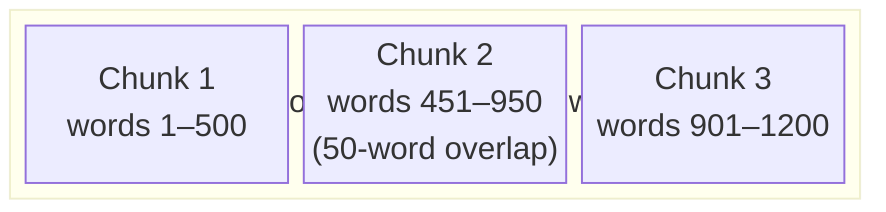
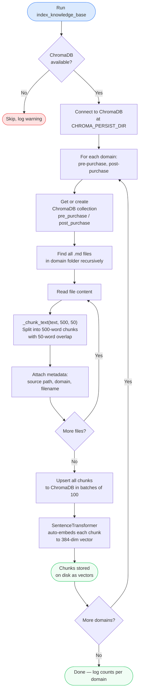
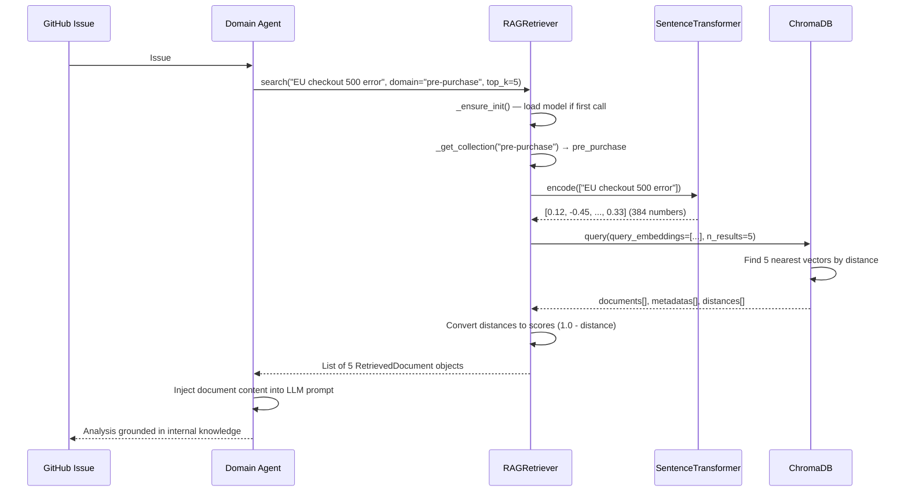

# RAG System — Retrieval-Augmented Generation

> **Audience:** Engineers new to RAG, vector databases, and semantic search. No prior machine learning knowledge assumed.

---

## Table of Contents

1. [What is RAG and Why Does AIIS Need It?](#1-what-is-rag-and-why-does-aiis-need-it)
2. [How RAG Works — The Big Picture](#2-how-rag-works--the-big-picture)
3. [Core Components](#3-core-components)
   - [Sentence Transformers — Turning Text into Numbers](#31-sentence-transformers--turning-text-into-numbers)
   - [ChromaDB — The Vector Database](#32-chromadb--the-vector-database)
   - [EmbeddingFunction — The Bridge](#33-embeddingfunction--the-bridge)
4. [The Knowledge Base](#4-the-knowledge-base)
5. [The Indexer — Building the Database](#5-the-indexer--building-the-database)
   - [How Text Gets Chunked](#51-how-text-gets-chunked)
   - [What Gets Stored](#52-what-gets-stored)
   - [Indexing Pipeline Diagram](#53-indexing-pipeline-diagram)
6. [The Retriever — Searching at Runtime](#6-the-retriever--searching-at-runtime)
   - [RetrievedDocument](#61-retrieveddocument)
   - [Search Flow](#62-search-flow)
   - [Fallback Behaviour](#63-fallback-behaviour)
   - [Singleton Pattern](#64-singleton-pattern)
7. [End-to-End Query Flow](#7-end-to-end-query-flow)
8. [Configuration Reference](#8-configuration-reference)
9. [Adding New Knowledge](#9-adding-new-knowledge)
10. [Troubleshooting](#10-troubleshooting)

---

## 1. What is RAG and Why Does AIIS Need It?

### The Problem with LLMs Alone

Large language models like Claude are trained on huge amounts of public text up to a fixed date. They know a lot about the world in general — but they know **nothing** about:

- Your company's internal runbooks
- Past GitHub issues your team has resolved
- Your specific microservice architecture
- Current on-call procedures

If you ask a plain LLM "how do we fix a pricing-engine cache miss?", it can only guess. It has never seen your system.

### What RAG Solves

**RAG (Retrieval-Augmented Generation)** fixes this by adding a retrieval step before the LLM generates its answer:

1. **Retrieve**: Search your private knowledge base for documents relevant to the current question.
2. **Augment**: Inject those documents into the LLM's prompt as additional context.
3. **Generate**: The LLM now answers using both its training knowledge *and* your domain-specific documents.

Think of it like giving an expert consultant a stack of your internal wikis to read before they diagnose a problem, instead of expecting them to already know everything about your systems.

### Why AIIS Uses RAG

When a GitHub issue arrives describing a bug (e.g., "checkout is failing for users in the EU"), the domain agents need to:

- Find similar past incidents and their resolutions
- Look up relevant troubleshooting guides
- Reference architecture docs for that service
- Check runbooks for operational procedures

RAG makes all of this possible without ever hardcoding knowledge into the agent code itself.

---

## 2. How RAG Works — The Big Picture


The key insight is that **similarity search operates in vector space**. Two pieces of text are "similar" if their vectors point in roughly the same direction, even if they share no exact words. For example, "payment gateway timeout" and "checkout service not responding" are semantically close, so ChromaDB will find both when searching for one.

---

## 3. Core Components

### 3.1 Sentence Transformers — Turning Text into Numbers

**Model used:** `all-MiniLM-L6-v2`

Computers cannot directly compare sentences. To make text searchable by meaning, we convert it to a **vector** — an array of numbers that encodes semantic meaning.

The `all-MiniLM-L6-v2` model is a small, fast transformer model that:

- Takes any text string as input (a sentence, a paragraph, a document chunk)
- Outputs a fixed-length array of **384 floating-point numbers**
- Produces vectors so that **semantically similar texts produce numerically similar vectors**

```
"search results not loading"  →  [0.12, -0.45, 0.87, ..., 0.33]   # 384 numbers
"product search is broken"    →  [0.14, -0.41, 0.91, ..., 0.31]   # very similar!
"order was delivered late"    →  [-0.72, 0.88, -0.11, ..., 0.55]  # very different
```

**Why this model?** It is lightweight (only 22 MB), runs fast on CPU, and produces high-quality embeddings for English text. It is a great default for most retrieval use cases.

**Environment variable:** Set `EMBED_MODEL` to use a different model. Default: `all-MiniLM-L6-v2`.

### 3.2 ChromaDB — The Vector Database

ChromaDB is an open-source database designed specifically for storing and searching vectors. Unlike a regular database (which searches by exact text matching), ChromaDB searches by **geometric distance** between vectors.

Key ChromaDB concepts used in AIIS:

| Concept | Description |
|---|---|
| **Collection** | A named group of documents, like a table in SQL. AIIS has two: `pre_purchase` and `post_purchase`. |
| **Embedding** | The numeric vector representation of a document chunk. |
| **Distance** | How far apart two vectors are. Smaller distance = more similar text. |
| **Upsert** | Insert-or-update. Safe to re-run indexing without creating duplicates. |
| **Persistent client** | Data is saved to disk at `CHROMA_PERSIST_DIR` so it survives restarts. |

ChromaDB stores data on disk at `./data/chroma` by default. Override with the `CHROMA_PERSIST_DIR` environment variable.

### 3.3 EmbeddingFunction — The Bridge

ChromaDB needs to know *how* to turn text into vectors. You teach it by providing a subclass of `chromadb.EmbeddingFunction`.

```python
# src/rag/indexer.py
from chromadb import EmbeddingFunction, Documents, Embeddings

class EmbeddingFn(EmbeddingFunction):
    def __call__(self, input: Documents) -> Embeddings:
        return model.encode(list(input)).tolist()
```

The `__call__` method receives a list of text strings (`Documents`) and must return a list of vectors (`Embeddings`). AIIS uses the SentenceTransformer model to do this conversion.

This class is registered with the ChromaDB collection at creation time, so ChromaDB automatically embeds documents when you add them and queries when you search.

---

## 4. The Knowledge Base

The knowledge base is a folder of plain Markdown files organized by domain. AIIS divides issues into two domains:

| Domain | Description | ChromaDB Collection |
|---|---|---|
| `pre-purchase` | Issues that happen before an order is placed: search, product display, cart, checkout | `pre_purchase` |
| `post-purchase` | Issues that happen after an order is placed: fulfillment, shipping, returns, refunds | `post_purchase` |

**Note:** Folder names use hyphens (`pre-purchase`) but ChromaDB collection names use underscores (`pre_purchase`). The indexer handles this conversion automatically.

### Folder Structure

```
knowledge-base/
├── pre-purchase/
│   ├── troubleshooting-guides/
│   │   ├── search-issues.md
│   │   └── cart-checkout-issues.md
│   ├── runbooks/
│   │   └── pricing-engine-runbook.md
│   ├── previous-issues/
│   │   └── issue-142-search-outage.md
│   └── architecture/
│       └── pdp-architecture.md
└── post-purchase/
    ├── troubleshooting-guides/
    │   ├── order-issues.md
    │   └── returns-refunds.md
    ├── runbooks/
    │   └── fulfillment-runbook.md
    ├── previous-issues/
    │   └── issue-289-shipping-delay.md
    └── architecture/
        └── order-lifecycle.md
```

### Subdirectory Types

| Subdirectory | Purpose | Example content |
|---|---|---|
| `troubleshooting-guides/` | Step-by-step guides for known problem patterns | "If search returns zero results, check Elasticsearch cluster health" |
| `runbooks/` | Operational procedures for specific services | "To restart the pricing engine: ssh to pricing-host, run systemctl restart..." |
| `previous-issues/` | Historical incidents and their resolutions | "Issue #142: Search outage caused by index corruption, resolved by..." |
| `architecture/` | How services are designed and how they interact | "The PDP service fetches pricing from the pricing-engine via gRPC on port 8080" |

---

## 5. The Indexer — Building the Database

**Source file:** `src/rag/indexer.py`

The indexer is a one-time (or periodic) process that reads all Markdown files from the knowledge base and stores them in ChromaDB. You run it whenever you add or update knowledge documents.

### 5.1 How Text Gets Chunked

Documents can be thousands of words long. If you store an entire document as a single vector, it loses fine-grained detail (the vector captures the average meaning rather than any specific section).

Instead, `_chunk_text()` splits each document into **overlapping word-level chunks**:

```python
def _chunk_text(text: str, chunk_size: int = 500, overlap: int = 50) -> list[str]:
    words = text.split()
    chunks = []
    start = 0
    while start < len(words):
        end = start + chunk_size
        chunks.append(" ".join(words[start:end]))
        start = end - overlap   # move forward by (chunk_size - overlap)
    return chunks
```

**Parameters:**
- `chunk_size=500`: Each chunk contains up to 500 words (~375 tokens, well within model limits).
- `overlap=50`: The last 50 words of one chunk are repeated at the start of the next. This ensures that a sentence split across a boundary is still fully represented in at least one chunk.



### 5.2 What Gets Stored

For each chunk, three things are stored in ChromaDB:

| Field | Type | Example |
|---|---|---|
| `document` | The chunk text itself | "If search returns zero results, check ES..." |
| `id` | Unique ID for upsert deduplication | `pre-purchase-42` |
| `metadata.source` | File path relative to knowledge-base root | `pre-purchase/runbooks/pricing-engine-runbook.md` |
| `metadata.domain` | The top-level domain | `pre-purchase` |
| `metadata.filename` | The file's base name | `pricing-engine-runbook.md` |

Chunks are upserted in **batches of 100** to avoid memory spikes with large collections.

### 5.3 Indexing Pipeline Diagram



---

## 6. The Retriever — Searching at Runtime

**Source file:** `src/rag/retriever.py`

When a domain agent is investigating a GitHub issue, it calls the retriever to find relevant knowledge. The retriever handles connecting to ChromaDB, encoding the query, and scoring results.

### 6.1 RetrievedDocument

Every search result is returned as a `RetrievedDocument` dataclass:

```python
@dataclass
class RetrievedDocument:
    content: str          # The actual text of the chunk
    source: str           # File path (e.g. "pre-purchase/runbooks/pricing-engine-runbook.md")
    domain: str           # "pre-purchase" or "post-purchase"
    relevance_score: float  # 0.0 (unrelated) to 1.0 (identical)
    filename: str         # "pricing-engine-runbook.md"
```

The **relevance score** is derived from ChromaDB's distance metric:

```
relevance_score = max(0.0, 1.0 - distance)
```

ChromaDB returns distance (smaller = more similar). AIIS converts to a score (higher = more relevant) clamped to a minimum of 0.0.

### 6.2 Search Flow

The `search()` method is the main entry point for agents:

```python
retriever.search(
    query="checkout fails with 500 error for EU users",
    domain="pre-purchase",
    top_k=5,
)
```

Internally it:

1. Calls `_ensure_init()` — lazily connects to ChromaDB and loads the SentenceTransformer model on the first call (lazy initialization avoids slow startup at import time).
2. Calls `_get_collection(domain)` — maps `"pre-purchase"` → `"pre_purchase"` and retrieves the ChromaDB collection (caches it for subsequent calls).
3. Encodes the query string with SentenceTransformer: `model.encode([query])` → a single 384-dim vector.
4. Queries ChromaDB: `collection.query(query_embeddings=..., n_results=top_k)`.
5. Converts distances to scores and wraps results in `RetrievedDocument` objects.

### 6.3 Fallback Behaviour

If ChromaDB is unavailable (not installed, or the data directory does not exist), `_fallback_results()` returns a single mock document indicating the system is operating in degraded mode. This prevents agent crashes — the agent can still function, just without retrieval context.

### 6.4 Singleton Pattern

```python
_retriever = RAGRetriever()   # module-level singleton

def get_retriever() -> RAGRetriever:
    return _retriever
```

A single `RAGRetriever` instance is created when the module is first imported and reused for all subsequent calls. This is important because loading the SentenceTransformer model takes a few seconds and uses several hundred MB of RAM — you only want to do it once per process.

---

## 7. End-to-End Query Flow

This diagram shows the complete journey from a GitHub issue arriving to the agent receiving retrieved context.



---

## 8. Configuration Reference

| Environment Variable | Default | Description |
|---|---|---|
| `EMBED_MODEL` | `all-MiniLM-L6-v2` | HuggingFace model name for embeddings. Change only if you need multilingual support or higher accuracy (larger models are slower). |
| `CHROMA_PERSIST_DIR` | `./data/chroma` | Filesystem path where ChromaDB saves its data. Must be writable by the process. |

**Example `.env`:**

```bash
EMBED_MODEL=all-MiniLM-L6-v2
CHROMA_PERSIST_DIR=./data/chroma
```

---

## 9. Adding New Knowledge

One of the best features of RAG is that adding knowledge requires **zero code changes**. You only need to:

1. Create a new Markdown file in the appropriate folder under `knowledge-base/`.
2. Write your content in plain Markdown.
3. Re-run the indexer.

```bash
# Step 1: Add your document
vim knowledge-base/pre-purchase/runbooks/new-service-runbook.md

# Step 2: Re-index
python -m src.rag.indexer
# or via the CLI if one is wired up:
# aiis index
```

The indexer uses `upsert`, so re-running it is safe — it will update existing chunks and add new ones without creating duplicates.

### Tips for Writing Good Knowledge Documents

| Tip | Reason |
|---|---|
| Write in full sentences | The embedding model captures sentence-level semantics better than bullet lists |
| Include symptom descriptions | Agents query with symptom text, so matching symptom language improves retrieval |
| Include resolution steps in the same document | The retrieved chunk should be immediately actionable |
| Keep documents focused | One topic per file is better than a giant catch-all document |
| Use descriptive filenames | The filename is stored as metadata and shown to the agent |

### What the Agent Sees

After retrieval, the agent's prompt includes something like:

```
RETRIEVED CONTEXT (from internal knowledge base):

[Source: pre-purchase/runbooks/pricing-engine-runbook.md | Score: 0.87]
If the pricing engine cache misses exceed 5%, restart the pricing-cache pod:
kubectl rollout restart deployment/pricing-cache -n commerce
Monitor with: kubectl logs -f deployment/pricing-cache | grep "cache"

[Source: pre-purchase/previous-issues/issue-142-search-outage.md | Score: 0.74]
Issue #142 (2024-03-15): Search outage caused by Elasticsearch index corruption.
Resolution: Triggered a full re-index via the admin API. RCA: a bulk delete
operation left the index in an inconsistent state.
```

---

## 10. Troubleshooting

### "ChromaDB not available; skipping indexing"

The `chromadb` package is not installed. Install it:

```bash
pip install chromadb
```

### "RAG: no collection for domain 'pre-purchase'; using fallback"

The knowledge base has not been indexed yet (or the `CHROMA_PERSIST_DIR` is wrong). Run:

```bash
python -m src.rag.indexer
```

### Retrieval quality is poor (wrong documents returned)

- Check that your documents are written in plain English, not just keywords or code
- Try adjusting `top_k` upward to retrieve more candidates
- Check that documents are in the correct domain folder (`pre-purchase` vs `post-purchase`)
- Re-run the indexer after adding or editing documents

### The indexer is slow

The SentenceTransformer model downloads from HuggingFace on first use (~22 MB). Subsequent runs use the cached model. If running in an air-gapped environment, pre-download the model and set `EMBED_MODEL` to the local path.
