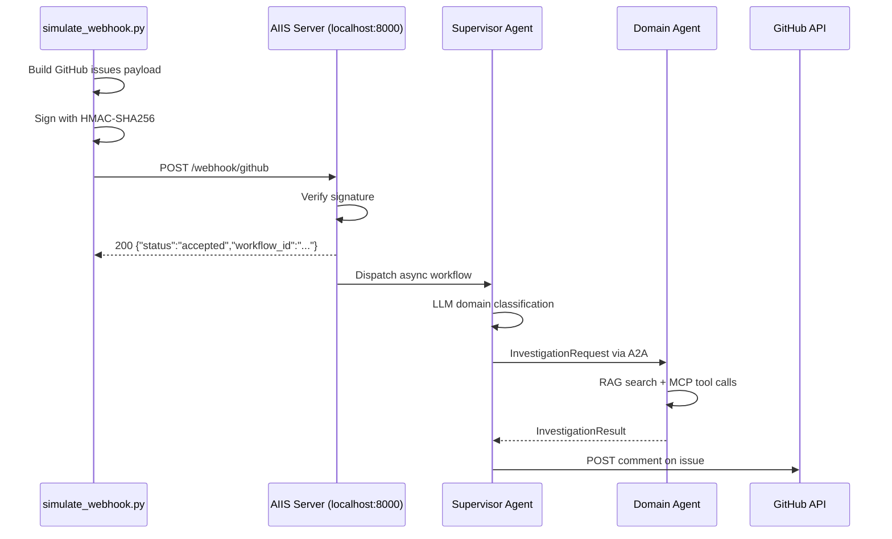
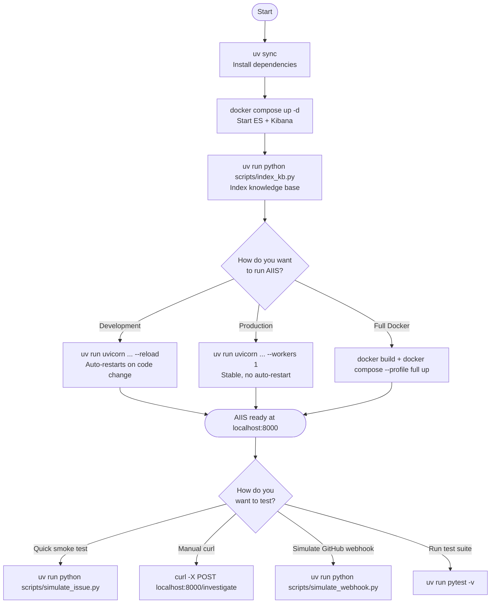

# Build and Run Guide

This guide covers everything you need for daily development with AIIS: managing your Python environment, running the server, working with Docker, running tests, and connecting a real GitHub webhook. Each section explains not just the commands but why they work the way they do.

---

## Python Environment with uv

### What Is uv?

`uv` is a blazing-fast Python package manager written in Rust. It replaces a confusing combination of tools you might have used before:

| Old Way | uv Equivalent |
|---|---|
| `pip install` | `uv add` |
| `pip install -r requirements.txt` | `uv sync` |
| `virtualenv .venv` + `source .venv/bin/activate` | `uv sync` (creates `.venv` automatically) |
| `poetry install` | `uv sync` |
| `python -m venv` | built into `uv` |

### Why uv?

- **10–100x faster than pip** — dependency resolution and package downloads happen in parallel
- **Lock file support** — `uv.lock` pins exact versions so every developer gets the same environment
- **No manual virtual environment management** — `uv` creates and manages `.venv` for you
- **Single tool** — replaces pip, pip-tools, virtualenv, pyenv (for version management), and poetry

### Installing Dependencies

Run this once after cloning, and again whenever `pyproject.toml` changes (e.g., after `git pull`):

```bash
uv sync
```

This command:

1. Reads `pyproject.toml` to find all required packages
2. Creates `.venv/` in the project root if it does not exist
3. Installs all packages into that virtual environment
4. Writes `uv.lock` to pin exact versions for reproducibility

### Adding a New Dependency

```bash
uv add package-name

# Example: add a specific version
uv add httpx==0.27.0

# Example: add a development-only dependency (not installed in production)
uv add --dev pytest-asyncio
```

This updates both `pyproject.toml` and `uv.lock` automatically.

### Running Scripts and Commands

The `uv run` prefix ensures the command runs inside the project's virtual environment — no need to activate it manually:

```bash
# Run a Python script
uv run python scripts/simulate_issue.py

# Run a module
uv run python -m pytest

# Run any installed CLI tool
uv run uvicorn src.api.webhook:app --reload
```

### Activating the Virtual Environment Manually

If you prefer to work in an activated shell (so you can just type `python` or `pytest` directly):

```bash
# macOS / Linux
source .venv/bin/activate

# Windows
.venv\Scripts\activate

# To deactivate when done
deactivate
```

---

## Running the API Server

### Development Mode (Recommended)

During development, use `--reload` so the server restarts automatically whenever you save a Python file:

```bash
uv run uvicorn src.api.webhook:app --reload --port 8000
```

The server will be available at `http://localhost:8000`.

When you see this output, the server is ready:

```
INFO:     Uvicorn running on http://127.0.0.1:8000 (Press CTRL+C to quit)
INFO:     Started reloader process [12345] using StatReload
INFO:     Started server process [12346]
INFO:     Application startup complete.
```

Useful API endpoints once running:

| Endpoint | Method | Purpose |
|---|---|---|
| `http://localhost:8000/` | GET | Health check |
| `http://localhost:8000/investigate` | POST | Submit an issue for investigation |
| `http://localhost:8000/webhook/github` | POST | GitHub webhook receiver |
| `http://localhost:8000/docs` | GET | Interactive API docs (Swagger UI) |

### Production Mode

For a production deployment, remove `--reload` and bind to all network interfaces:

```bash
uv run uvicorn src.api.webhook:app --host 0.0.0.0 --port 8000 --workers 1
```

> **Important: Use `--workers 1`**
> AIIS uses in-memory singletons for the agent registry, transport, and ChromaDB client. These are shared state objects that must live in a single process. Running multiple workers (`--workers 4`) would give each worker its own isolated copy, breaking agent communication. Horizontal scaling requires a different architecture (e.g., Redis-backed transport), which is outside the scope of this POC.

---

## Running Docker Services

### Starting Elasticsearch and Kibana

```bash
docker compose up -d
```

The `-d` flag runs containers in the background (detached mode). Your terminal remains usable.

### Viewing Logs

Follow logs in real time for a specific service:

```bash
# Elasticsearch logs
docker compose logs -f elasticsearch

# Kibana logs
docker compose logs -f kibana

# Both at once
docker compose logs -f
```

Press `Ctrl+C` to stop following logs (containers keep running).

### Stopping Services

```bash
# Stop containers (data is preserved)
docker compose down

# Stop containers AND delete all data volumes (full reset)
docker compose down -v
```

> **When to use `docker compose down -v`:** If Elasticsearch is in a bad state, or you want to start completely fresh. Note that this deletes all indexed events — Kibana dashboards will be empty again.

### Checking Container Status

```bash
docker ps
```

Expected output when everything is running:

```
CONTAINER ID   IMAGE                  PORTS                    NAMES
a1b2c3d4e5f6   elasticsearch:8.15.0   0.0.0.0:9200->9200/tcp   aiis-elasticsearch
b2c3d4e5f6a1   kibana:8.15.0          0.0.0.0:5601->5601/tcp   aiis-kibana
```

### Docker Compose Services Explained

AIIS's `docker-compose.yml` defines two services:

**`aiis-elasticsearch`**

| Setting | Value | Why |
|---|---|---|
| Image | `elasticsearch:8.15.0` | Pinned version for reproducibility |
| Port | `9200` | Standard Elasticsearch HTTP port |
| Mode | Single-node | Simpler setup for local dev (no cluster needed) |
| Security | Disabled | Removes TLS/auth for easy local access |
| Heap | 512 MB | Enough for development; increase for production |
| Data volume | `esdata` | Persists data across container restarts |

**`aiis-kibana`**

| Setting | Value | Why |
|---|---|---|
| Image | `kibana:8.15.0` | Must match Elasticsearch version |
| Port | `5601` | Standard Kibana HTTP port |
| Dependency | `elasticsearch` | Waits for ES to be healthy before starting |

---

## Indexing the Knowledge Base

The knowledge base is a collection of Markdown files in `knowledge-base/` that describe your system's architecture, known issues, runbooks, and domain knowledge. AIIS converts these into vector embeddings that agents can search semantically.

```bash
uv run python scripts/index_kb.py
```

This script:

1. Reads all `.md` files from `knowledge-base/`
2. Splits each document into overlapping chunks
3. Converts each chunk into a vector embedding using the model specified by `EMBED_MODEL`
4. Stores the embeddings in ChromaDB at `CHROMA_PERSIST_DIR`

**When to run this:**

- Once, after initial setup
- Whenever you add or edit files in `knowledge-base/`
- After changing `EMBED_MODEL` (embeddings are model-specific)
- After deleting the `data/chroma/` directory

> **Note:** The AIIS server also runs the indexer automatically on startup if the ChromaDB collection is empty. However, explicit indexing is faster and ensures you are not waiting for startup to complete.

---

## Running Tests

AIIS has two test suites: unit/integration tests and browser tests.

### Unit and Integration Tests

| Test File | What It Tests |
|---|---|
| `tests/test_a2a.py` | A2A protocol: message creation, routing, and transport |
| `tests/test_mcp_tools.py` | MCP tool calls: GitHub API, Elasticsearch, knowledge base |
| `tests/test_supervisor.py` | Supervisor agent: triage logic and domain classification |
| `tests/test_workflow.py` | End-to-end workflow: full investigation cycle |

```bash
# Run all unit/integration tests
uv run pytest

# Run a specific test file
uv run pytest tests/test_workflow.py -v

# Run with stdout visible (useful for seeing print statements and logs)
uv run pytest -s -v

# Run a single specific test function
uv run pytest tests/test_supervisor.py::test_pre_purchase_classification -v
```

A passing run looks like:

```text
============================= test session starts ==============================
platform darwin -- Python 3.12.4, pytest-8.x.x
collected 24 items

tests/test_a2a.py ....                                                   [ 16%]
tests/test_mcp_tools.py ......                                           [ 41%]
tests/test_supervisor.py .......                                         [ 70%]
tests/test_workflow.py .......                                            [100%]

============================== 24 passed in 3.42s ==============================
```

Each `.` represents one passing test. An `F` means a failure and `E` means an error.

### Browser Tests (Playwright)

Browser tests use [Playwright](https://playwright.dev/) to drive a real Chromium browser against all three AIIS web surfaces: the FastAPI server, Elasticsearch, and Kibana.

**Prerequisites:** The AIIS server and Docker services must be running before executing browser tests.

```bash
# Run all browser tests (headless — no visible window)
uv run pytest tests/browser/ -v -s

# Run with a visible browser window
uv run pytest tests/browser/ -v -s --headed

# Run a specific browser test class
uv run pytest tests/browser/test_aiis_browser.py::TestAIISSwaggerUI -v -s

# Run only API tests (skip Elasticsearch and Kibana)
uv run pytest tests/browser/ -v -s -k "AIIS"
```

Browser tests save screenshots to `tests/browser/screenshots/` for every test step:

| Screenshot | What It Shows |
|---|---|
| `01_health_endpoint.png` | `/health` JSON response in browser |
| `02_swagger_ui.png` | FastAPI Swagger UI with all endpoints |
| `03_swagger_endpoints.png` | All 3 AIIS endpoints listed |
| `04_swagger_investigate_expanded.png` | `/investigate` endpoint expanded |
| `05_redoc.png` | ReDoc API documentation |
| `06_investigate_swagger_after_call.png` | Swagger after a live `/investigate` call |
| `07_elasticsearch_cluster_health.png` | Elasticsearch cluster health JSON |
| `08_elasticsearch_event_count.png` | AIIS event count in ES |
| `09_elasticsearch_mappings.png` | ES index field mappings |
| `10_elasticsearch_recent_events.png` | Recent observability events |
| `11_kibana_home.png` | Kibana home page |

**What browser tests verify:**

- Swagger UI loads with the correct AIIS title and all 3 endpoints
- `/investigate` correctly routes pre-purchase and post-purchase issues
- Elasticsearch cluster is healthy and AIIS events are being ingested
- Kibana is accessible and loads

**Installing Playwright browsers (first time only):**

```bash
uv run playwright install chromium
```

---

## Running the Simulation Script

The simulation script exercises the full system end-to-end without needing a GitHub account or webhook:

```bash
uv run python scripts/simulate_issue.py
```

The script sends two realistic issue payloads to the running server and prints detailed output for each:

```
=== Pre-Purchase Investigation ===
Issue: Search results showing wrong prices on product listing page
Domain: pre_purchase (confidence: 0.82)
Root Cause: Price indexing job failed after deployment — stale cache served to PLP
Actions:
  1. Re-run the price indexing job
  2. Add post-deployment smoke test comparing PLP and PDP prices
  3. Audit indexing job scheduler for missed runs
Trace ID: a3f9c2d1-4e56-7890-abcd-ef1234567890
Duration: 4231ms

=== Post-Purchase Investigation ===
Issue: Order not shipped after 3 days
Domain: post_purchase (confidence: 0.91)
Root Cause: Fulfillment worker process crashed — dead-letter queue not processed
Actions:
  1. Restart fulfillment worker
  2. Process dead-letter queue manually
  3. Set up alerting for fulfillment queue depth
Trace ID: b4g0d3e2-5f67-8901-bcde-fg2345678901
Duration: 5817ms
```

---

## GitHub Webhook Configuration

For local development, AIIS provides a webhook simulator script that sends a properly signed GitHub `issues` event directly to the running server. This is the recommended approach — no public URL, tunnel service, or GitHub account required.

The simulator exercises the **exact same code path** as a real GitHub webhook: HMAC-SHA256 signature verification → async workflow dispatch → domain agent investigation → GitHub API comment.

---

### Local Development — Simulate a Webhook

#### Step 1 — Start the AIIS Server

```bash
uv run uvicorn src.api.webhook:app --reload --port 8000
```

#### Step 2 — Run the Simulator

```bash
# Pre-purchase issue (default)
uv run python scripts/simulate_webhook.py

# Post-purchase issue
uv run python scripts/simulate_webhook.py --domain post-purchase

# Second built-in sample
uv run python scripts/simulate_webhook.py --domain pre-purchase --sample 1

# Custom issue
uv run python scripts/simulate_webhook.py \
    --issue-number 42 \
    --title "Payment gateway timeout during checkout" \
    --body "Customers are getting 504s when clicking Pay Now. Started after today's deploy."
```

Expected output:

```
AIIS Webhook Simulator
────────────────────────────────────────────────────────────
Server  : http://localhost:8000
Issue   : #101 — Search returns no results for 'Electronics' category
Signed  : yes (HMAC-SHA256)
────────────────────────────────────────────────────────────

Accepted by AIIS:
  Status      : accepted
  workflow_id : 3e7f1a2b-9c4d-4e5f-8a6b-1c2d3e4f5a6b
  issue_id    : 101

The investigation is running in the background.
Check server logs for progress, then open Kibana to see trace data:
  http://localhost:5601
```

The investigation runs asynchronously in the server — watch the server terminal for live log output. When complete, Kibana dashboards at `http://localhost:5601` show the full trace.

---

### Sample Request and Response

The simulator sends the following HTTP request structure to `POST /webhook/github`:

**Request headers:**

```
POST /webhook/github HTTP/1.1
Host: localhost:8000
Content-Type: application/json
X-GitHub-Event: issues
X-Hub-Signature-256: sha256=a3f9c2d14e567890abcdef1234567890abcdef1234567890abcdef1234567890
X-GitHub-Delivery: simulate-1750000000
User-Agent: GitHub-Hookshot/simulate
```

**Request body (GitHub `issues` payload):**

```json
{
  "action": "opened",
  "issue": {
    "number": 101,
    "title": "Search returns no results for 'Electronics' category",
    "body": "When users search for 'Electronics' or any sub-category, the PLP returns an empty results page...",
    "state": "open",
    "created_at": "2026-07-19T08:00:00+00:00",
    "updated_at": "2026-07-19T08:00:00+00:00",
    "labels": [],
    "assignees": [],
    "user": {
      "login": "simulate-webhook-script",
      "type": "User"
    },
    "html_url": "https://github.com/your-org/your-repo/issues/101"
  },
  "repository": {
    "full_name": "your-org/your-repo",
    "name": "your-repo",
    "owner": { "login": "your-org" },
    "private": false
  },
  "sender": { "login": "simulate-webhook-script" }
}
```

**Response (HTTP 200):**

```json
{
  "status": "accepted",
  "workflow_id": "3e7f1a2b-9c4d-4e5f-8a6b-1c2d3e4f5a6b",
  "issue_id": 101
}
```

The response returns immediately — `workflow_id` is the ID to use when querying Kibana or Elasticsearch for the trace. The actual investigation runs asynchronously after the `200` is returned.

**Ignored events (non-`opened` actions return `200` with status `ignored`):**

```json
{ "status": "ignored", "action": "closed" }
```

---

### Equivalent curl Command

If you prefer `curl` over the Python script:

```bash
# Build and sign the payload manually
SECRET="your-webhook-secret"   # must match GITHUB_WEBHOOK_SECRET in .env
PAYLOAD='{
  "action": "opened",
  "issue": {
    "number": 42,
    "title": "Payment gateway timeout during checkout",
    "body": "Customers are getting 504s when clicking Pay Now.",
    "state": "open",
    "labels": [],
    "assignees": [],
    "user": {"login": "dev", "type": "User"}
  },
  "repository": {"full_name": "your-org/your-repo", "name": "your-repo", "owner": {"login": "your-org"}, "private": false},
  "sender": {"login": "dev"}
}'

SIG="sha256=$(echo -n "$PAYLOAD" | openssl dgst -sha256 -hmac "$SECRET" | awk '{print $2}')"

curl -s -X POST http://localhost:8000/webhook/github \
  -H "Content-Type: application/json" \
  -H "X-GitHub-Event: issues" \
  -H "X-Hub-Signature-256: $SIG" \
  -H "X-GitHub-Delivery: curl-test-001" \
  -d "$PAYLOAD" | python3 -m json.tool
```

Expected curl output:

```json
{
  "status": "accepted",
  "workflow_id": "a1b2c3d4-e5f6-7890-abcd-ef1234567890",
  "issue_id": 42
}
```

> **No secret configured?** Leave `SECRET=""` and omit the `X-Hub-Signature-256` header — the server accepts unsigned requests when `GITHUB_WEBHOOK_SECRET` is not set in `.env`.

---

### Server Logs During Investigation

After the webhook is accepted, the AIIS server terminal shows the investigation progress in real time:

```
INFO  Received GitHub issue #101: Search returns no results for 'Electronics' category
INFO  Supervisor routed issue #101 → pre_purchase (confidence=0.85, reason='...')
INFO  pre-purchase-agent: iteration 1 complete (confidence=0.55, evidence=4, duration=1203ms)
INFO  pre-purchase-agent: iteration 2 complete (confidence=0.70, evidence=8, duration=980ms)
INFO  pre-purchase-agent: iteration 3 complete (confidence=0.85, evidence=12, duration=1105ms)
INFO  GitHub comment posted on issue #101
INFO  Workflow completed for issue #101 (domain=pre_purchase, confidence=0.85)
```

Use the `workflow_id` from the response to filter Kibana or query Elasticsearch directly:

```bash
curl -s "http://localhost:9200/aiis-events-*/_search" \
  -H "Content-Type: application/json" \
  -d '{"query": {"term": {"workflow_id": "3e7f1a2b-9c4d-4e5f-8a6b-1c2d3e4f5a6b"}}, "size": 50}' \
  | python3 -m json.tool
```

---

### How the Simulator Works



The script builds the same JSON payload structure that GitHub sends, adds the `X-GitHub-Event: issues` and `X-Hub-Signature-256` headers, and POSTs to the local server. The server cannot distinguish this from a real GitHub delivery.

---

### Signature Verification

The simulator reads `GITHUB_WEBHOOK_SECRET` from `.env` and signs the payload with HMAC-SHA256, matching GitHub's signing method. If the secret is not set, the request is sent unsigned — the server allows unsigned requests when `GITHUB_WEBHOOK_SECRET` is empty (suitable for local testing without a secret configured).

For a realistic test with signature verification enabled:

```bash
# Generate a secret (run once, add to .env)
python3 -c "import secrets; print(secrets.token_hex(32))"

# Add to .env
GITHUB_WEBHOOK_SECRET=your-generated-secret
```

---

### Connecting a Real GitHub Webhook (Staging / Production)

When deploying AIIS to a server with a public URL, configure the GitHub webhook in the repository:

1. Go to your repository → **Settings** → **Webhooks** → **Add webhook**
2. Fill in:

| Field | Value |
|---|---|
| **Payload URL** | `https://your-aiis-server.example.com/webhook/github` |
| **Content type** | `application/json` |
| **Secret** | Value of `GITHUB_WEBHOOK_SECRET` from `.env` |
| **Which events?** | Let me select → **Issues** only |
| **Active** | ✓ |

3. Click **Add webhook**

GitHub sends a `ping` event immediately — check your AIIS server logs for:

```
INFO: POST /webhook/github — received ping event (ignored)
```

Then open a real GitHub issue and AIIS will investigate it automatically.

---

### Troubleshooting

**`401 Unauthorized` from the simulator**

Your server has `GITHUB_WEBHOOK_SECRET` set but the simulator is using a different value. Check both match in `.env`.

**`Connection refused` when running the simulator**

The AIIS server is not running. Start it first:

```bash
uv run uvicorn src.api.webhook:app --reload --port 8000
```

**Webhook accepted but no investigation output in logs**

The async task started but the workflow encountered an error. Check the server terminal — exceptions are logged there. Common causes:
- Elasticsearch not running (`docker compose up -d`)
- ChromaDB not indexed (`uv run python scripts/index_kb.py`)

---

## Docker Build — Full Stack

For deployment scenarios where you want to run everything in Docker (including the AIIS API server itself, not just Elasticsearch and Kibana):

### Build the AIIS Container Image

```bash
docker build -t aiis:latest .
```

This uses the `Dockerfile` in the project root to create a container image with Python, all dependencies, and the AIIS source code.

### Run the Full Stack

The Docker Compose file includes a `full` profile that adds the AIIS API container:

```bash
docker compose --profile full up -d
```

This starts three containers: Elasticsearch, Kibana, and AIIS API.

> **For local development**, running the API server directly with `uv run uvicorn` (not in Docker) is much more convenient because `--reload` gives you instant code-change restarts. Use the Docker build for staging or production deployments.

---

## Environment Variable Summary

All AIIS configuration is done through environment variables in the `.env` file.

| Variable | Default | Required | Description |
|---|---|---|---|
| `ANTHROPIC_API_KEY` | _(empty)_ | No | Anthropic Claude API key. If set, overrides Ollama. |
| `OLLAMA_BASE_URL` | `http://localhost:11434` | No | URL for the local Ollama server. |
| `OLLAMA_MODEL` | `llama3.1:8b` | No | Model name to use with Ollama. |
| `GITHUB_TOKEN` | _(empty)_ | For webhook | GitHub personal access token with `issues:write`. |
| `GITHUB_REPO` | _(empty)_ | For webhook | Target repo in `owner/repo` format. |
| `GITHUB_WEBHOOK_SECRET` | _(empty)_ | Recommended | HMAC secret shared with GitHub for payload verification. |
| `ELASTICSEARCH_URL` | `http://localhost:9200` | No | Elasticsearch endpoint. AIIS works without it. |
| `CHROMA_PERSIST_DIR` | `./data/chroma` | No | Directory where ChromaDB stores its vector index. |
| `EMBED_MODEL` | `all-MiniLM-L6-v2` | No | Sentence transformer model for RAG embeddings. |
| `KNOWLEDGE_BASE_DIR` | `./knowledge-base` | No | Path to the Markdown knowledge base files. |
| `MAX_INVESTIGATION_ITERATIONS` | `4` | No | Max RAG+tool cycles per investigation. |
| `CONFIDENCE_THRESHOLD` | `0.75` | No | Confidence score at which investigation stops early. |
| `LOG_LEVEL` | `INFO` | No | Python log level: `DEBUG`, `INFO`, `WARNING`, `ERROR`. |

---

## Build and Run Flow Overview


