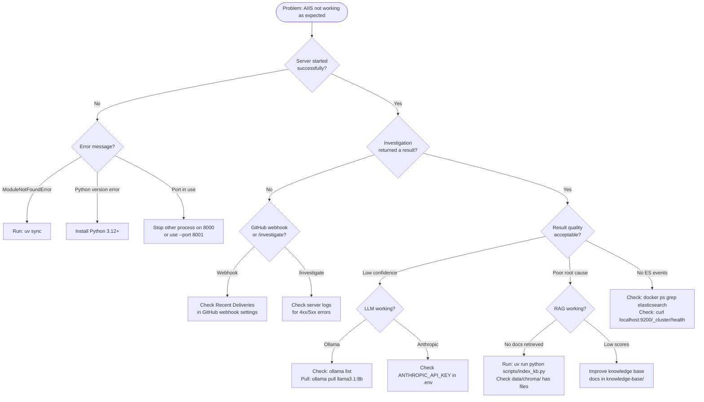

# Debugging Guide

This guide helps you diagnose and fix the most common problems you will encounter running AIIS. It covers reading logs, using the debug endpoint, querying Elasticsearch directly, and inspecting internal agent state.

---

## Log Levels and Structured Logging

### Setting the Log Level

AIIS uses Python's standard logging system. Set `LOG_LEVEL` in your `.env` file to control how much output you see:

| Level | What You See | Use When |
|---|---|---|
| `ERROR` | Only crashes and failures | Production (minimal noise) |
| `WARNING` | Failures and degraded behaviour | Production monitoring |
| `INFO` | Normal operational messages | Default — good balance |
| `DEBUG` | Everything, including internal state | Diagnosing specific problems |

To enable verbose debug output:

```bash
# In .env
LOG_LEVEL=DEBUG
```

Then restart the server:

```bash
uv run uvicorn src.api.webhook:app --reload
```

### What DEBUG Mode Reveals

With `LOG_LEVEL=DEBUG` you will see detailed messages for every step of the investigation pipeline:

- **A2A message routing** — every message sent between agents, including routing decisions and delivery confirmations
- **RAG search results** — documents retrieved from ChromaDB, relevance scores, and chunk content
- **MCP tool calls** — inputs and outputs of every GitHub API call, Elasticsearch query, and knowledge base lookup
- **Elasticsearch ingestion** — every event being written to the index, or failures if ES is unavailable

### Logger Hierarchy

AIIS loggers follow Python's module hierarchy. You can filter logs by module if you only want to see a specific component:

| Logger Name | Component |
|---|---|
| `src.agents.supervisor.agent` | Supervisor: triage and routing decisions |
| `src.agents.pre_purchase.agent` | Pre-purchase domain agent |
| `src.agents.post_purchase.agent` | Post-purchase domain agent |
| `src.a2a.transport` | A2A message transport layer |
| `src.a2a.registry` | Agent registry: registration and health checks |
| `src.rag.retriever` | RAG: ChromaDB search and document retrieval |
| `src.mcp.tools` | MCP: tool call execution |
| `src.es.ingest` | Elasticsearch event ingestion |

---

## Reading the Logs

### Key Log Lines and What They Mean

When you read AIIS log output, these are the most important lines to look for:

| Log Message | What It Means | Normal? |
|---|---|---|
| `Transport: registered handler for agent 'pre_purchase'` | The pre-purchase agent has registered itself and is ready to receive work | Yes — expected at startup |
| `Supervisor routed issue #N → pre-purchase (confidence=0.75)` | The supervisor finished classifying the issue and delegated it | Yes — expected for each issue |
| `A2A: sending InvestigationRequest to 'pre_purchase'` | The supervisor is delegating the investigation via A2A | Yes — delegation in progress |
| `RAG: retrieved 5 docs (top score: 0.85)` | The domain agent retrieved 5 knowledge base documents; the most relevant scored 0.85 | Yes — knowledge lookup working |
| `MCP tool 'search_knowledge_base' completed` | A specific tool call finished successfully | Yes — per tool invocation |
| `ES ingest failed (events will be silently dropped)` | Elasticsearch is unreachable; event logging is disabled | Non-fatal — AIIS still works |
| `Confidence threshold reached (0.82 >= 0.75), stopping early` | Agent found a high-confidence answer and stopped iterating | Yes — efficiency mechanism |
| `Max iterations reached (4/4), finalizing result` | Agent used all allowed RAG+tool cycles | Yes — agent did its best |

### Example Debug Log Output

Here is what a complete investigation looks like in the logs with `LOG_LEVEL=DEBUG`:

```
INFO  src.api.webhook         POST /investigate — issue_id=101
INFO  src.agents.supervisor   Received IssueOpenedEvent: "Search results showing wrong prices"
DEBUG src.agents.supervisor   LLM classification response: domain=pre_purchase, confidence=0.82
INFO  src.agents.supervisor   Routed issue #101 → pre_purchase (confidence=0.82)
DEBUG src.a2a.transport       Sending InvestigationRequest → handler 'pre_purchase'
INFO  src.agents.pre_purchase Starting investigation: issue_id=101, max_iterations=4
DEBUG src.rag.retriever       Query: "price mismatch product listing page"
DEBUG src.rag.retriever       Retrieved 5 docs (top score: 0.85): [pricing-service.md, ...]
DEBUG src.mcp.tools           Calling search_knowledge_base(query="price indexing")
DEBUG src.mcp.tools           MCP tool 'search_knowledge_base' completed in 142ms
DEBUG src.agents.pre_purchase Iteration 1/4 — current confidence: 0.61
DEBUG src.rag.retriever       Query: "price indexing job deployment"
DEBUG src.rag.retriever       Retrieved 5 docs (top score: 0.91): [indexing-pipeline.md, ...]
DEBUG src.mcp.tools           Calling get_github_issue(issue_id=101)
DEBUG src.mcp.tools           MCP tool 'get_github_issue' completed in 287ms
DEBUG src.agents.pre_purchase Iteration 2/4 — current confidence: 0.82
INFO  src.agents.pre_purchase Confidence threshold reached (0.82 >= 0.75), stopping early
INFO  src.es.ingest           Indexed InvestigationCompleted event — trace_id=a3f9c2d1
INFO  src.api.webhook         Response sent — 200 OK, duration=4231ms
```

---

## Common Issues and Solutions

### 1. Server Won't Start

**Symptoms:** Running `uv run uvicorn src.api.webhook:app --reload` gives an error immediately.

**Diagnosis:**

```bash
# Check Python version (need 3.12+)
python3 --version

# Check uv is installed
uv --version

# Check all dependencies are installed
uv sync
```

**Common causes:**

| Error Message | Fix |
|---|---|
| `python: command not found` | Install Python 3.12+ from python.org |
| `uv: command not found` | Run `pip install uv` or the curl install command |
| `ModuleNotFoundError: No module named 'src'` | Make sure you are in the project root, not a subdirectory |
| `ImportError: cannot import name 'X'` | Run `uv sync` to install missing dependencies |

---

### 2. Elasticsearch Connection Failed

**Symptoms:** Log line `ES ingest failed (events will be silently dropped)` at startup, or Kibana shows no data.

**Important:** This is **non-fatal**. AIIS continues to work; it just cannot log events to Elasticsearch. Investigation results are still returned to the caller.

**Diagnosis:**

```bash
# Check if the Elasticsearch container is running
docker ps | grep elasticsearch

# If it appears, check its health
curl http://localhost:9200/_cluster/health

# If not running, start it
docker compose up -d elasticsearch
```

**Common causes:**

| Problem | Fix |
|---|---|
| Docker not running | Open Docker Desktop and wait for it to start |
| Container crashed | `docker compose down` then `docker compose up -d` |
| Port 9200 in use | Check `lsof -i :9200` and stop the conflicting process |
| Container still initialising | Wait 30 seconds and retry |

---

### 3. Ollama Model Not Found

**Symptoms:** Logs show an LLM call error, or the supervisor falls back to keyword-based classification with low confidence.

**Diagnosis:**

```bash
# Check Ollama is running and which models are available
ollama list

# Check the OLLAMA_BASE_URL is reachable
curl http://localhost:11434/api/tags
```

**Fix:**

```bash
# Pull the required model (downloads ~4.7 GB)
ollama pull llama3.1:8b
```

**Fallback behaviour:** If the LLM is unavailable, the supervisor falls back to keyword-based classification. It looks for words like "price", "search", "browse" (pre-purchase) or "order", "ship", "refund" (post-purchase). This is less accurate but keeps the system functional.

---

### 4. ChromaDB / RAG Not Working

**Symptoms:** Agents return low-confidence results (< 0.5), log lines show `RAG: retrieved 0 docs`, or errors referencing ChromaDB collections.

**Diagnosis:**

```bash
# Check the ChromaDB data directory exists and has files
ls -la data/chroma/

# If empty or missing, re-run the indexer
uv run python scripts/index_kb.py
```

**Important:** If the ChromaDB collection is missing, domain agents do not crash — they use fallback results and continue the investigation. You will see a log warning like `RAG collection not found, using fallback`. The investigation still completes but quality may be lower.

**Common causes:**

| Problem | Fix |
|---|---|
| `data/chroma/` does not exist | Run `uv run python scripts/index_kb.py` |
| Collection is empty | Re-run the indexer |
| Changed `EMBED_MODEL` | Delete `data/chroma/` and re-run the indexer |
| Wrong `KNOWLEDGE_BASE_DIR` | Check the path in `.env` matches your knowledge base location |

---

### 5. Tests Failing

**Symptoms:** `uv run pytest` reports failures or errors.

**Diagnosis:**

```bash
# Run a single failing test file with full output
uv run pytest tests/test_a2a.py -v -s

# Test that imports work correctly
uv run python -c "from src.a2a.messages import Domain; print('OK')"
uv run python -c "from src.agents.supervisor.agent import SupervisorAgent; print('OK')"
```

**Common causes:**

| Error | Fix |
|---|---|
| `ModuleNotFoundError` | Run `uv sync` to install all dependencies |
| `ImportError` | You may be running `python` directly instead of `uv run python` |
| Test timeout | Ollama is slow — increase pytest timeout or mock the LLM in tests |
| `PYTHONPATH` issues | Use `uv run pytest` not `python -m pytest` (uv sets PYTHONPATH automatically) |

---

### 6. GitHub Webhook Not Being Received

**Symptoms:** Creating an issue on GitHub does not trigger an investigation. GitHub shows a red X on the webhook delivery.

**Diagnosis checklist:**

```bash
# Check the AIIS server is running
curl http://localhost:8000/

# If testing locally, check ngrok is running
curl http://localhost:4040/api/tunnels   # ngrok status API
```

In GitHub:
1. Go to **Settings → Webhooks**
2. Click on your webhook
3. Scroll to **Recent Deliveries**
4. Click on a failed delivery to see the request and response

**Common causes:**

| Problem | Fix |
|---|---|
| Wrong secret | `GITHUB_WEBHOOK_SECRET` in `.env` must exactly match the GitHub webhook secret |
| ngrok stopped | Restart ngrok, update the Payload URL in GitHub |
| Wrong event type | Webhook must be subscribed to **Issues** events |
| Server not reachable | Confirm the public URL resolves to port 8000 |
| `action != "opened"` | AIIS only triggers on `action="opened"` — editing issues does nothing |

---

## Using the /investigate Endpoint for Debugging

The `/investigate` endpoint is the fastest way to test a specific scenario without needing GitHub at all.

### Test a Pre-Purchase Issue

```bash
curl -X POST http://localhost:8000/investigate \
  -H "Content-Type: application/json" \
  -d '{
    "issue_id": 1,
    "title": "Search results showing wrong prices",
    "description": "Users report incorrect pricing on PLP"
  }'
```

### Test a Post-Purchase Issue

```bash
curl -X POST http://localhost:8000/investigate \
  -H "Content-Type: application/json" \
  -d '{
    "issue_id": 2,
    "title": "Order not shipped after 3 days",
    "description": "Fulfillment pipeline stuck"
  }'
```

### Pretty-Print the Response

Pipe to `python3 -m json.tool` for readable output:

```bash
curl -s -X POST http://localhost:8000/investigate \
  -H "Content-Type: application/json" \
  -d '{"issue_id": 1, "title": "Search broken", "description": "No results"}' \
  | python3 -m json.tool
```

---

## Querying Elasticsearch for Investigation Traces

After investigations complete, every event is indexed in Elasticsearch. Use these queries to explore what happened.

### Count All Events

```bash
curl -s "http://localhost:9200/aiis-events-*/_count" | python3 -m json.tool
```

### Get All Events for a Specific Investigation

Replace `YOUR-TRACE-ID` with the `trace_id` from the investigation response:

```bash
curl -s "http://localhost:9200/aiis-events-*/_search" \
  -H "Content-Type: application/json" \
  -d '{
    "query": {
      "term": {"trace_id": "YOUR-TRACE-ID"}
    },
    "sort": [{"timestamp": "asc"}],
    "size": 100
  }' | python3 -m json.tool
```

This returns all events for that trace in chronological order — from the initial `IssueReceived` event through each RAG search, tool call, and the final `InvestigationCompleted` event.

### Get All Events for Today

```bash
curl -s "http://localhost:9200/aiis-events-$(date +%Y.%m.%d)/_search?size=50&sort=timestamp:asc" \
  | python3 -m json.tool
```

### Get the Most Recent Investigations

```bash
curl -s "http://localhost:9200/aiis-events-*/_search" \
  -H "Content-Type: application/json" \
  -d '{
    "query": {"term": {"event_type": "InvestigationCompleted"}},
    "sort": [{"timestamp": "desc"}],
    "size": 10
  }' | python3 -m json.tool
```

---

## Inspecting the A2A Message Log

The A2A transport keeps an in-memory log of all messages sent between agents. You can inspect this in a Python script or interactive session:

```python
from src.a2a.transport import get_transport

transport = get_transport()

print(f"Total messages: {len(transport.message_log)}")

for msg in transport.message_log:
    print(f"  {msg.timestamp} | {msg.message_type} | {msg.from_agent} → {msg.to_agent}")
```

This is useful for verifying that:
- The supervisor correctly routed the issue to the right domain agent
- The domain agent sent its result back to the supervisor
- No messages were silently dropped

---

## Debug Mode for LangGraph

To see detailed LangGraph state transitions and node execution logs, enable LangChain verbose mode before starting the server:

```python
# Add to the top of src/api/webhook.py (temporarily, for debugging)
import os
os.environ["LANGCHAIN_VERBOSE"] = "true"
```

Or set it in your shell before running:

```bash
LANGCHAIN_VERBOSE=true uv run uvicorn src.api.webhook:app --reload
```

This prints every LangGraph node invocation, state snapshot, and edge traversal — very verbose, but invaluable for understanding why an agent is taking a particular path.

---

## Checking Agent Registration

At startup, all domain agents register themselves with the central registry. If an agent fails to register, the supervisor cannot route work to it.

```python
from src.a2a.registry import get_registry

registry = get_registry()

print("Registered agents:")
for agent in registry.all_agents():
    status = "healthy" if agent.is_healthy else "UNHEALTHY"
    print(f"  {agent.agent_id}: domain={agent.domain}, status={status}")
```

Expected output:

```
Registered agents:
  pre_purchase: domain=pre_purchase, status=healthy
  post_purchase: domain=post_purchase, status=healthy
```

If an agent shows `UNHEALTHY`, check its startup logs for import errors or configuration problems.

---

## Debugging Decision Tree


