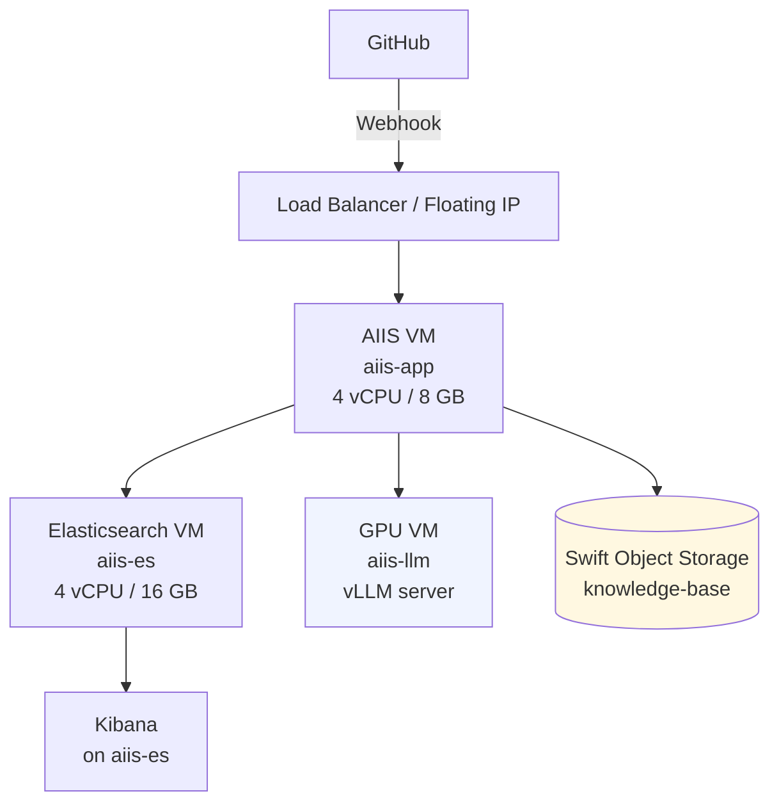
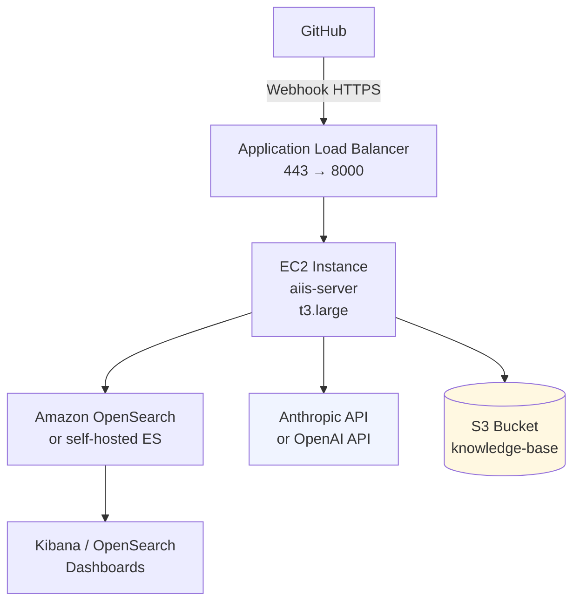
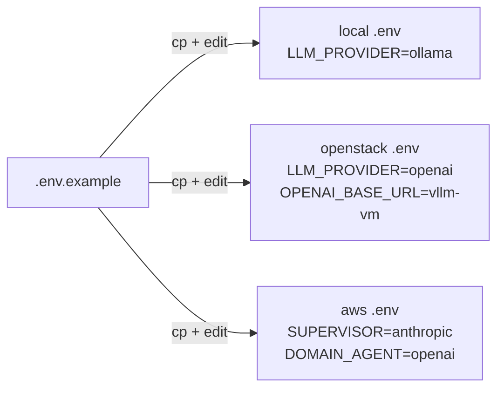

# Deployment Guide

This guide covers deploying AIIS in three environments:

| Environment | Infrastructure | LLM |
|---|---|---|
| [Local Development](#local-development) | Docker Compose + uv | Ollama (local) |
| [OpenStack](#openstack-deployment) | Nova VMs + Docker Compose | vLLM on GPU VM or external API |
| [AWS (Cloud)](#aws-deployment) | EC2 + Docker Compose | Anthropic / OpenAI API |

All three environments use the same Docker Compose file and `.env` for configuration — only the variable values change between environments.

---

## Local Development

Full instructions are in [build-and-run.md](build-and-run.md). Quick reference:

```bash
# 1. Install prerequisites
pip install uv
ollama pull llama3.1:8b

# 2. Install dependencies
uv sync

# 3. Configure
cp .env.example .env
# Set: GITHUB_TOKEN, GITHUB_REPO, GITHUB_WEBHOOK_SECRET

# 4. Start infrastructure
docker compose up -d         # Elasticsearch + Kibana

# 5. Index knowledge base
uv run python scripts/index_kb.py

# 6. Start AIIS
uv run uvicorn src.api.webhook:app --reload --port 8000

# 7. Trigger a test investigation
uv run python scripts/simulate_webhook.py
```

**.env for local:**

```bash
LLM_PROVIDER=ollama
OLLAMA_BASE_URL=http://localhost:11434
OLLAMA_MODEL=llama3.1:8b
ELASTICSEARCH_URL=http://localhost:9200
```

---

## OpenStack Deployment

### Architecture



### Step 1 — Provision VMs

Create three VMs using the OpenStack CLI or Horizon dashboard:

```bash
# Application VM
openstack server create \
  --flavor m1.large \
  --image Ubuntu-22.04 \
  --network private-net \
  --key-name my-keypair \
  --security-group aiis-sg \
  aiis-app

# Elasticsearch + Kibana VM
openstack server create \
  --flavor m1.xlarge \
  --image Ubuntu-22.04 \
  --network private-net \
  --key-name my-keypair \
  --security-group aiis-sg \
  aiis-es

# GPU VM for vLLM (optional — skip if using cloud LLM API)
openstack server create \
  --flavor gpu.medium \
  --image Ubuntu-22.04 \
  --network private-net \
  --key-name my-keypair \
  --security-group aiis-sg \
  aiis-llm
```

Assign a floating IP to the application VM so GitHub can reach it:

```bash
openstack floating ip create public-net
openstack server add floating ip aiis-app <floating-ip>
```

### Step 2 — Configure Security Groups

```bash
# Create security group
openstack security group create aiis-sg --description "AIIS application"

# Allow SSH
openstack security group rule create --protocol tcp --dst-port 22 aiis-sg

# Allow AIIS webhook port from internet
openstack security group rule create --protocol tcp --dst-port 8000 aiis-sg

# Allow Kibana (restrict to your IP in production)
openstack security group rule create --protocol tcp --dst-port 5601 aiis-sg

# Allow internal communication (ES, vLLM)
openstack security group rule create --protocol tcp --dst-port 9200 --remote-ip 10.0.0.0/8 aiis-sg
openstack security group rule create --protocol tcp --dst-port 8001 --remote-ip 10.0.0.0/8 aiis-sg
```

### Step 3 — Set Up the LLM VM with vLLM

SSH into `aiis-llm` and install vLLM:

```bash
ssh ubuntu@<llm-vm-ip>

# Install CUDA drivers (skip if image already has them)
sudo apt-get update && sudo apt-get install -y nvidia-driver-535

# Install vLLM
pip install vllm

# Pull and serve a model (OpenAI-compatible API on port 8000)
python -m vllm.entrypoints.openai.api_server \
  --model meta-llama/Llama-3.1-8B-Instruct \
  --host 0.0.0.0 \
  --port 8000 \
  --dtype auto \
  --max-model-len 8192

# Verify
curl http://localhost:8000/v1/models
```

> **Note:** vLLM requires a Hugging Face token for gated models like Llama. Set `HF_TOKEN` or use `--hf-token` flag. Alternatively, use `mistralai/Mistral-7B-Instruct-v0.3` which is not gated.

To run vLLM as a persistent service:

```bash
sudo tee /etc/systemd/system/vllm.service <<EOF
[Unit]
Description=vLLM OpenAI-compatible server
After=network.target

[Service]
User=ubuntu
ExecStart=/home/ubuntu/.local/bin/python -m vllm.entrypoints.openai.api_server \
  --model meta-llama/Llama-3.1-8B-Instruct \
  --host 0.0.0.0 --port 8000
Restart=always
Environment=HF_TOKEN=hf_your_token_here

[Install]
WantedBy=multi-user.target
EOF

sudo systemctl enable vllm
sudo systemctl start vllm
```

### Step 4 — Set Up Elasticsearch on the ES VM

SSH into `aiis-es`:

```bash
ssh ubuntu@<es-vm-ip>

# Install Docker
sudo apt-get update
sudo apt-get install -y docker.io docker-compose-v2
sudo usermod -aG docker ubuntu
newgrp docker

# Clone the repo
git clone https://github.com/your-org/aiis.git
cd aiis

# Start only Elasticsearch and Kibana
docker compose up -d elasticsearch kibana

# Verify
curl http://localhost:9200/_cluster/health
```

### Step 5 — Deploy AIIS on the App VM

SSH into `aiis-app`:

```bash
ssh ubuntu@<app-vm-ip>

# Install Docker + uv
sudo apt-get update
sudo apt-get install -y docker.io docker-compose-v2 python3-pip
pip install uv
sudo usermod -aG docker ubuntu
newgrp docker

# Clone and install
git clone https://github.com/your-org/aiis.git
cd aiis
uv sync

# Configure
cp .env.example .env
```

Edit `.env` for the OpenStack environment:

```bash
# LLM — vLLM on GPU VM
LLM_PROVIDER=openai
OPENAI_API_KEY=not-checked-by-vllm
OPENAI_BASE_URL=http://<llm-vm-internal-ip>:8000/v1
OPENAI_MODEL=meta-llama/Llama-3.1-8B-Instruct

# Or split by role: fast cloud model for routing, vLLM for analysis
SUPERVISOR_LLM_PROVIDER=anthropic
SUPERVISOR_LLM_MODEL=claude-haiku-4-5-20251001
ANTHROPIC_API_KEY=sk-ant-...
DOMAIN_AGENT_LLM_PROVIDER=openai
DOMAIN_AGENT_LLM_MODEL=meta-llama/Llama-3.1-8B-Instruct
OPENAI_API_KEY=not-checked
OPENAI_BASE_URL=http://<llm-vm-internal-ip>:8000/v1

# Elasticsearch on the ES VM
ELASTICSEARCH_URL=http://<es-vm-internal-ip>:9200

# GitHub
GITHUB_TOKEN=ghp_...
GITHUB_REPO=your-org/your-repo
GITHUB_WEBHOOK_SECRET=your-secret

LOG_LEVEL=INFO
```

Index the knowledge base and start AIIS:

```bash
uv run python scripts/index_kb.py

# Run as a systemd service for persistence
sudo tee /etc/systemd/system/aiis.service <<EOF
[Unit]
Description=AIIS Webhook Server
After=network.target

[Service]
User=ubuntu
WorkingDirectory=/home/ubuntu/aiis
ExecStart=/home/ubuntu/.local/bin/uv run uvicorn src.api.webhook:app --host 0.0.0.0 --port 8000 --workers 1
Restart=always
EnvironmentFile=/home/ubuntu/aiis/.env

[Install]
WantedBy=multi-user.target
EOF

sudo systemctl enable aiis
sudo systemctl start aiis
sudo systemctl status aiis
```

### Step 6 — Configure GitHub Webhook

Add the floating IP to the GitHub webhook:

1. Go to your repository → **Settings** → **Webhooks** → **Add webhook**
2. Set **Payload URL** to `http://<floating-ip>:8000/webhook/github`
3. Set **Content type** to `application/json`
4. Set **Secret** to the value of `GITHUB_WEBHOOK_SECRET`
5. Select **Issues** events only
6. Click **Add webhook**

> **HTTPS in production:** Put an HTTPS reverse proxy (nginx + Let's Encrypt, or OpenStack LBaaS) in front of port 8000 and use `https://` in the webhook URL. GitHub requires HTTPS for production webhooks.

### Step 7 — Verify

```bash
# Check AIIS is running
curl http://<floating-ip>:8000/health

# Open Kibana
open http://<es-vm-ip>:5601

# Simulate a webhook to test the pipeline
uv run python scripts/simulate_webhook.py --server http://<floating-ip>:8000
```

---

## AWS Deployment

### Architecture



### Step 1 — Launch EC2 Instance

```bash
# Launch instance (t3.large: 2 vCPU, 8 GB RAM)
aws ec2 run-instances \
  --image-id ami-0c55b159cbfafe1f0 \
  --instance-type t3.large \
  --key-name my-keypair \
  --security-group-ids sg-xxxx \
  --subnet-id subnet-xxxx \
  --tag-specifications 'ResourceType=instance,Tags=[{Key=Name,Value=aiis-server}]'

# Associate an Elastic IP for a stable public address
aws ec2 allocate-address --domain vpc
aws ec2 associate-address --instance-id i-xxxx --allocation-id eipalloc-xxxx
```

### Step 2 — Configure Security Group

```bash
# Allow inbound on port 8000 from ALB security group (or all for testing)
aws ec2 authorize-security-group-ingress \
  --group-id sg-xxxx \
  --protocol tcp \
  --port 8000 \
  --source-group sg-alb-xxxx

# Allow SSH for administration
aws ec2 authorize-security-group-ingress \
  --group-id sg-xxxx \
  --protocol tcp \
  --port 22 \
  --cidr your.ip.address/32
```

### Step 3 — Set Up the EC2 Instance

SSH into the instance:

```bash
ssh -i my-keypair.pem ec2-user@<elastic-ip>

# Install dependencies
sudo yum update -y
sudo yum install -y git docker
sudo systemctl start docker
sudo usermod -aG docker ec2-user
newgrp docker

# Install uv
curl -LsSf https://astral.sh/uv/install.sh | sh
source ~/.bashrc

# Clone and install AIIS
git clone https://github.com/your-org/aiis.git
cd aiis
uv sync
```

### Step 4 — Start Elasticsearch with Docker

```bash
docker compose up -d elasticsearch kibana
```

> **For production:** Use [Amazon OpenSearch Service](https://aws.amazon.com/opensearch-service/) (managed Elasticsearch) instead of self-hosted. Set `ELASTICSEARCH_URL` to the OpenSearch endpoint. This gives you automated backups, scaling, and HA.

### Step 5 — Configure `.env`

```bash
cp .env.example .env
```

Edit `.env` for AWS:

```bash
# LLM — cloud APIs (no GPU required)
SUPERVISOR_LLM_PROVIDER=anthropic
SUPERVISOR_LLM_MODEL=claude-haiku-4-5-20251001
ANTHROPIC_API_KEY=sk-ant-...

DOMAIN_AGENT_LLM_PROVIDER=openai
DOMAIN_AGENT_LLM_MODEL=gpt-4o
OPENAI_API_KEY=sk-proj-...

# Elasticsearch (self-hosted on same instance, or OpenSearch endpoint)
ELASTICSEARCH_URL=http://localhost:9200
# ELASTICSEARCH_URL=https://your-domain.us-east-1.es.amazonaws.com  # managed OpenSearch

# GitHub
GITHUB_TOKEN=ghp_...
GITHUB_REPO=your-org/your-repo
GITHUB_WEBHOOK_SECRET=your-secret

LOG_LEVEL=INFO
```

### Step 6 — Index and Start

```bash
uv run python scripts/index_kb.py

# Systemd service
sudo tee /etc/systemd/system/aiis.service <<EOF
[Unit]
Description=AIIS Webhook Server
After=network.target

[Service]
User=ec2-user
WorkingDirectory=/home/ec2-user/aiis
ExecStart=/home/ec2-user/.local/bin/uv run uvicorn src.api.webhook:app \
  --host 0.0.0.0 --port 8000 --workers 1
Restart=always
EnvironmentFile=/home/ec2-user/aiis/.env

[Install]
WantedBy=multi-user.target
EOF

sudo systemctl enable aiis && sudo systemctl start aiis
```

### Step 7 — HTTPS with Application Load Balancer

GitHub requires HTTPS for webhook URLs in production.

```bash
# Create ALB (via AWS Console or CLI)
# 1. Create ALB listener on port 443 with ACM certificate
# 2. Forward to target group pointing at EC2:8000
# 3. Use ALB DNS name or your custom domain as the webhook URL

# Verify health check passes
curl https://your-alb-dns.us-east-1.elb.amazonaws.com/health
```

### Step 8 — Configure GitHub Webhook

1. Go to your repository → **Settings** → **Webhooks** → **Add webhook**
2. Set **Payload URL** to `https://your-alb-dns.us-east-1.elb.amazonaws.com/webhook/github`
3. Set **Content type** to `application/json`
4. Set **Secret** to `GITHUB_WEBHOOK_SECRET`
5. Select **Issues** events only

---

## Environment Comparison

| Concern | Local | OpenStack | AWS |
|---|---|---|---|
| **LLM** | Ollama (free, local) | vLLM on GPU VM or external API | Anthropic / OpenAI API |
| **Elasticsearch** | Docker on localhost | Docker on dedicated VM | Docker on EC2 or Amazon OpenSearch |
| **Public URL** | Not needed (simulator) | Floating IP → port 8000 | ALB → HTTPS → EC2:8000 |
| **Webhook trigger** | `simulate_webhook.py` | Real GitHub webhook | Real GitHub webhook |
| **Cost** | $0 | VM + GPU costs | EC2 + LLM API costs |
| **Privacy** | Fully local | Fully on-prem (with vLLM) | Issues sent to LLM provider |
| **HA / Scaling** | No | Manual | ALB + Auto Scaling (advanced) |

## Shared `.env` Template by Environment



The same AIIS codebase and Docker Compose file runs in all three environments. Only `.env` values differ.
