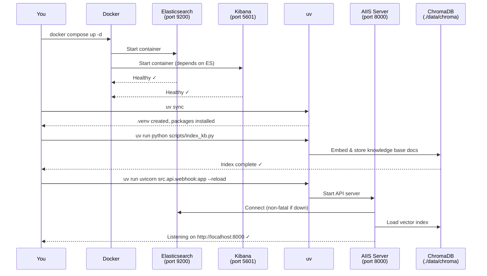

# Getting Started with AIIS

Welcome to the **Agentic Issue Investigation System (AIIS)**! This guide will walk you through everything you need to get AIIS up and running from scratch — even if you are brand new to Python, Docker, or AI agents.

AIIS is a multi-agent system that automatically triages GitHub issues, routes them to specialist AI agents, and produces structured investigation reports with root-cause analysis. This guide focuses on getting a working system in front of you as quickly as possible.

---

## What You Will Build

By the end of this guide, you will have a locally running AIIS instance that:

- Accepts GitHub issue payloads (real webhook or simulated)
- Classifies the issue as pre-purchase or post-purchase
- Delegates investigation to the correct specialist agent
- Returns a structured JSON report with root cause, confidence, and recommended actions
- Logs all events to Elasticsearch for analytics in Kibana

---

## Prerequisites

Before you start, make sure you have the following installed. Each item links to its installer or a check command.

### Required

| Tool | Why It Is Needed | Check / Install |
|---|---|---|
| **Python 3.12+** | AIIS is written in Python | `python3 --version` |
| **uv** | Fast Python package manager | `uv --version` |
| **Docker Desktop** or **Rancher Desktop** | Runs Elasticsearch and Kibana | `docker --version` |
| **Git** | Clone the repository | `git --version` |

### LLM Backend — Choose One

AIIS needs a Large Language Model to reason about issues. You have two options:

| Option | Cost | Setup | Best For |
|---|---|---|---|
| **Ollama + llama3.1:8b** | Free, runs locally | Install Ollama, pull model | Privacy, offline, no API bills |
| **Anthropic API key** | Paid, cloud | Create account, copy key | Better quality, no GPU needed |

**Option A — Ollama (recommended for beginners):**

```bash
# 1. Install Ollama from https://ollama.com/download
# 2. Pull the model (this downloads ~4.7 GB)
ollama pull llama3.1:8b
# 3. Verify
ollama list
```

**Option B — Anthropic API:**

1. Go to [console.anthropic.com](https://console.anthropic.com)
2. Create an account and generate an API key
3. You will paste this into your `.env` file in Step 2 below

### Optional

| Tool | Why You Might Want It |
|---|---|
| **GitHub repo with webhook** | For real-time issue triage from GitHub |
| **ngrok** | Tunnel local server for GitHub webhook testing |

---

## Quick Start — Five Steps

### Step 1 — Clone the Repository

```bash
git clone https://github.com/your-org/aiis.git
cd aiis
```

> **What is happening?** `git clone` downloads the entire project to your computer. `cd aiis` moves you into the project folder.

---

### Step 2 — Configure Your Environment

AIIS reads all configuration from a file called `.env` in the project root. A template is provided as `.env.example`.

```bash
cp .env.example .env
```

Now open `.env` in any text editor and fill in the values. Here is what each variable means:

```bash
# ─── LLM BACKEND ──────────────────────────────────────────────────────────────
# Leave ANTHROPIC_API_KEY empty to use Ollama instead of Claude
ANTHROPIC_API_KEY=

# Ollama settings (only used when ANTHROPIC_API_KEY is empty)
OLLAMA_BASE_URL=http://localhost:11434
OLLAMA_MODEL=llama3.1:8b

# ─── GITHUB INTEGRATION (optional) ───────────────────────────────────────────
# Personal access token — needs issues:write and repo:read permissions
GITHUB_TOKEN=ghp_xxxxxxxxxxxxxxxxxxxx

# The repo AIIS will comment on (format: owner/repo)
GITHUB_REPO=myorg/myrepo

# Secret string shared between GitHub and AIIS to verify webhook payloads
# Make something up — a long random string is fine
GITHUB_WEBHOOK_SECRET=my-super-secret-webhook-key

# ─── ELASTICSEARCH ────────────────────────────────────────────────────────────
# Where AIIS sends event logs (Docker starts this for you)
ELASTICSEARCH_URL=http://localhost:9200

# ─── CHROMADB / KNOWLEDGE BASE ────────────────────────────────────────────────
# Where ChromaDB stores its vector index on disk
CHROMA_PERSIST_DIR=./data/chroma

# Sentence transformer model used to embed knowledge base documents
EMBED_MODEL=all-MiniLM-L6-v2

# Path to your markdown knowledge base files
KNOWLEDGE_BASE_DIR=./knowledge-base

# ─── AGENT TUNING ─────────────────────────────────────────────────────────────
# How many RAG + tool cycles each agent runs before stopping
MAX_INVESTIGATION_ITERATIONS=4

# Confidence score (0.0–1.0) at which the agent stops investigating early
CONFIDENCE_THRESHOLD=0.75

# ─── LOGGING ──────────────────────────────────────────────────────────────────
# Set to DEBUG to see detailed agent reasoning, tool calls, and routing decisions
LOG_LEVEL=INFO
```

> **Tip:** If you are using Ollama, you only need to set `OLLAMA_BASE_URL` and `OLLAMA_MODEL`. You can leave `ANTHROPIC_API_KEY` completely empty. If you set an Anthropic API key, it takes priority over Ollama.

---

### Step 3 — Start Docker Services

AIIS uses Docker to run Elasticsearch (event storage) and Kibana (analytics dashboard). You do not need to understand Docker deeply — just run:

```bash
docker compose up -d
```

> **What is `-d`?** It means "detached" — Docker starts the containers in the background so they do not block your terminal.

Verify both containers are running:

```bash
docker ps
```

You should see two containers: `aiis-elasticsearch` and `aiis-kibana`. Wait about 30 seconds for Elasticsearch to fully initialize, then confirm it is healthy:

```bash
curl http://localhost:9200/_cluster/health
```

A healthy response looks like: `{"status":"green",...}` or `{"status":"yellow",...}`. Both are fine for local use.

---

### Step 4 — Install Python Dependencies

`uv` manages all Python packages for AIIS. One command installs everything and creates a virtual environment automatically:

```bash
uv sync
```

> **What is `uv sync`?** It reads `pyproject.toml` (the project's dependency list), creates a `.venv` folder in the project directory, and installs every required package into it. You will only need to run this once, or again after pulling new changes.

After `uv sync` completes, index the knowledge base so the RAG system has documents to search:

```bash
uv run python scripts/index_kb.py
```

> **What is the knowledge base?** It is a collection of Markdown files in the `knowledge-base/` folder. AIIS converts them into vector embeddings so agents can search them semantically. Think of it as the agents' reference library.

---

### Step 5 — Run the Server

Start the AIIS API server:

```bash
uv run uvicorn src.api.webhook:app --reload
```

> **What is Uvicorn?** It is the web server that runs AIIS. `--reload` makes it automatically restart when you change any Python file — very handy during development.

You will see output like:

```
INFO:     Uvicorn running on http://127.0.0.1:8000 (Press CTRL+C to quit)
INFO:     Started reloader process
INFO:     Started server process
INFO:     Application startup complete.
```

AIIS is now running at `http://localhost:8000`.

---

## Startup Sequence Diagram

The diagram below shows what happens internally when you run those five steps:



---

## Testing Without a GitHub Webhook

You do not need a real GitHub repository to test AIIS. The `/investigate` endpoint accepts issue payloads directly.

### Test a Pre-Purchase Issue

Pre-purchase issues involve product discovery, search, pricing, and browsing — things that happen before a customer places an order.

```bash
curl -X POST http://localhost:8000/investigate \
  -H "Content-Type: application/json" \
  -d '{
    "issue_id": 101,
    "title": "Search results showing wrong prices on product listing page",
    "description": "Multiple users are reporting that the prices shown on the PLP do not match the prices on the product detail page. This started after yesterday'\''s deployment."
  }'
```

### Test a Post-Purchase Issue

Post-purchase issues involve order confirmation, fulfillment, shipping, and returns — things that happen after the customer has paid.

```bash
curl -X POST http://localhost:8000/investigate \
  -H "Content-Type: application/json" \
  -d '{
    "issue_id": 102,
    "title": "Order not shipped after 3 days",
    "description": "Several customers report their orders are stuck in '\''processing'\'' state. The fulfillment pipeline appears to not be picking up new orders since the weekend."
  }'
```

### What to Look For in the Response

A successful response is a JSON object. Here is what each field means:

```json
{
  "issue_id": 101,
  "domain": "pre_purchase",
  "confidence": 0.82,
  "root_cause": "Price indexing job failed after deployment — cached prices are stale",
  "recommended_actions": [
    "Re-run the price indexing job for all products",
    "Add a post-deployment smoke test that compares PLP and PDP prices",
    "Check the indexing job scheduler for missed runs"
  ],
  "trace_id": "a3f9c2d1-4e56-7890-abcd-ef1234567890",
  "duration_ms": 4231
}
```

| Field | What It Means |
|---|---|
| `domain` | Which specialist agent handled this: `pre_purchase` or `post_purchase` |
| `confidence` | How sure the agent is (0.0 = guessing, 1.0 = certain) |
| `root_cause` | The agent's best explanation of why the issue occurred |
| `recommended_actions` | Concrete next steps the engineering team should take |
| `trace_id` | A unique ID you can use to look up all events for this investigation in Elasticsearch |
| `duration_ms` | How long the entire investigation took in milliseconds |

---

## Using the Simulation Script

The simulation script runs both a pre-purchase and a post-purchase scenario automatically, without you needing to write any curl commands:

```bash
uv run python scripts/simulate_issue.py
```

The script:

1. Sends a pre-purchase issue payload to `/investigate`
2. Prints the full structured response
3. Sends a post-purchase issue payload to `/investigate`
4. Prints the full structured response
5. Prints a summary showing both trace IDs

This is the fastest way to verify that the entire system — from HTTP request through agent routing to investigation and response — is working correctly.

---

## Verifying Elasticsearch is Working

### Browser Check

Open [http://localhost:9200](http://localhost:9200) in your browser. You should see a JSON response like:

```json
{
  "name": "aiis-elasticsearch",
  "cluster_name": "aiis-cluster",
  "version": { "number": "8.15.0", ... },
  "tagline": "You Know, for Search"
}
```

### Count Indexed Events

After running the simulation script (or sending some requests), check how many events AIIS has logged:

```bash
curl http://localhost:9200/aiis-events-*/_count
```

The response shows the total number of events across all daily indices:

```json
{
  "count": 42,
  "_shards": { "total": 1, "successful": 1, "skipped": 0, "failed": 0 }
}
```

---

## Kibana Setup

Kibana gives you a visual dashboard for exploring AIIS events and investigation traces.

### Open Kibana

Navigate to [http://localhost:5601](http://localhost:5601) in your browser. It may take a minute to load on first start.

### Run the Setup Script

The setup script creates the Kibana data view and imports the pre-built dashboards:

```bash
bash kibana/setup.sh
```

### Navigate to Dashboards

1. In Kibana, click the hamburger menu (three lines) in the top left
2. Click **Analytics** → **Dashboards**
3. You will see the **AIIS Investigation Overview** dashboard

The dashboard shows:
- Number of investigations over time
- Domain breakdown (pre-purchase vs post-purchase)
- Average confidence scores
- Investigation duration trends
- Recent investigation trace list

---

## What's Next?

Now that AIIS is running, explore these topics:

- **[Build and Run Guide](build-and-run.md)** — All commands for daily development, running tests, and Docker management
- **[Debugging Guide](debugging.md)** — What to do when something goes wrong
- **[Configuration Reference](configuration.md)** — Full reference for every environment variable

---

> **Stuck?** The most common issues are: Docker not running (check `docker ps`), Ollama model not pulled (run `ollama pull llama3.1:8b`), and missing `.env` file (check `ls -la .env`). See the [Debugging Guide](debugging.md) for detailed solutions.
