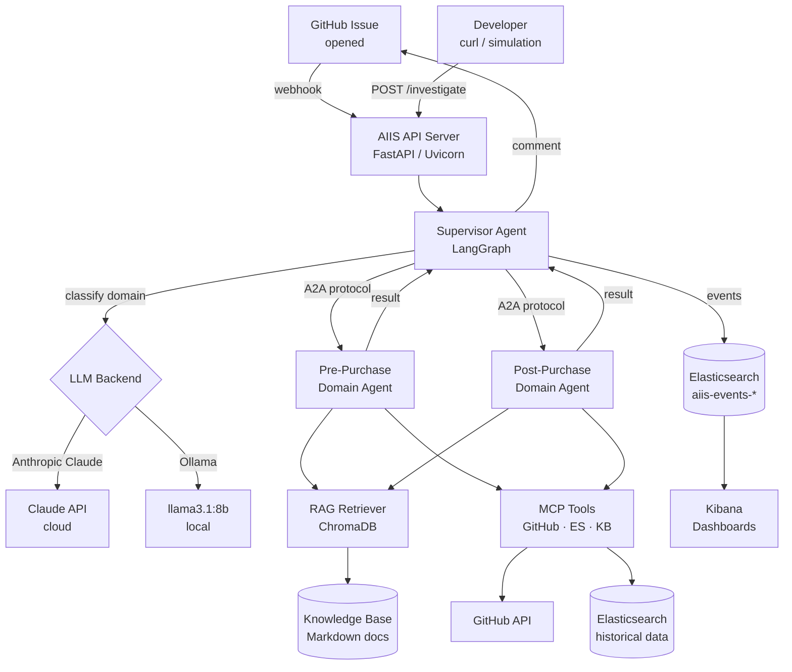
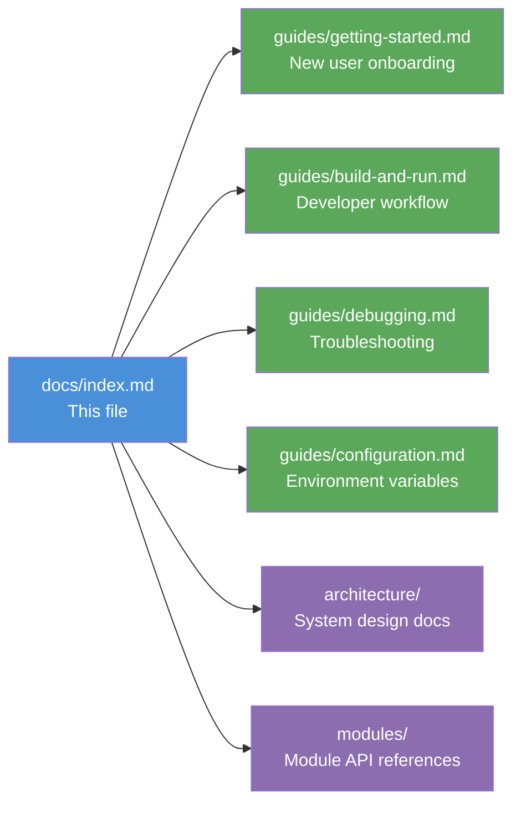

# AIIS Documentation

Welcome to the documentation for the **Agentic Issue Investigation System (AIIS)** — a multi-agent AI system that automatically investigates GitHub issues, classifies them by domain, and produces structured root-cause analysis reports.

AIIS is built as a proof-of-concept using [LangGraph](https://langchain-ai.github.io/langgraph/) for multi-agent orchestration, the Agent-to-Agent (A2A) protocol for inter-agent communication, and the Model Context Protocol (MCP) for tool integration.

---

## What Does AIIS Do?

When a GitHub issue is opened, AIIS:

1. **Receives** the issue via webhook (or the `/investigate` API endpoint)
2. **Classifies** it as a pre-purchase or post-purchase problem using an LLM-powered supervisor agent
3. **Delegates** to a specialist domain agent via the A2A protocol
4. **Investigates** using Retrieval-Augmented Generation (RAG) over a knowledge base and MCP tool calls to GitHub and Elasticsearch
5. **Reports** a structured result with root cause, confidence score, and recommended actions — posted as a GitHub issue comment

---

## Quick Navigation

| Document | Audience | What You Will Learn |
|---|---|---|
| [Getting Started](guides/getting-started.md) | New users | Install prerequisites, configure, and run AIIS in 5 steps |
| [Build and Run](guides/build-and-run.md) | Developers | Daily development workflow, Docker, tests, and webhook setup |
| [Deployment](guides/deployment.md) | Operators | Deploy to Local, OpenStack, and AWS with build steps for each |
| [Configuration Reference](guides/configuration.md) | All operators | Every environment variable, LLM providers, per-agent model config |
| [Debugging](guides/debugging.md) | Everyone | Diagnose problems, read logs, query Elasticsearch traces |

### Architecture and Module References

| Document | What It Covers |
|---|---|
| [docs/architecture/](architecture/) | System design, data flow, and component relationships |
| [docs/modules/](modules/) | Per-module API and design references |

---

## Getting Started in 3 Steps

If you want to get something running right now:

**Step 1 — Install prerequisites**

```bash
# Check Python 3.12+
python3 --version

# Install uv (fast Python package manager)
pip install uv

# Install Docker Desktop from https://www.docker.com/products/docker-desktop/

# Install Ollama (free local LLM) from https://ollama.com/download
ollama pull llama3.1:8b
```

**Step 2 — Clone, configure, and install**

```bash
git clone https://github.com/your-org/aiis.git
cd aiis
cp .env.example .env          # then edit .env with your settings
docker compose up -d           # start Elasticsearch + Kibana
uv sync                        # install Python dependencies
uv run python scripts/index_kb.py  # index the knowledge base
```

**Step 3 — Run and test**

```bash
# Start the server
uv run uvicorn src.api.webhook:app --reload

# In another terminal, run the simulation
uv run python scripts/simulate_issue.py
```

For full instructions, see the [Getting Started Guide](guides/getting-started.md).

---

## System Architecture Overview



---

## Documentation Structure



---

## Technology Stack

| Layer | Technology | Role |
|---|---|---|
| **API** | FastAPI + Uvicorn | HTTP server, webhook receiver, REST endpoints |
| **Orchestration** | LangGraph | Multi-agent state machine and workflow |
| **Agent Protocol** | A2A (Agent-to-Agent) | Structured inter-agent communication |
| **Tool Protocol** | MCP (Model Context Protocol) | Standardized tool definitions for agents |
| **LLM** | Anthropic Claude or Ollama | Language model for reasoning and classification |
| **RAG** | ChromaDB + Sentence Transformers | Vector search over knowledge base documents |
| **Event Bus** | Kafka (KRaft) | Mandatory event pipeline — all observability events published here |
| **Event Store** | Elasticsearch | Storage layer — Kafka consumer writes complete payloads here |
| **Analytics** | Kibana | Dashboard and visualization for investigation data |
| **Package Manager** | uv | Python dependency management and virtual environment |
| **Containers** | Docker Compose | Local orchestration of Kafka, Elasticsearch, and Kibana |

---

## Key Concepts for New Users

**Multi-Agent System:** AIIS runs multiple AI agents simultaneously, each with a specific role. The Supervisor classifies issues and routes them; domain agents investigate specific problem types. Agents communicate by passing structured messages.

**A2A Protocol:** A standardized way for agents to talk to each other. Think of it as an internal messaging system where each agent has an address and a mailbox.

**RAG (Retrieval-Augmented Generation):** Instead of relying only on the LLM's training data, agents search a curated knowledge base to find relevant context before answering. Better knowledge base → better investigations.

**MCP (Model Context Protocol):** A standard way to give AI agents access to external tools (APIs, databases). Each tool has a typed schema so the agent knows how to call it and what to expect back.

**Confidence Score:** A number between 0.0 and 1.0 representing how certain an agent is about its root-cause conclusion. The agent keeps investigating until it reaches the configured threshold or runs out of iterations.

**Trace ID:** Every investigation gets a unique identifier. Use this to look up all events for that investigation in Elasticsearch.

---

> **New to AIIS?** Start with the [Getting Started Guide](guides/getting-started.md). It covers everything from installing prerequisites to getting your first investigation result, step by step.
