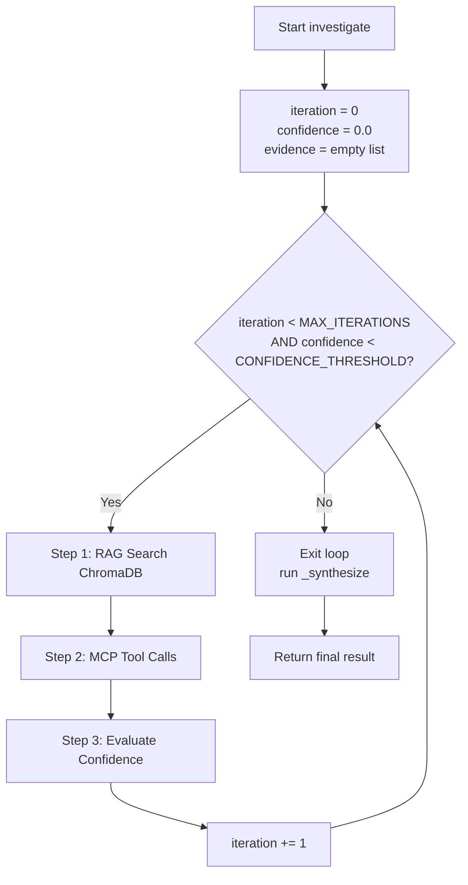
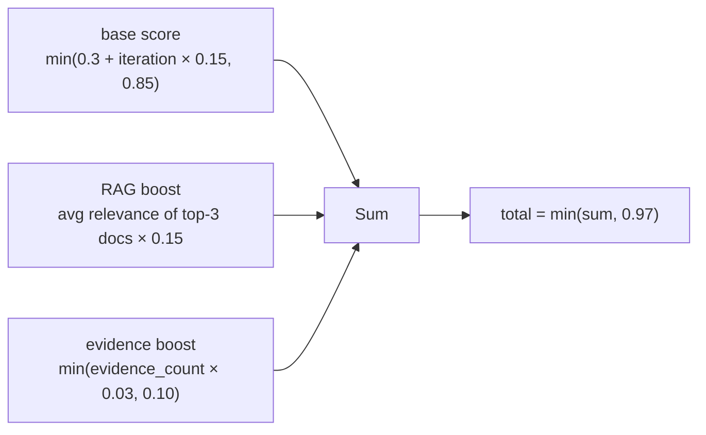
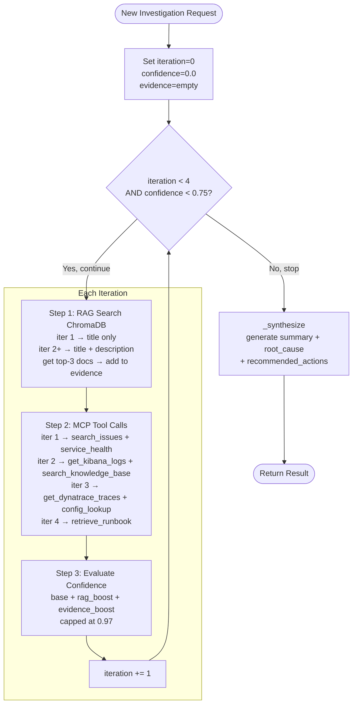
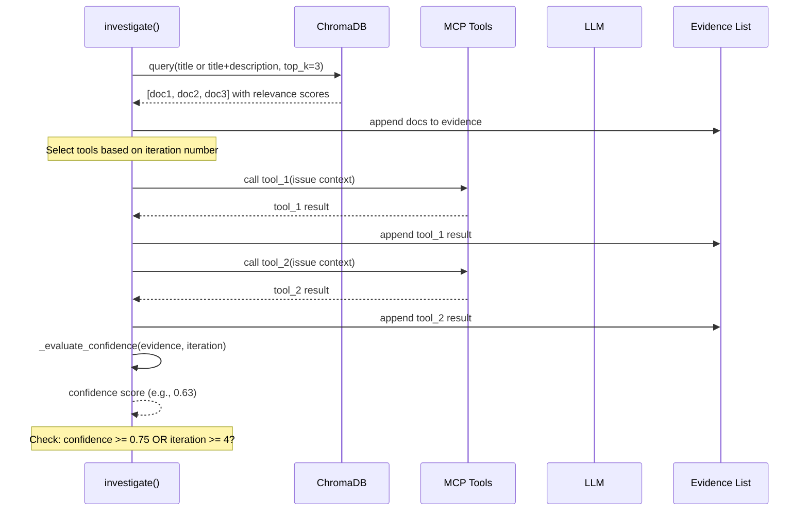
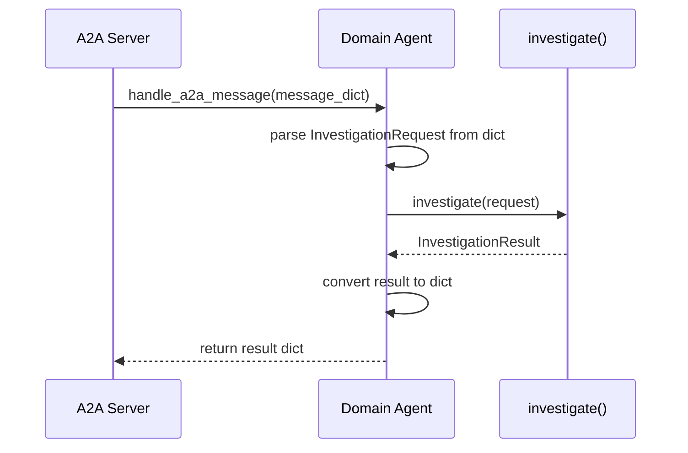

# Domain Agents

**Files:**
- `src/agents/domain/base_agent.py` — shared base class
- `src/agents/domain/pre_purchase_agent.py` — Pre-Purchase specialist
- `src/agents/domain/post_purchase_agent.py` — Post-Purchase specialist
- `src/agents/domain/__init__.py` — agent registration

---

## What Are Domain Agents?

Domain agents are the **specialist investigators** of the AIIS system. After the Supervisor decides which domain owns a GitHub issue, the matching domain agent takes over and performs a deep, multi-step investigation.

There are two domain agents:

| Agent | Covers |
|-------|--------|
| **Pre-Purchase Agent** | Search, catalog, cart, checkout, pricing |
| **Post-Purchase Agent** | Orders, fulfillment, shipping, returns, notifications |

Both agents share the same investigation algorithm — the **ReAct loop** — defined in the shared base class `BaseDomainAgent`.

> **ReAct** stands for **Re**ason + **Act**. The agent reasons about what it knows, acts by gathering more evidence, and repeats until it is confident enough to produce a conclusion.

---

## Base Class: `BaseDomainAgent`

All domain agents extend `BaseDomainAgent`, which is an abstract base class (ABC). This means it defines a blueprint that all domain agents must follow.

### Abstract Properties (must be set by each subclass)

| Property | Type | Used For |
|----------|------|----------|
| `service_areas` | `list[str]` | Searching ChromaDB runbooks and knowledge base |
| `primary_services` | `list[str]` | Querying health checks and log sources |

### Configurable Constants

These constants control how the ReAct loop behaves and can be tuned via environment variables:

| Constant | Default | Environment Variable | Meaning |
|----------|---------|---------------------|---------|
| `MAX_ITERATIONS` | `4` | `MAX_INVESTIGATION_ITERATIONS` | Maximum investigation cycles before stopping |
| `CONFIDENCE_THRESHOLD` | `0.75` | `CONFIDENCE_THRESHOLD` | Stop early if confidence reaches this level |

---

## The ReAct Investigation Loop

The `investigate()` method is the core of every domain agent. It runs a loop that gathers evidence, evaluates how confident it is, and stops when it knows enough (or hits the maximum iteration count).

### Loop Termination Conditions



---

## Inside Each Iteration: Three Steps

Every pass through the loop performs these three steps in order.

### Step 1 — RAG Search (Retrieval-Augmented Generation)

The agent searches a local vector database (ChromaDB) for documents relevant to the issue.

- **Iteration 1:** Searches using only the issue **title** (broad, quick scan)
- **Iteration 2 and beyond:** Searches using **title + description** (more precise)
- Retrieves the **top 3** most relevant documents
- Adds those documents to the `evidence` list

> **What is RAG?** Instead of relying solely on the LLM's training knowledge, RAG pulls real documents (runbooks, past issue resolutions, architecture notes) from a database and feeds them to the agent as context.

### Step 2 — MCP Tool Calls (`_select_tools`)

The agent calls external tools to gather live system data. Which tools are called depends on the current iteration number:

| Iteration | Tools Called | Why |
|-----------|-------------|-----|
| 1 | `search_issues`, `service_health` | Quick scan: look for similar past issues and check if services are up |
| 2 | `get_kibana_logs`, `search_knowledge_base` | Deeper dive: examine application logs and internal documentation |
| 3 | `get_dynatrace_traces`, `configuration_lookup`* | Performance traces; config check if issue mentions "feature", "flag", or "config" |
| 4 | `retrieve_runbook` | Last resort: fetch the relevant operational runbook |

> *`configuration_lookup` is only called in iteration 3 if the issue text contains the words **feature**, **flag**, or **config**.

### Step 3 — Confidence Evaluation (`_evaluate_confidence`)

After each iteration, the agent calculates a confidence score from 0.0 to 1.0 using this formula:



#### Confidence Formula Breakdown

**Base score** grows with each iteration, representing that more investigation cycles means more data was gathered:

| Iteration | Base Score Calculation | Base Score |
|-----------|----------------------|------------|
| 1 | `min(0.3 + 1 × 0.15, 0.85)` | 0.45 |
| 2 | `min(0.3 + 2 × 0.15, 0.85)` | 0.60 |
| 3 | `min(0.3 + 3 × 0.15, 0.85)` | 0.75 |
| 4 | `min(0.3 + 4 × 0.15, 0.85)` | 0.85 (capped) |

**RAG boost** rewards finding relevant documentation. If the top-3 retrieved documents have an average relevance score of 0.8, the RAG boost = `0.8 × 0.15 = 0.12`.

**Evidence boost** rewards accumulating more evidence items, capped at 0.10:

- 1 evidence item: `1 × 0.03 = 0.03`
- 3 evidence items: `3 × 0.03 = 0.09`
- 4+ evidence items: capped at `0.10`

**Cap at 0.97:** The agent can never be 100% certain — there's always some residual uncertainty.

---

## Full ReAct Loop Flowchart



---

## Single Iteration Sequence Diagram



---

## After the Loop: `_synthesize()`

Once the loop exits (either because confidence is high enough, or max iterations reached), `_synthesize()` is called. It uses the LLM to turn all the accumulated evidence into a structured conclusion:

| Output Field | Description |
|-------------|-------------|
| `summary` | A plain-English overview of what was found |
| `root_cause` | The most likely reason the issue is occurring |
| `recommended_actions` | A list of concrete steps the engineering team should take |

---

## A2A Transport Handler: `handle_a2a_message()`

Domain agents communicate with the Supervisor via the **Agent-to-Agent (A2A)** protocol. The `handle_a2a_message()` method is the entry point that the A2A server calls when a new investigation request arrives:



---

## Pre-Purchase Agent

**File:** `src/agents/domain/pre_purchase_agent.py`

This agent handles issues related to the shopping experience **before** a customer places an order.

| Property | Value |
|----------|-------|
| `agent_id` | `"pre-purchase-agent"` |
| `domain` | `Domain.PRE_PURCHASE` |
| `service_areas` | `["search", "catalog", "cart", "checkout", "pricing"]` |
| `primary_services` | `["search-service", "catalog-service", "cart-service", "pricing-engine"]` |

**Typical issue types handled:**
- Search results showing wrong products
- Product listing page (PLP) not displaying correctly
- Product detail page (PDP) errors
- Cart not updating
- Checkout failures
- Pricing or promotion bugs

---

## Post-Purchase Agent

**File:** `src/agents/domain/post_purchase_agent.py`

This agent handles issues related to what happens **after** a customer places an order.

| Property | Value |
|----------|-------|
| `agent_id` | `"post-purchase-agent"` |
| `domain` | `Domain.POST_PURCHASE` |
| `service_areas` | `["order", "fulfillment", "shipping", "returns", "notifications"]` |
| `primary_services` | `["order-service", "fulfillment-service", "shipping-service"]` |

**Typical issue types handled:**
- Order not appearing in system
- Fulfillment delays
- Shipping tracking not updating
- Return or refund not processing
- Email/notification not sent
- Invoice or receipt errors

---

## Agent Registration

**File:** `src/agents/domain/__init__.py`

Two factory functions create and register domain agents with the A2A server at startup:

```python
create_pre_purchase_agent()   # creates and registers the Pre-Purchase Agent
create_post_purchase_agent()  # creates and registers the Post-Purchase Agent
```

These are called by the FastAPI webhook API during application startup (see the Webhook API documentation). Registration means the A2A server knows how to route incoming `Domain.PRE_PURCHASE` and `Domain.POST_PURCHASE` investigation requests to the correct agent.

---

## Beginner's Summary

1. A domain agent is a specialist that investigates GitHub issues for its area of the business.
2. The investigation runs in a loop (up to 4 times) that gathers more and more evidence each pass.
3. Each pass has three steps: search documentation (RAG), call live system tools (MCP), score confidence.
4. The loop stops early if confidence reaches 75%, or after 4 iterations at the latest.
5. A final synthesis step turns all the evidence into a human-readable summary, root cause, and action plan.
6. The Pre-Purchase Agent covers shopping (search, cart, pricing); the Post-Purchase Agent covers fulfillment (orders, shipping, returns).
