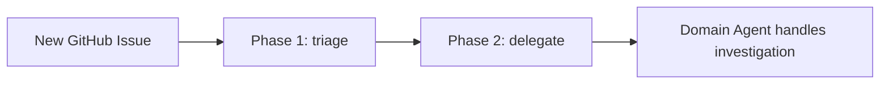
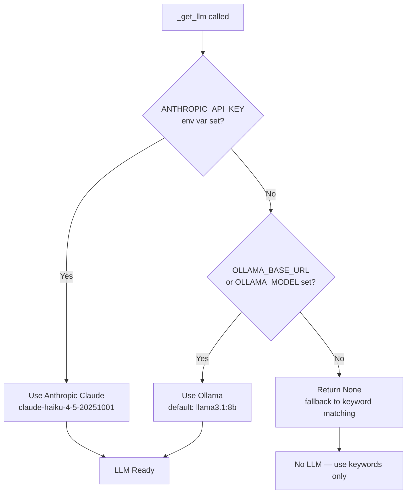
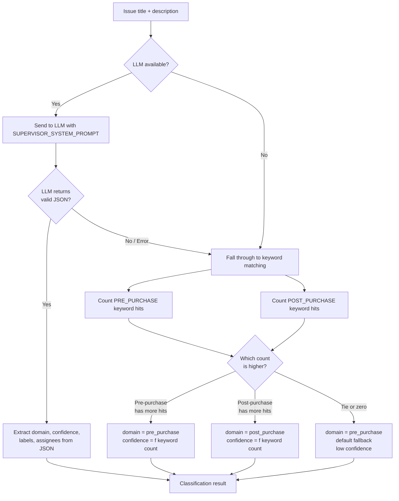
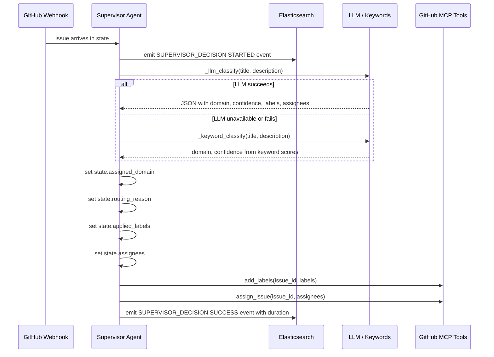
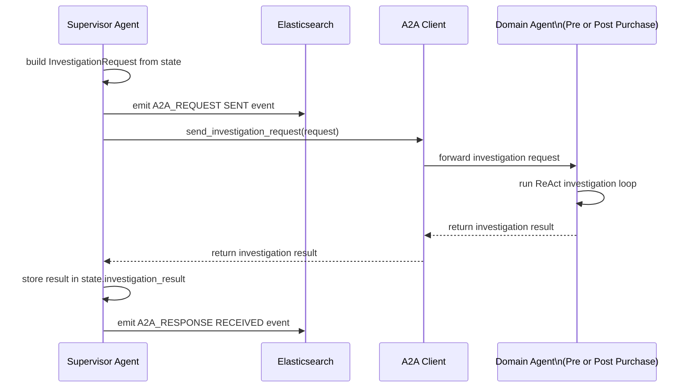
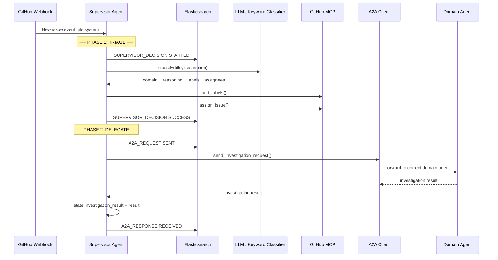

# Supervisor Agent

**File:** `src/agents/supervisor/agent.py`

---

## What Is the Supervisor Agent?

Think of the Supervisor Agent as the **receptionist** of the AIIS system. When a new GitHub issue arrives, the Supervisor reads it and decides: "Is this a pre-purchase problem (search, cart, pricing) or a post-purchase problem (orders, shipping, returns)?" It then hands the issue off to the right specialist team.

> **Key principle:** The Supervisor **never investigates** an issue itself. Its only jobs are to **classify** (triage) and **delegate** (hand off).

---

## Two-Phase Operation

The Supervisor works in exactly two phases:

| Phase | Method | What It Does |
|-------|--------|--------------|
| Phase 1 | `triage(state)` | Reads the issue, decides which domain owns it, applies GitHub labels and assignees |
| Phase 2 | `delegate(state)` | Sends the classified issue to the appropriate domain agent and waits for the result |



---

## How the Supervisor Chooses an LLM

Before the Supervisor can classify anything, it needs to pick a language model (LLM) to reason with. The `_get_llm()` method tries options in order:



**Environment variables that control this:**

| Variable | Default | Purpose |
|----------|---------|---------|
| `ANTHROPIC_API_KEY` | _(none)_ | Enables Anthropic Claude |
| `OLLAMA_BASE_URL` | `http://localhost:11434` | URL for local Ollama server |
| `OLLAMA_MODEL` | `llama3.1:8b` | Which Ollama model to use |

---

## Classification: How the Supervisor Decides Which Domain Owns the Issue

Classification is the heart of the Supervisor. It happens in `triage()` through a two-level hierarchy.

### Level 1 — LLM-Based Classification (`_llm_classify`)

When an LLM is available, the Supervisor sends the issue title and description to the model with a special system prompt (`SUPERVISOR_SYSTEM_PROMPT`). This prompt instructs the LLM to respond with a structured JSON object.

**What the LLM returns:**

```json
{
  "domain": "pre_purchase",
  "reasoning": "The issue mentions the search results page returning wrong prices for filtered products.",
  "confidence": 0.92,
  "suggested_labels": ["pre-purchase", "search", "pricing"],
  "suggested_assignees": ["search-team-lead"]
}
```

| JSON Field | Type | Meaning |
|------------|------|---------|
| `domain` | string | Either `"pre_purchase"` or `"post_purchase"` |
| `reasoning` | string | The LLM's explanation for its decision |
| `confidence` | float (0–1) | How certain the LLM is (1.0 = 100% certain) |
| `suggested_labels` | list | GitHub labels to apply to the issue |
| `suggested_assignees` | list | GitHub usernames to assign to the issue |

### Level 2 — Keyword Fallback (`_keyword_classify`)

If no LLM is available, or if the LLM call fails, the Supervisor falls back to simple keyword matching. It scores the issue text against two keyword lists:

**Pre-Purchase Keywords** (things that happen *before* buying):

> `search`, `plp`, `pdp`, `price`, `pricing`, `promotion`, `cart`, `checkout`, `availability`, `product`, `catalog`, `facet`, `filter`, `add to cart`, `stock`, `inventory`, `browse`

**Post-Purchase Keywords** (things that happen *after* buying):

> `order`, `fulfillment`, `shipping`, `delivery`, `return`, `refund`, `notification`, `email`, `tracking`, `cancel`, `invoice`, `receipt`, `payment failed`, `dispatch`, `warehouse`

The domain whose keywords appear more often in the issue text wins. Confidence is determined by how many keyword matches were found.

---

## Classification Decision Flowchart



---

## Phase 1: `triage()` — Step by Step



**State fields updated by `triage()`:**

| Field | What Gets Set |
|-------|--------------|
| `state.assigned_domain` | `Domain.PRE_PURCHASE` or `Domain.POST_PURCHASE` |
| `state.routing_reason` | Human-readable explanation of the classification |
| `state.applied_labels` | List of GitHub labels that were applied |
| `state.assignees` | List of GitHub usernames that were assigned |

---

## Phase 2: `delegate()` — Step by Step

Once triage is complete, `delegate()` hands the classified issue to the correct domain agent using the **Agent-to-Agent (A2A)** protocol.



**What `InvestigationRequest` contains:**

```python
InvestigationRequest(
    issue_id=state.issue_id,
    title=state.title,
    description=state.description,
    domain=state.assigned_domain,
    labels=state.applied_labels
)
```

---

## Full Supervisor Flow (Combined View)



---

## Observability: Elasticsearch Events

Every significant action emits a structured event to Elasticsearch so the system can be monitored:

| Event Name | When Emitted |
|------------|--------------|
| `SUPERVISOR_DECISION STARTED` | At the beginning of `triage()` |
| `SUPERVISOR_DECISION SUCCESS` | At the end of `triage()`, includes duration |
| `A2A_REQUEST SENT` | When `delegate()` sends to a domain agent |
| `A2A_RESPONSE RECEIVED` | When `delegate()` gets the result back |

---

## Configuration Reference

| Environment Variable | Default | Effect |
|---------------------|---------|--------|
| `ANTHROPIC_API_KEY` | _(unset)_ | Enables Anthropic Claude as the classifier LLM |
| `OLLAMA_BASE_URL` | `http://localhost:11434` | URL for Ollama local LLM server |
| `OLLAMA_MODEL` | `llama3.1:8b` | Ollama model name to use |
| `GITHUB_WEBHOOK_SECRET` | _(unset)_ | Used upstream for webhook validation |

---

## Beginner's Summary

1. A GitHub issue comes in.
2. The Supervisor tries to use an LLM (Claude or Ollama) to read and classify the issue.
3. If no LLM is available, it counts keywords from two lists (pre-purchase vs post-purchase).
4. It applies labels and assigns people on GitHub.
5. It sends the classified issue to the correct specialist agent (Pre-Purchase or Post-Purchase).
6. It records every step in Elasticsearch for monitoring.
7. It waits for the specialist agent to finish and stores the result.

The Supervisor never digs into logs, traces, or runbooks. That is the domain agent's job.
