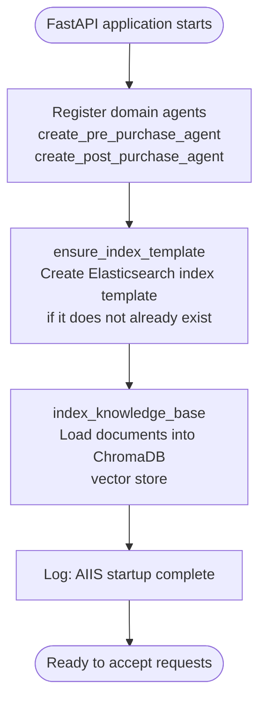
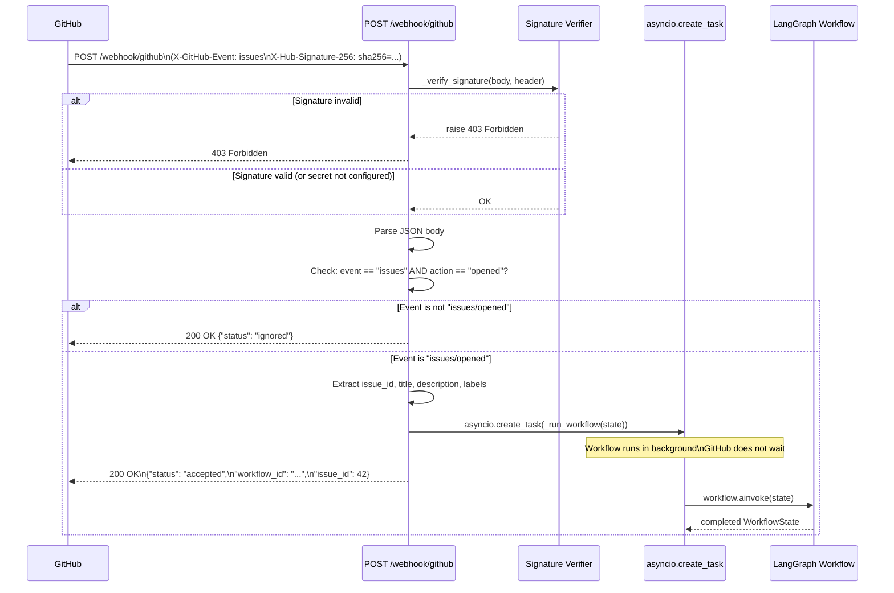
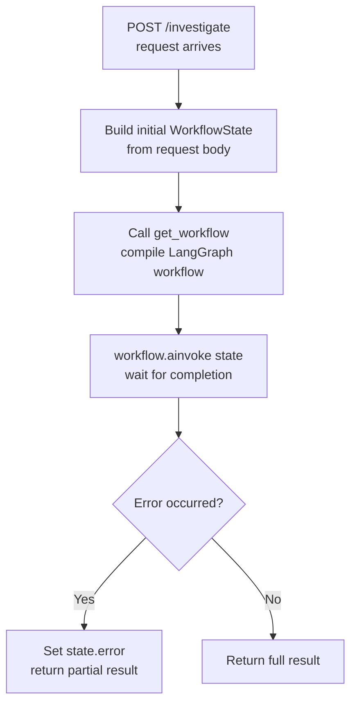
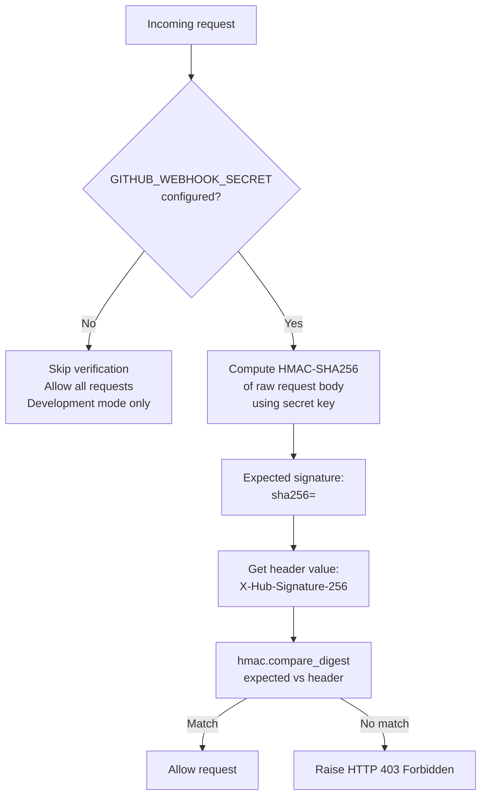
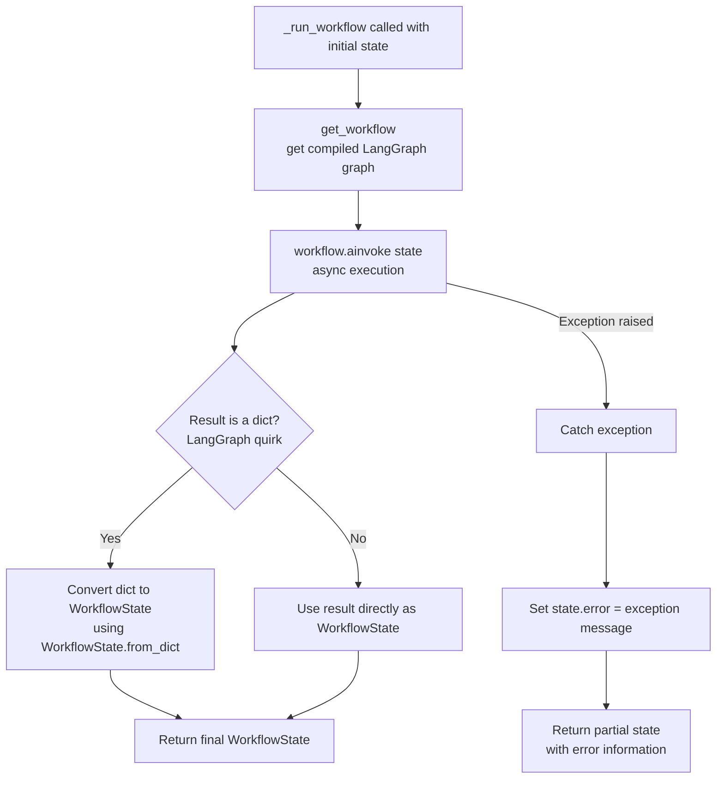
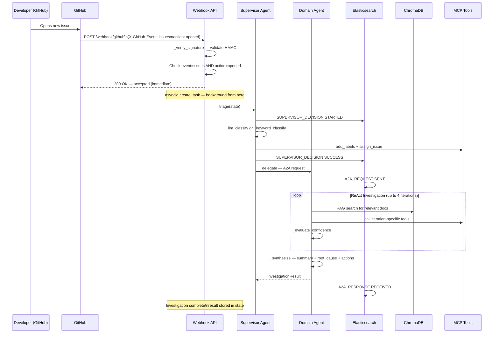

# Webhook API

**File:** `src/api/webhook.py`

---

## What Is the Webhook API?

The Webhook API is the **front door** of the AIIS system. It is a FastAPI application that listens for incoming HTTP requests. There are two ways it gets triggered:

1. **Automatically** — GitHub sends a webhook event when a new issue is opened
2. **Manually** — A developer directly calls the `/investigate` endpoint for testing

Everything the system does — triage, investigation, GitHub updates — starts here.

---

## Application Startup Sequence

When the FastAPI application starts, it runs a `startup()` function that prepares all the moving parts before accepting any requests.



**What each startup step does:**

| Step | Function | Purpose |
|------|----------|---------|
| 1 | `create_pre_purchase_agent()` | Instantiates the Pre-Purchase domain agent and registers it with the A2A server |
| 2 | `create_post_purchase_agent()` | Same for the Post-Purchase domain agent |
| 3 | `ensure_index_template()` | Creates the Elasticsearch index schema if it doesn't exist yet |
| 4 | `index_knowledge_base()` | Reads documentation files and loads them into ChromaDB as vector embeddings |
| 5 | Log message | Confirms startup is complete |

> **Why does startup order matter?** Domain agents must be registered before any webhook can be processed. ChromaDB must be populated before domain agents can perform RAG searches. The startup sequence ensures everything is ready in the right order.

---

## API Endpoints

The application exposes three HTTP endpoints:

| Method | Path | Purpose |
|--------|------|---------|
| `POST` | `/webhook/github` | Receives GitHub webhook events (primary flow) |
| `POST` | `/investigate` | Directly trigger an investigation (for testing) |
| `GET` | `/health` | Check if the service is running |

---

## Endpoint 1: `POST /webhook/github`

This is the primary endpoint that GitHub calls whenever something happens in your repository.

### What It Accepts

| Header | Required | Description |
|--------|----------|-------------|
| `X-GitHub-Event` | Yes | The type of GitHub event (e.g., `issues`) |
| `X-Hub-Signature-256` | Yes* | HMAC-SHA256 signature for authenticity verification |

> *If `GITHUB_WEBHOOK_SECRET` is not configured, signature verification is skipped (development mode only — not safe for production).

### What It Does



> **Why respond immediately?** GitHub expects a response within 10 seconds or it will retry. By using `asyncio.create_task()`, the API returns `{"status": "accepted"}` immediately while the investigation runs in the background. This prevents timeouts.

### Response (immediate)

```json
{
  "status": "accepted",
  "workflow_id": "wf-a3f7b2c1",
  "issue_id": 42
}
```

---

## Endpoint 2: `POST /investigate`

This endpoint is for **testing and development**. It lets you trigger an investigation directly without needing a real GitHub webhook.

### Request Body

```json
{
  "issue_id": 42,
  "title": "Search results show wrong prices for filtered products",
  "description": "When I filter by brand on the PLP, the prices shown do not match the actual product page prices.",
  "labels": ["bug", "search"]
}
```

| Field | Type | Required | Description |
|-------|------|----------|-------------|
| `issue_id` | integer | Yes | The GitHub issue number |
| `title` | string | Yes | The issue title |
| `description` | string | Yes | The full issue body text |
| `labels` | list of strings | No | Existing labels on the issue |

### What It Does

Unlike the webhook endpoint, `/investigate` runs the workflow **synchronously** — it waits for the full investigation to complete before responding.



### Response (after full investigation)

```json
{
  "workflow_id": "wf-a3f7b2c1",
  "issue_id": 42,
  "domain": "pre_purchase",
  "confidence": 0.87,
  "completed": true,
  "github_updated": true,
  "summary": "The pricing discrepancy on filtered PLP results is caused by a caching inconsistency between the search-service and pricing-engine. Cached price data is not invalidated when promotions are applied..."
}
```

| Field | Type | Description |
|-------|------|-------------|
| `workflow_id` | string | Unique ID for this investigation run |
| `issue_id` | integer | The GitHub issue number |
| `domain` | string | Which domain handled the issue (`pre_purchase` or `post_purchase`) |
| `confidence` | float | Final confidence score (0.0 – 1.0) |
| `completed` | boolean | Whether the investigation finished without error |
| `github_updated` | boolean | Whether labels and assignees were applied to GitHub |
| `summary` | string | The investigation summary from `_synthesize()` |

### Testing with `curl`

```bash
curl -X POST http://localhost:8000/investigate \
  -H "Content-Type: application/json" \
  -d '{
    "issue_id": 42,
    "title": "Search results show wrong prices for filtered products",
    "description": "When I filter by brand on the PLP, the prices shown do not match the actual product page prices. This started happening yesterday around 3pm UTC.",
    "labels": ["bug"]
  }'
```

---

## Endpoint 3: `GET /health`

A simple liveness check. Returns a 200 OK when the service is running.

**Request:**
```bash
curl http://localhost:8000/health
```

**Response:**
```json
{
  "status": "ok",
  "service": "aiis"
}
```

Use this to verify the application started correctly, or to wire into a load balancer health check.

---

## Signature Verification: `_verify_signature()`

GitHub signs every webhook payload with an HMAC-SHA256 signature using your `GITHUB_WEBHOOK_SECRET`. The `_verify_signature()` function validates this signature to ensure the request genuinely came from GitHub and was not tampered with.



**Why `hmac.compare_digest()` instead of `==`?**

A normal string comparison (`==`) exits as soon as it finds a difference. This leaks timing information — an attacker can guess the secret one character at a time by measuring how long the comparison takes. `hmac.compare_digest()` always takes the same amount of time regardless of where strings differ, making this attack impossible.

---

## `_run_workflow()` Internal Function

This is the internal function that executes the LangGraph workflow. It is called by both the webhook handler (in a background task) and the `/investigate` endpoint (synchronously).



> **LangGraph dict note:** LangGraph sometimes returns the workflow result as a plain Python dictionary instead of a typed object. `_run_workflow()` handles this by detecting the type and converting when necessary.

---

## Configuration Reference

All configuration is done through environment variables. No code changes are needed to switch between environments.

| Variable | Default | Required | Description |
|----------|---------|----------|-------------|
| `GITHUB_WEBHOOK_SECRET` | _(unset)_ | Recommended | Secret token for HMAC signature verification. If unset, all requests are accepted. |
| `ANTHROPIC_API_KEY` | _(unset)_ | Optional | Enables Claude as the Supervisor's classifier LLM |
| `OLLAMA_BASE_URL` | `http://localhost:11434` | Optional | URL for local Ollama LLM server |
| `OLLAMA_MODEL` | `llama3.1:8b` | Optional | Ollama model to use for classification |
| `ELASTICSEARCH_URL` | `http://localhost:9200` | Optional | Elasticsearch host for event logging |
| `CHROMA_PERSIST_DIR` | `./chroma_db` | Optional | Directory where ChromaDB stores vector embeddings |
| `MAX_INVESTIGATION_ITERATIONS` | `4` | Optional | Maximum ReAct loop iterations per domain agent |
| `CONFIDENCE_THRESHOLD` | `0.75` | Optional | Stop investigating early when confidence exceeds this |

---

## End-to-End Flow Diagram

This diagram shows the complete path from a GitHub issue being opened to an investigation completing:



---

## Beginner's Summary

1. The Webhook API is the entry point — nothing happens in AIIS until a request arrives here.
2. On startup, it prepares the domain agents, Elasticsearch, and the ChromaDB knowledge base.
3. GitHub sends webhook events when issues are opened. The API verifies they are authentic using HMAC-SHA256 signatures.
4. The API responds to GitHub immediately (to avoid timeouts) and runs the investigation in the background.
5. For testing without GitHub, use `POST /investigate` directly with a JSON body.
6. `GET /health` tells you if the service is running.
7. All sensitive configuration (API keys, secrets, URLs) is passed via environment variables — never hardcoded.
